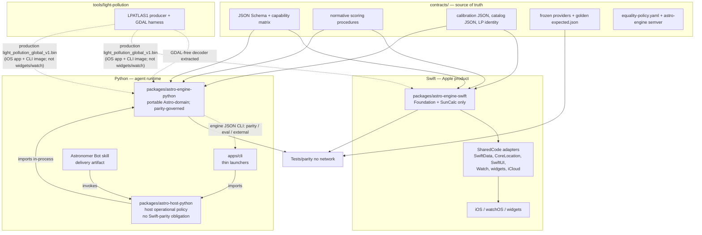
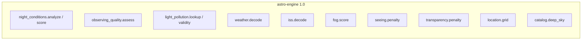
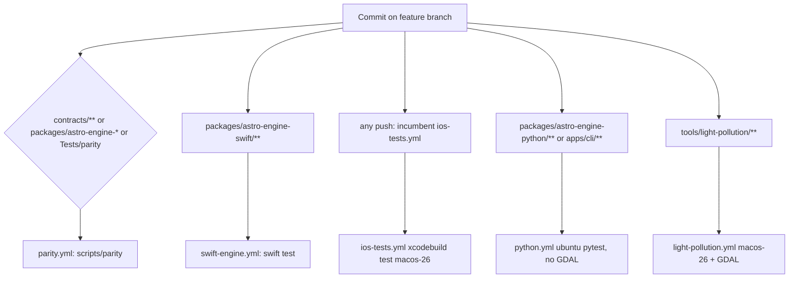

# Dual-Implementation Astro Engine: Contract-First iOS + Headless Python CLI

| Field | Value |
|---|---|
| **Document** | Dual-implementation Astro Engine architecture |
| **Author** | Design owner |
| **Date** | 2026-08-30 |
| **Status** | Living implementation roadmap |
| **Branch strategy** | One dedicated feature branch; many reviewable commits; **one eventual PR into `main`**. Do not land dual-engine work on `main` before the [feasibility gate](#feasibility-gate-grok-bot-vm). The branch may be abandoned wholesale. |
| **Resolved open questions** | 2026-08-30 — CLI is a local AGPL tool (no network wrap); production CLI **bundles** `light_pollution_global_v1.bin`; English copy out of parity; longer forecast horizon is CLI-only / out of contract |
| **Product** | Astro Viewing Conditions (iOS 18 / watchOS 11, Swift 6, AGPL-3.0) |
| **Current app version** | MARKETING_VERSION `2.3.1` (`apps/ios/project.yml`) |
| **Scope** | Architecture and implementation roadmap. This file **is** the roadmap: update it when implementation disproves an assumption or changes an architectural decision. Do not let the branch and this document diverge. |

---

## Overview

Astro Viewing Conditions is today a root-centric XcodeGen iOS/watch/widget product. Domain logic lives in `Sources/SharedCode`, but that module is a kitchen-sink: pure scoring (`ObservingQualityCalculator.assess`, `NightQualityAnalyzer`, `DefaultTargetRecommendationScorer`) sits beside Apple adapters (`CoreLocationSuitabilityResolver`, SwiftData `@Model SavedLocation` / `EquipmentItem`, SwiftUI presentation on `ViewingConditions` / `LocationScore`, WatchConnectivity, WidgetKit). CI already exists (`.github/workflows/ios-tests.yml` on `macos-26`). The only Python **preprocessing** tree is `tools/light-pollution/` (`light-pollution-harness`). Runtime LPATLAS1 decode/lookup is owned by `packages/astro-engine-python` (`astro_engine.light_pollution`); the harness keeps encoding and GDAL and re-exports that decoder.

This document proposes a **contract-first dual-engine** architecture:

1. A language-neutral **Astro Engine contract** is the source of truth. It is **not** a third runtime. It contains: capability matrix, engine semver, calibration/catalog **data**, golden fixtures, a field-level equality policy, input/output schemas for capabilities the CLI actually speaks, and **normative procedures only for product scoring algorithms** where prose is what stops Swift from becoming the oracle.
2. An idiomatic **Swift engine** (Foundation + SunCalc only) powers the existing iOS/watch/widget app.
3. An idiomatic **Python engine + headless JSON CLI** runs on a Linux VM (Grok Bot) as a deterministic capability API for an AI astronomer assistant.
4. A **Python host package** composes those deterministic facts into product answers (provider acquisition, timezone acquisition, persistence, runtime prompts/templates, and LLM integration). It is Python-only by intent and carries no Swift-parity obligation. See [Python host boundary](#11-python-host-boundary-packagesastro-host-python).

The two implementations must reach **semantic parity** on in-contract capabilities given the same normalized inputs, including frozen provider envelopes (Open-Meteo, N2YO, LPATLAS1). Exact equality is required for integer scores, rankings, enums, and decoded provider DTOs (UUIDs, emoji, and English copy stripped). Astronomy-library floats live in a later capability slice, use explicit per-field tolerances, and must not feed live into integer product-score fixtures. **Swift must not silently become the source of truth**; fixtures and procedures are authored from the product rules, not dumped from whichever implementation is written first.

This is **not** “feature parity of the whole app,” not a second UI, not a 1:1 class mirror of `SharedCode`, and not a custom backend that the iOS app would call. iOS remains a no-backend, public-API + local-calculation product. The CLI is a local tool on the bot VM.

**Feasibility before breadth.** The main uncertainty is not whether Python can reproduce `ObservingQualityCalculator.assess`. It is whether a local CLI on the actual Grok Bot VM is installed, invoked unattended by a skill/routine, and consumed as JSON. A [vertical proof](#feasibility-gate-grok-bot-vm) of one real capability happens **before** SharedCode extraction and the rest of the 1.0 port. If that gate fails, abandon the feature branch.

**Release status (after Phase 14):** Astro Engine 1.0.0 has not been publicly released. The scoring/decode slice and `location.compare` are unreleased work under that first 1.0.0 identity. Targets/equipment, live astronomy, and composed CLI/Bot-host operations are later unreleased slices toward the same first production release; roadmap sequencing does not authorize a second semantic release.

---

## Background & Motivation

### Current state (verified)

| Area | Reality |
|---|---|
| Product | Open-source AGPL-3.0 SwiftUI app, iOS 18 + watchOS 11, Swift 6, XcodeGen via root `project.yml` (`xcodeVersion: "26.5"`), checked-in `AstroViewingConditions.xcodeproj`. |
| Data | Open-Meteo weather + geocoding; SunCalc SPM (`nikolajjensen/SunCalc`); optional N2YO ISS; curated local catalog (**29** deep-sky objects in `CuratedDeepSkyCatalogProvider` plus Moon and four planets); offline LPATLAS1 binary ~10 MiB bundled only in the iOS app (`Sources/AstroViewingConditions/Resources/LightPollution/light_pollution_global_v1.bin`). |
| Backend | None. Documented product principle in `PROJECT_DOCUMENTATION.md` and `FEATURES/FEATURE_ROADMAP.md`. |
| Air quality | **Not present.** Out of 1.0. Schema placeholder only if needed later. |
| CI | **Incumbent:** `.github/workflows/ios-tests.yml` runs on push to `main` / `feature/astro-engine-cli` and PR to `main`, `macos-26`, timezone `America/Los_Angeles`, `xcodegen generate` from repo root, then `xcodebuild test` on a dynamically selected iOS simulator. `build.sh` is a local `xcodebuild` wrapper and is **not** the CI definition. Phase 10 adds path-filtered `swift-engine.yml`, `python.yml`, `parity.yml`, `light-pollution.yml`, plus `ios-nightly.yml`. |
| Tests | `Tests/AstroViewingConditionsTests/` is one XCTest bundle mixing domain, widget presentation, and watch tests. The test target depends only on `AstroViewingConditions` (`project.yml`), so several “pure” calculator tests `@testable import AstroViewingConditions` (`FogCalculatorTests`, `GeographicGridGeneratorTests`, `WeatherServiceTests`, `ISSServiceTests`, `NightQualityAnalyzerTests`). |
| Python | `tools/light-pollution/` is a Python 3.11+ atlas harness (`pyproject.toml` name `light-pollution-harness`). Tiny fixtures exist at `tools/light-pollution/fixtures/` (harness copies) and `contracts/fixtures/providers/lpatlas1/` (canonical). Runtime lookup is owned by `packages/astro-engine-python` (`astro_engine.light_pollution`, stdlib, no NumPy/GDAL). The harness re-exports that decoder and keeps encoding/GDAL. Full harness (GeoTIFF / `osgeo`) is Mac-only Homebrew GDAL. |

### Pain points that make a naive dual implementation fail

1. **`SharedCode` is not a domain engine.** Phase 2 split Foundation DTOs **in place** (still under `Sources/SharedCode`; see [File-split map](#file-split-map-prerequisite-of-the-swift-package)), but the module still mixes engine types with Apple adapters:
   - `HourlyForecast`, `FogScore`, `SunEvents`, `MoonInfo`, `NightQualityAssessment`, `ISSPass`, `Coordinate`, and `CachedLocation` now live in dedicated Foundation files. SwiftUI `Color` helpers moved to `NightQualityColor.swift` / `LocationScore+Color.swift`. `NightQualityPresentation` stays Foundation-only (copy/tone), not a Color adapter.
   - `@Model SavedLocation` remains SwiftData; `SelectedLocation` stays with it. `CachedLocation.init(from: SavedLocation)` is an iOS host adapter on `SavedLocation.swift`, **not** on the extractable `CachedLocation.swift`. `@Model EquipmentItem` is now `EquipmentItem.swift` (`#if os(iOS)`); `Equipment.swift` is Foundation-only.
   - `NightQualityAssessment.calculatedScore` is a convenience that calls `NightConditionsScoring.publicScore` (same formula as the former `BestSpotSearcher.calculateScore` body). It does **not** call `BestSpotSearcher`. The property was kept because Watch/widget/iOS call sites are extensive; deleting it would be API churn with no extraction benefit.
   - `CuratedDeepSkyCatalogProvider` no longer calls `TargetImageManifest` at type-init. `DefaultTargetCatalogProvider` attaches credits when building `ObservableTarget` (`entry.image` wins, else the host manifest). iOS still loads pixels via `TargetImageRepository` by target id.
   - `EquipmentMatchingService` is in `Sources/SharedCode/Core/Models/EquipmentMatching.swift` (there is **no** `EquipmentMatchingService.swift`).
   - `LocationTimeZoneResolver` and `CoreLocationSuitabilityResolver` still depend on `CLGeocoder`.
   - `LocationManager` is CoreLocation + SwiftUI; `WidgetReloadService` imports WidgetKit.
   - `ISSService` `import CoreLocation` is **unused** (no `CLLocation`). That unused import is hygiene, not architectural coupling. The real Apple coupling in ISS is `URLSession` / actor hosting, not geocoding. Phase 2 did not clean it (not an engine-DTO file).
   - Remaining `import SunCalc` after Phase 2: `AstronomyService`, `MoonRecommendationService`, `NightQualityAnalyzer`. `BestSpotSearcher` had an unused `import SunCalc` (no `MoonPosition`/`SunTimes` call sites) and Phase 2 removed it. `BestSpotSearcher` still uses CoreLocation for `CLGeocoder`.
   Mirroring `SharedCode` class-for-class in Python would copy this contamination.

2. **Integer product scores currently depend on live astronomy-library floats and Calendar.** `NightQualityAnalyzer.analyzeNight` calls SunCalc `MoonPosition` / `MoonIllumination` per nighttime hour **and** consumes `sunEventsToday` / `sunEventsTomorrow` via `NightForecastFilter.calculateNightRange`, which copies twilight hour/minute into a location-zone `Calendar`. A 60 s twilight disagreement can drop or add an hourly forecast and change the public integer. `ConditionsProvider.fetchConditions` uses `Date()` for `startOfDay` and `fetchedAt`. Injecting only moon samples is not enough.

3. **Best Nearby land/water is not portable.** `CoreLocationSuitabilityResolver` reverse-geocodes with `CLGeocoder`, treats `placemark.ocean` / `inlandWater` as unsuitable, and caps checks at 40 (`BestSpotSearcher.maxSuitabilityCandidateChecks`). Ranking (`isHigherRanked`) also tie-breaks on `suitability.verificationRank`. That cannot be an implicit CLI invariant.

4. **Timezone identity is derived, not input.** `LocationTimeZoneResolver.resolve` uses `CLGeocoder` (4 s timeout) and falls back to `approximate(longitude:)` (15°/hour GMT offset). Open-Meteo is requested with `timezone=auto`. IANA timezone must be an explicit input on the contract side.

5. **Fixtures are trapped in Swift tests.** `WeatherServiceTests` and `ISSServiceTests` embed JSON strings (happy path, missing fields, negatives, offset-only timezone, short optional arrays, empty/nil ISS passes). OQ calibration anchors `(17.5, 8.0) … (21.75, 0.0)` are duplicated in `ObservingQualityCalculator` and `ObservingQualityCalculatorTests`. The catalog is a Swift array. Only LPATLAS1 already has a language-neutral fixture. Several Night Quality tests use `Calendar.current` (`NightQualityAnalyzerTests`, `BestSpotSearcherTests`, `AstronomyServiceTests`) and cannot be transcribed into timezone-fixed goldens without rewriting those tests.

6. **The existing Python tree is the wrong home for a CLI.** Putting an observing engine under `tools/light-pollution/` or `Sources/` would confuse atlas preprocessing with runtime semantics and would pollute Xcode. `open_in_xcode.sh` currently runs `open -a Xcode .` (opens the **directory**), which is how Python files get dragged into the pbxproj. Changing it to open the `.xcodeproj` fixes that footgun.

7. **There is no behavioral contract.** Swift is the accidental oracle. Generating Python goldens from current Swift output would freeze Swift bugs and UI-adjacent copy as “the spec.” Schemas-without-procedures would leave `expected.json` as the real spec.

---

## Goals & Non-Goals

### Goals

- One GitHub monorepo containing the Apple product, a headless Python CLI + library, a language-neutral Astro Engine contract (including **normative scoring procedures**), cross-language parity tests, and the existing LP atlas preprocessing tool.
- Semantic parity for **in-contract capabilities** given identical normalized inputs and frozen provider payloads. No network in parity tests.
- Capability-catalog so iOS-only UI and agent-only tooling are not forced onto the other platform.
- Idiomatic Swift and idiomatic Python. Shared truth is semantics and procedures, not class names.
- Xcode remains clean: Python, venv, pytest, contracts, and tools never appear as Xcode groups. `open_in_xcode.sh` opens the `.xcodeproj`, not the directory.
- Independent `astro-engine` semantic version, reported by both products.
- Incremental, reviewable **commits on one feature branch** that satisfy the [iOS migration invariant](#ios-migration-invariant). Incumbent iOS CI already runs on this branch; Phase 10 adds path-filtered engine jobs.
- An explicit Grok Bot feasibility gate before extracting SharedCode or porting the rest of Astro.

### Non-goals

- A Python GUI, TUI, or SwiftUI rewrite.
- Making the iOS app a client of a remote Python service.
- Requiring Swift on the Grok Bot Linux VM (bot language is Python).
- 1:1 type/class mirroring of `SharedCode` in Python.
- Porting Field Mode, widgets, WatchConnectivity, MapKit, SwiftData, iCloud, or CLGeocoder land/water to the CLI.
- Wrapping the CLI as an HTTP/network service (it is a **local process** on the Grok Bot VM; AGPL §13 does not trigger).
- Treating `tools/light-pollution` as the observing engine (the GDAL-free **decoder** may be extracted; the harness stays a tool).
- Optical FOV, mounts, cameras, or a full Messier/NGC dump.
- Implementing air quality; out of 1.0.
- Treating live astronomy or `location.compare` as a later release. `location.compare` is already unreleased 1.0.0 work; live astronomy remains a later unreleased slice toward that first release.
- Putting English summary strings or a longer-than-3-day forecast horizon into 1.0 parity.

---

## Alternatives Considered

### A. Contract-first dual engine in one monorepo (recommended)

Two idiomatic implementations behind one language-neutral contract, plus a capability matrix.

| | |
|---|---|
| **Pros** | Matches the two real runtimes (Apple app, Linux bot VM). One branch/PR can change fixtures + Swift + Python together. No custom iOS backend. Each language stays idiomatic. Xcode can be isolated. Abandonable as a unit. |
| **Cons** | Dual maintenance. Drift risk. Golden files can become a shadow spec if generated from one implementation. |

Mitigations: capability matrix with a small initial 1.0 capability slice, frozen inputs (moon **and** sun/night window **and** clock), normative procedures in `contracts/`, independent `expected.json` with `origin` tags, field-level equality, CI gates, engine-semver.

### B. Extract a Swift-only engine and run it on Linux

`SharedCode` cannot run on Linux as it exists (SwiftUI, SwiftData, CoreLocation, WidgetKit). A Foundation-only Swift package might compile on Linux Swift.org images; that has **not** been evaluated empirically in this repo (neither has macOS `swift test` of a package that does not yet exist).

| | |
|---|---|
| **Pros** | Single scoring implementation. No Python port of OQ/night formulas. |
| **Cons** | **The bot host language is Python** (product constraint). A Python wrapper around a Swift binary is still two artifacts, with a harder Linux deploy (runtime / static linking on an unmanaged VM). Widgets/watch cannot call that binary. Apple Foundation `Calendar` / `TimeZone` / `DateFormatter` vs Linux Foundation is the same class of gap the dual-engine equality policy already has to police — Linux Swift would not remove it. |

**Decision:** extract a pure Swift package for iOS cleanliness and **macOS** `swift test` CI. Do **not** reject Linux Swift because “SunCalc-on-Linux is unverified”; that is equally true of the new macOS package until it exists. Reject Swift-on-Linux **as the Grok Bot runtime** because the agent host is Python. Linux Swift remains an optional experiment *after* macOS `swift test` is green.

### C. Single Python engine; iOS as a remote client

Rejected for the iOS product (no custom backend, widgets/watch offline, AGPL network clause). The CLI may run on the bot VM without the iOS app calling it.

### D. Separate repositories (iOS vs CLI)

Rejected. Contract/fixture/semver coordination becomes cross-repo; semantic drift is the default. Xcode cleanliness is a layout problem, not a Git-boundary problem.

### E. Mirror Swift types 1:1 in Python

Rejected. Python is a library of functions/modules grouped by capability, not `class NightQualityAnalyzer`.

### F. Generate both implementations from a DSL

Rejected as premature.

---

## Recommended Target Architecture

**Capability-catalog / contract-first dual engine in a restructured monorepo**, with a **small initial unreleased-1.0 capability slice**.



**Reading the arrows.** In `PythonSide`, solid arrows are **dependency** edges
(dependent → dependency) and match the normative direction in
[§ 11](#dependency-direction-normative); the dotted engine→CLI edge is the JSON
CLI *interface*, not a dependency. Elsewhere the diagram shows contract data
flowing into implementations, and `SwiftEngine → AppleAdapters → iOSApp` is that
same flow reading — the Apple dependency direction is the reverse of the arrow
and is independent of the Python chain.

### Architectural rules

1. **The contract is the oracle**, not whichever implementation is written first. New **scoring** semantics: procedure + data + fixture + equality policy, then both implementations. At least one OQ fixture (and later one night-conditions fixture) must be arithmetic from the procedure with **no implementation in the loop**. Decode/catalog/grid do **not** get a parallel prose restatement of the code; fixtures + equality are enough.
2. **Capabilities, not apps.** A capability is a named, versioned function with JSON in/out.
3. **Prove the Grok Bot path first.** One real capability on the actual VM + skill, then extract SharedCode. See [feasibility gate](#feasibility-gate-grok-bot-vm).
4. **Inject provider I/O, clocks, moon samples, and night-window bounds** once night-conditions is in-contract. Production hosts fetch HTTP and call AstroEngine SunCalc samplers; scoring fixtures never call astronomy libraries. **SharedCode never `import SunCalc` after the package-extract phase.**
5. **Do not JSON-ify UI.** Field Mode, Dynamic Type, widget layout, WatchConnectivity, MapKit stay iOS-only.
6. **Split Foundation types out of SwiftUI/SwiftData files before creating the Swift package.** Isolation rules on `project.yml` paths are necessary but not sufficient.
7. **`contracts/data` is the only source-controlled copy of product numbers.** Do not commit generated copies into engine packages. Do not symlink. Tests and eval read `contracts/` via `CONTRACTS_ROOT`. Production bundles are **build artifacts** (see [Runtime data loading](#runtime-data-loading-no-committed-copies)).
8. **Extract the Swift package in the current root layout before moving `apps/ios/`**, and only **after** the feasibility gate. Prove `swift test` + XcodeGen local-package linking before path churn. Retarget the incumbent `ios-tests.yml`; do not invent a greenfield iOS workflow.
9. **This document is the roadmap.** When a phase disproves an assumption, edit this file in the same commit series. Do not accumulate silent drift between code and design.
10. **[iOS migration invariant](#ios-migration-invariant)** — no intentional iOS/watch/widget behavior change; existing tests are not weakened to land a refactor.
11. **Portable Astro-domain semantics and host operational policy are separate packages.** Portable Astro-domain calculation expected to stay authoritative across products lives in `packages/astro-engine-*` under contract governance. Host operational policy — provider and timezone acquisition, retries, concurrency and cost control, persistence, freshness/lifecycle, agent orchestration, prompts and answer templates, LLM integration — lives in `packages/astro-host-python`. Python dependencies point **one way**: `Python delivery adapter (Bot skill, CLI launcher) → astro_host → astro_engine`, with `astro_host` integrating the engine **in-process** (`import astro_engine`). Apple surfaces are independent and unaffected: `iOS/watch/widget adapters → AstroEngine (Swift)`; nothing under `apps/ios` depends on `astro_host`. Host code, prompts and templates may explain, orchestrate and compose authoritative engine facts; they must never duplicate, override or independently re-implement an authoritative Astro-domain rule. "Deterministic" alone is not the placement test — see [placement criterion](#placement-criterion-portable-semantics-vs-operational-policy) and [Python host boundary](#11-python-host-boundary-packagesastro-host-python).

#### iOS migration invariant

Dual-engine work must introduce **no intentional user-visible or semantic behavior changes** to the existing iOS/watch/widget product.

- Existing tests are a regression safety net. They may be **mechanically adapted** when the architecture requires it (imports change from the app target to `AstroEngine`; test files move with the Apple product; embedded provider JSON moves into shared contract fixtures; helpers change because module/resource boundaries change).
- Those adaptations **preserve original behavioral assertions and expected values** unless there is an independently justified product-semantic change documented in this file.
- Do **not** delete, loosen, skip, or rewrite an existing assertion merely because the refactored code initially fails it.
- New engine/package/parity tests are **additive**; they do not replace existing iOS regression coverage.
- Every structural/extraction phase must leave the existing iOS product tests green and the actual iOS/watch targets compiling.
- Phase 13 (`apps/ios` tree relocation) remains **strictly behavior-free**.
- Before the eventual merge to `main`, run the **full existing iOS test suite** plus a **manual app smoke test**, in addition to engine/parity CI.

---

## Proposed Design

### 1. Monorepo vs separate repos

**Keep one monorepo.** The value of this work is coordinated semantic change. Separate repos optimize language purity and regress the requirement (one PR, one contract, two implementations).

### 2. Current layout cannot support this cleanly — but the move is not the first work

The current tree is an Apple app with a tools folder and a working iOS CI job. Problems: kitchen-sink `SharedCode`; tests import the app target; fixtures live in XCTest strings; `open -a Xcode .` directory open; Python only under `tools/light-pollution`.

**Do not move to `apps/ios/` first. Do not extract SharedCode first.** Sequence:

1. **Feasibility vertical slice** (OQ contract + Python + minimal CLI + existing Swift XCTest + Grok Bot VM/skill). Gate.
2. Split Foundation types **in place** (still `Sources/SharedCode`).
3. Extract `packages/astro-engine-swift` **including** `NightQualityAnalyzer`, `NightForecastFilter` (helper), `calculateScore`, injected night window + 1:1 moon_series, **and** SunCalc-backed `MoonSampling`/`SunEventsSampling` so SharedCode can drop `import SunCalc`. XcodeGen gains a local package path while sources are still at repo root.
4. Only then relocate Apple sources to `apps/ios/` and retarget `.github/workflows/ios-tests.yml`.

### 3. Target repository tree

```
.
├── README.md
├── LICENSE
├── Makefile                         # `make parity`; optional `make bundle-engine-data` for local Swift prod builds
├── scripts/
│   ├── bundle-engine-data           # build-time copy contracts/data → untracked package/app resource dirs
│   └── parity                       # local macOS Swift eval + Python eval
├── open_in_xcode.sh                 # opens the .xcodeproj (not the directory)
├── build.sh
├── CODEOWNERS                       # contracts/ required reviewers
├── .github/workflows/
│   ├── ios-tests.yml                # INCUMBENT; unfiltered macos-26 xcodebuild test; workflow_call for nightly
│   ├── swift-engine.yml             # macos-26, path-filtered swift test (no simulator)
│   ├── python.yml                   # ubuntu, Python 3.13 pytest (no GDAL)
│   ├── parity.yml                   # macos-26; scripts/parity (Tests/parity)
│   ├── light-pollution.yml          # macos-26 + Homebrew GDAL; harness pytest
│   └── ios-nightly.yml              # cron + workflow_dispatch; reuses ios-tests.yml
│
├── contracts/
│   ├── ENGINE_VERSION
│   ├── CHANGELOG.md
│   ├── capabilities.yaml
│   ├── equality-policy.yaml
│   ├── json-profile.md              # dates, finite numbers, null-vs-omitted, debug pretty-print
│   ├── procedures/                  # scoring algorithms ONLY; not decode/grid/catalog
│   │   ├── observing-quality.md     # required before feasibility gate
│   │   ├── night-conditions.md      # after gate
│   │   ├── calculate-score.md
│   │   ├── fog-seeing-transparency.md
│   │   └── target-scoring.md        # later unreleased 1.0 slice
│   ├── schemas/
│   ├── data/
│   │   ├── calibration/                    # + moon-/planet-recommendation.json
│   │   ├── catalog/deep-sky.json
│   │   └── identity/light-pollution-dataset.json
│   │   # No orbital/schlyter-planets.json: the planet slice kept the Schlyter
│   │   # coefficients as code in both hosts. They are the model, not tunable
│   │   # calibration. See the planet slice below.
│   └── fixtures/
│       ├── providers/
│       └── capabilities/
│
├── packages/
│   ├── astro-engine-swift/
│   │   ├── Package.swift            # SunCalc resolved HERE only
│   │   ├── Sources/AstroEngine/
│   │   ├── Sources/AstroEngineEval/ # astro-engine-eval
│   │   └── Tests/AstroEngineTests/
│   ├── astro-engine-python/         # deterministic; parity-governed
│   │   ├── pyproject.toml
│   │   ├── src/astro_engine/
│   │   └── tests/
│   └── astro-host-python/           # host operational policy; no Swift-parity obligation
│       ├── pyproject.toml           # astro-engine version range; engine never depends back
│       ├── src/astro_host/          # acquisition, composition, persistence, LLM adapters
│       │   ├── cli/                 # reusable arg parsing + runtime entry logic
│       │   ├── prompts/             # runtime resource: LLM instruction text
│       │   └── templates/           # runtime resource: answer shaping
│       └── tests/                   # host tests (not parity fixtures)
│       # platform Grok/OpenAI skill bundles are delivery artifacts, not package
│       # data; their location is intentionally unfrozen (see section 11)
│
├── apps/
│   ├── ios/                         # after the relocation phase
│   │   ├── project.yml              # no SunCalc URL; depends on AstroEngine package
│   │   ├── AstroViewingConditions.xcodeproj/
│   │   ├── Sources/…
│   │   └── Tests/AstroViewingConditionsTests/   # UI, watch, widgets, adapters only
│   └── cli/                         # thin executables only; no reusable host logic
│       └── astro-engine             # parity-governed engine JSON CLI launcher
│
├── Tests/parity/
│   ├── parity_runner.py
│   └── compare.py                   # field-level compare using equality-policy.yaml
│
└── tools/light-pollution/           # moved tools/light-pollution in the relocation phase
```

**Gitignore:** SwiftPM’s vendor directory is `/Packages/`. On case-insensitive volumes that also matches `packages/`, so `.gitignore` must re-include `!/packages/` or the engine trees are invisible to git.

**Xcode isolation rules:**

- After the move, `apps/ios/project.yml` may only list paths under `apps/ios/Sources`, `apps/ios/Tests`, and the local package `../../packages/astro-engine-swift`.
- No glob of repo-root `Sources/`.
- Python, `contracts/`, `tools/`, `.venv`, `__pycache__` never appear as Xcode groups.
- `open_in_xcode.sh` runs `xcodegen` if needed and `open <path-to>/AstroViewingConditions.xcodeproj`.
- Keep XcodeGen as the Apple project generator.
- **Only one SunCalc resolution:** `packages/astro-engine-swift/Package.swift`. SharedCode / the app link AstroEngine; they do **not** redeclare the SunCalc URL and **must not** `import SunCalc` (SPM does not re-export it). 1.0 AstroEngine owns `MoonSampling` + `SunEventsSampling` with SunCalc-backed implementations. Host `AstronomyService` only **wires** those samplers and keeps Foundation-only `approximateSunEvents`. Unused SunCalc in the initial capability slice (samplers are not yet on the parity allow-list) is acceptable: later unreleased live astronomy lives in the same package.

watchOS continues to link AstroEngine for scoring only and **must not** embed the 10 MiB atlas (unchanged from `CROSS_SURFACE_ARCHITECTURE.md`).

---

### File-split map (prerequisite of the Swift package)

Do this **in place** before `Package.swift` exists. Engine XCTest must `import AstroEngine` only. Ban `@testable import AstroViewingConditions` for moved types.

| Current file | Extract to AstroEngine (Foundation) | Stay in SharedCode / iOS adapters |
|---|---|---|
| `Models/ViewingConditions.swift` | Already split in place: `HourlyForecast.swift`, `SunEvents.swift`, `MoonInfo.swift`, `FogScore.swift`, `ISSPass.swift`, `NightQualityAssessment.swift`. Equality DTO still **omits** `HourlyForecast.id`, `MoonInfo.phaseName`/`emoji`, FogFactor English, `Trend.icon`/`label`. `calculatedScore` stays as a convenience wrapping `NightConditionsScoring.publicScore` | `ViewingConditions` host aggregate remains a Codable snapshot (`import Foundation` only). SwiftUI `Color` / `scoreColor` / `scoreLabel` → `NightQualityColor.swift` (Watch/widgets need SharedCode). Do **not** put Color on `NightQualityPresentation` (that file is Foundation copy/tone). `analyzeConditions(_ ViewingConditions)` wrapper |
| `Models/SavedLocation.swift` | `Coordinate.swift` and `CachedLocation.swift` are Foundation-only / engine-extractable (optional `id` omitted from equality DTO). `CachedLocation.swift` must **not** reference `SavedLocation` | `@Model SavedLocation`, `SelectedLocation`, SwiftData ordering, and the iOS host adapter `CachedLocation.init(from: SavedLocation)` on `SavedLocation.swift`. `ViewingConditions`'s `SavedLocation` convenience init stays host-side with the aggregate |
| `Models/LocationScore.swift` | File is Foundation-only after Phase 2 (`LocationSuitabilityStatus`, `BestSpotScoringMode`, `LocationScore`, `BestSpotResult` stay together). Equality DTO still **omits** `id` / `summary` / Color | SwiftUI `LocationScore.color` → `LocationScore+Color.swift`. String `scoreColor` and English `label` / `lightPollutionUnavailableMessage` stay on the Foundation types (not SwiftUI) |
| `Models/Equipment.swift` | File is Foundation-only after Phase 2: `EquipmentType`, `EquipmentApertureUnit`, `EquipmentDraft`, `EquipmentValidation`. `EquipmentCapability` already had its own file | `@Model EquipmentItem` + persisted snapshot/validation → `EquipmentItem.swift` (`#if os(iOS)` stays) |
| `Models/EquipmentMatching.swift` | Entire `EquipmentMatchingService.match` structured result (`level`, `reason`, `mode`, apertures). **Equality omits `explanation`** | Host formats `explanation` strings |
| `Models/TargetEquipmentRequirements.swift` | Entire file | — |
| `Models/ObservableTarget.swift` | Domain fields; image credit **id** only. Do not move `TargetImageCredit` presentation metadata into the engine DTO | iOS image loading; host may attach `TargetImageCredit` when building recommendations |
| `Models/ObservingQualityAssessment.swift` | Entire file | — |
| `Models/LightPollutionDatasetIdentity.swift` | Entire file | — |
| `Services/ObservingQualityCalculator.swift` path: `Utilities/ObservingQualityCalculator.swift` | Entire file | — |
| `Utilities/NightQualityAnalyzer.swift` | `analyzeNight` taking already-windowed or inject-clipped forecasts + **required 1:1 `moon_series`** + injected `night_window` + tz. **No** `import SunCalc` in this type. | Host wrapper `analyzeConditions(_ ViewingConditions)` that supplies window + samples |
| `Utilities/NightQualityAnalysisRules.swift` | Entire file (enums; `summaryText` is presentation, omitted from equality) | — |
| `Utilities/NightForecastFilter.swift` | Entire file as a **separately tested helper** (sun events + local start-of-day → filter window). 1.0 `night_conditions.analyze` does **not** call it live | — |
| `Utilities/SeeingCalculator.swift`, `TransparencyCalculator.swift`, `FogCalculator.swift` | Entire files | — |
| `Utilities/GeographicGridGenerator.swift` | Entire file. Phase 2 already deleted the unused `import CoreLocation`. `GridPoint` stays here | — |
| `Services/WeatherService.swift` | `OpenMeteoResponse`, `HourlyData`, `parseHourlyForecasts` (pure decode + time parser). Protocol `WeatherForecastProviding` | Actor + `dataLoader` + HTTP + timeouts |
| `Services/ISSService.swift` | `N2YOResponse` decode → `[ISSPass]` | Actor + `dataLoader` + URL builder + API key encoding |
| `Services/BinaryLightPollutionProvider.swift`, `LightPollutionProviding.swift`, `ModeledZenithBrightnessValidity.swift` | Entire files | `BundledLightPollutionResource` (CryptoKit SHA-256, app bundle) |
| `Services/ObservingQualityService.swift` | Pure assess-after-lookup | Bootstrap / session wiring |
| `Services/DeepSkyCatalogService.swift` | Curated catalog **data** (`DeepSkyCatalogEntry` identity/fields, `CuratedDeepSkyCatalogProvider`). Engine catalog does **not** depend on `TargetImageManifest` and must **not** own `TargetImageCredit` presentation metadata. SharedCode may keep optional `DeepSkyCatalogEntry.image` temporarily so injected providers can supply a credit; Phase 3 must not copy that compatibility field into AstroEngine merely because it exists today. Split this file on extract: curated data moves; host mapping stays | `DefaultTargetCatalogProvider` host mapping (`entry.image ?? TargetImageManifest.image(for: id)`), `TargetImageManifest`, iOS images (`TargetImageRepository` loads pixels by target id) |
| `Services/TargetRecommendationService.swift` | `DefaultTargetRecommendationScorer` (later unreleased fixtures) | Service orchestration, debug logger |
| `Services/BestSpotSearcher.swift` | `NightConditionsScoring.publicScore` (already the formula owner; `BestSpotSearcher.calculateScore` is a one-line wrapper); `isHigherRanked` total order (`location.compare`, delivered in Phase 14); coherent mode/public-score/center-delta composition (`location.compose_scores`); recommendability state filtering (`location.filter_recommendable`) | `CoreLocationSuitabilityResolver`, search actor, progress, suitability bands and 40-check cap, final truncation, English `generateSummary`. Phase 2 already deleted unused `import SunCalc`. Remaining Apple coupling is real `CLGeocoder` / `CLLocation`, not SunCalc |
| `Utilities/LocationTimeZoneResolver.swift` | `calendar(for:)` Gregorian+tz; **not** `resolve` / `approximate` | `CLGeocoder` resolve + longitude fallback (iOS host) |
| `Utilities/AdaptiveFont.swift`, `BestSpotSettings.swift` | Geometry defaults (radius/spacing numbers) may live in calibration JSON | SwiftUI / AppGroup persistence |
| `Services/AstronomyService.swift` | **1.0:** `MoonSampling` + `SunEventsSampling` protocols and `SunCalcMoonSampler` / `SunCalcSunEventsSampler` (the only `import SunCalc` in the iOS tree). Polar missing-times stay out of the sampler. | Host actor: injects samplers, maps missing SunCalc times through Foundation-only `approximateSunEvents` (`hosts: [ios]`). **Never `import SunCalc`.** |
| `Services/PlanetRecommendationService.swift` | **Done:** the orbital-element algorithm and coefficients are `AstroEngine.LowPrecisionPlanetObservationSampler`; the specialized scorer is `AstroEngine.PlanetRecommendation` | Target-type guard, `TargetVisibilityWindow` mapping, recommendation copy, validation logging |
| `Services/MoonRecommendationService.swift` | SunCalc-backed `MoonAstronomyProviding` implementation moved into AstroEngine in the package-extract phase so SharedCode does not keep `import SunCalc`. **Done:** the sampler is `AstroEngine.SunCalcMoonObservationSampler` and the scorer is `AstroEngine.MoonRecommendation` | Host orchestration / copy only |
| Watch / widget / App Group / iCloud / `LocationManager` | — | All stay |

`NightQualityAssessment.calculatedScore` no longer calls `BestSpotSearcher`. It is a convenience wrapping `NightConditionsScoring.publicScore(_ assessment)`. Callers may use either; there is one implementation. Do not delete the property in a later phase unless the Watch/widget/iOS call sites are migrated for a real API reason.

After the package-extract phase, `rg 'import SunCalc' Sources/` (Apple tree) must be empty. Remaining SharedCode importers after Phase 2: `AstronomyService`, `MoonRecommendationService`, `NightQualityAnalyzer`. `BestSpotSearcher` is **not** a SunCalc rewrite. Do not `@_exported import SunCalc` and do not leave a SharedCode adapter that calls `MoonPosition.compute()`.

---

### 4. What is Swift-only, Python-only, or in-contract

#### 1.0 in-contract (must have fixtures + both implementations + eval without the iOS app)



| Capability ID | Current Swift locus | Equality |
|---|---|---|
| `weather.decode` | `OpenMeteoForecastDecoder.parseHourlyForecasts` | Exact DTO: omit `HourlyForecast.id` (`UUID()`). Times exact under the [Open-Meteo time parser](#open-meteo-time-parser). Skip malformed times. Always emit `timezone` (`string\|null`) and `utc_offset_seconds`. **Phase 8 / current 1.0** mirrors existing `HourlyForecast` (time, cloud cover, humidity, temperature, dew point, wind speed/direction, visibility, layered clouds, 200 hPa wind) and therefore does **not** expose precipitation. Open-Meteo `precipitation` is requested and decoded on the raw envelope but is not a `HourlyForecast` field; do not invent it in Phase 8. That omission is a **known Bot-facing domain gap**, not a current production recommendation-rule parity blocker — see [Grok Bot information surface](#grok-bot-information-surface-objective-engine-facts-not-one-mega-capability). Do not duplicate scoring inside weather decode. |
| `iss.decode` | `N2YOPassDecoder` | Exact `ISSPass` DTO including deterministic `id` (`"{riseTime.timeIntervalSince1970.bitPattern}-{duration.bitPattern}"`, IEEE-754 bits as decimal, not Python `hash()`). Empty array vs missing `passes` as in Swift (`[]` vs no-key → `[]` output either way after map). Provider azimuth degrees, magnitude, and `info` satellite metadata are not `ISSPass` fields. |
| `night_conditions.analyze` | `NightQualityAnalyzer.analyzeNight` | Exact DTO given injected `night_window` + **1:1 `moon_series`** + clock/tz. See [Night conditions procedure](#night-conditions-analyzenight). Omit `HourlyRating.id`, English `summary`, `Trend.label`/`icon`, **`best_window`**. The omission remains intentional; the production decision is now separately portable through `observing_window.select`, as reviewed after the [compatibility audit](#production-business-logic-compatibility-audit-2026-09-05). **Bot-facing:** `hourly_ratings` is first-class objective data (time, score, cloud, fog, moon illumination/altitude, wind, optional seeing/transparency), not merely an input to the aggregate `public_score`. |
| `night_conditions.score` | `BestSpotSearcher.calculateScore` | Integer exact. |
| `observing_window.select` | `ObservingWindowSelector.select`, used by `NightQualityAnalyzer` | Exact nullable endpoint pair over already-included scored rows; see [procedure](../../contracts/procedures/observing-window.md). |
| `observing_night.resolve_active` | `ObservingNightSelector.select`, used by `ActiveObservingNightResolver` | Exact discrete state, day offset/index, local observing date, observing-day start and both astronomical-night boundaries. Preceding civil date first; all three comparisons inclusive; day indexing, empty-hourly and missing-following-row quirks frozen. Host keeps timezone acquisition; see [procedure](../../contracts/procedures/observing-night.md). |
| `night_forecast.derive_window` | `NightForecastWindowDeriver.derive`, used by `NightQualityAnalyzer` and the source-compatible `NightForecastFilter` adapter | Exact timezone identity and projected `[start,end)` forecast-window boundaries. Twilight date/seconds are discarded; Foundation DST ambiguity/gap behavior and missing-tomorrow fallback are frozen. Host keeps timezone/Sun acquisition and forecast composition; see [procedure](../../contracts/procedures/night-forecast-window.md). |
| `observing_night.compose_outlook` | `NightOutlookComposer.compose`, used by `ThreeNightOutlookWidgetPayloadBuilder` | Exact three-slot day composition over `observing_night.resolve_active`: slot/day offset and index, local observing date, observing-day start, both astronomical-night boundaries and the per-night `available` / `no_astronomical_night` / `unavailable` status. All-or-nothing composition and the fallback reference-day rows are frozen. Hourly rows are transported as timestamps only. Labels, verdicts, tone, best windows, scores and every cache/persistence concern stay host-owned; see [procedure](../../contracts/procedures/night-outlook.md). |
| `observing_night.select_best` | `NightOutlookComposer.selectBestNight`, used by `ThreeNightOutlookWidgetPayloadBuilder.bestNightIndex` | Exact best-night index or null over already-composed statuses and the host's headline score. Only an available row with a score is eligible; highest score wins and a tie keeps the earliest eligible row; caller order is never sorted. |
| `astronomy.horizontal_position` | `HorizontalCoordinates.position`, previously inline in `DeepSkyTargetPositionProvider` | Closed-form geometric equatorial→horizontal at one instant. Deterministic despite the `astronomy.` namespace: no ephemeris provider, no refraction, no precession/proper motion, UT1 taken as UTC. Altitude/azimuth abs 1e-9 deg; see [procedure](../../contracts/procedures/deep-sky-observation.md). |
| `targets.deep_sky_windows` | `DeepSkyObservation.observe`, used by `DeepSkyTargetPositionProvider` | Deep-sky visible-run windows over an explicit UTC interval: inclusive `>=` threshold, interpolated interior crossings, per-run earliest-wins best sample, interval-end reporting quirk. Timestamps exact after flooring to whole seconds; the typed API keeps full precision for the iOS caller. |
| `observing_quality.assess` | `ObservingQualityCalculator.assess` | Integer `score` exact. Anchor penalties abs 1e-12. Interpolated penalties abs 1e-9 (matches `ObservingQualityCalculatorTests` home/stub). |
| `light_pollution.lookup` | `BinaryLightPollutionProvider.modeledZenithSkyBrightness` | Exact dequantized value for fixture coordinates (existing tiny-bin lookups). |
| `light_pollution.validity` | `ModeledZenithBrightnessValidity`, `LightPollutionDatasetIdentity` | Exact (1000 m haversine, `[13.0, 22.5]`, identity triple). |
| `fog.score` | `FogCalculator.calculate` | Integer exact; factor **enum set** exact (not English). |
| `seeing.penalty` | `SeeingCalculator.penalty` | Exact optional number (abs 1e-12; these are small discrete tables). |
| `transparency.penalty` | `TransparencyCalculator.penalty` | Same. |
| `location.grid` | `GeographicGridGenerator.generateGrid` | Equality on discrete `(northStep, eastStep)` lattice plus center/boundary bearings. Derived lat/lon abs **1e-4 deg** (~11 m), matching `GeographicGridGeneratorTests`. Not 1e-9 deg. |
| `catalog.deep_sky` | `CuratedDeepSkyCatalogProvider` | Exact JSON round-trip of the 29 entries (image **id** only). |

#### Additional unreleased first-1.0 in-contract slices (hedges removed first)

| Capability ID | Notes |
|---|---|
| `geocoding.decode` | Open-Meteo search JSON. Not needed to prove scoring. |
| `astronomy.sun_events` | **Implemented in Phase 16; unreleased first-1.0 work.** Required Grok Bot product capability. Live Skyfield/SunCalc; times ±60 s. Sunset, civil/nautical/astronomical twilight, astronomical night start/end, sunrise, and explicit nullable crossings. The legacy Apple-only `approximateSunEvents` polar fallback is host-owned and outside portable equality. Live suite **must not** assert product integers. |
| `astronomy.moon_info` / `astronomy.moon_series` | **Implemented in Phase 16; unreleased first-1.0 work.** Required Grok Bot product capabilities. Public results contain explicit UTC time, altitude, and integer illumination; the series accepts explicit instants. Altitude ±0.5°; illumination integer ±1. Phase name/emoji, continuous phase identity, waxing/waning, and rise/set are not public Phase 16 fields. Not fed live into integer fixtures. Phase 16's public facts are not complete lunar-recommendation parity: the remaining production observation, useful-window, scoring, and semantic-reason decisions are release-gate work. |
| `astronomy.planet_positions` | **Superseded.** The planet slice shipped `astronomy.planet_observation` (night-scoped facts) instead of a bare position capability, and kept the Schlyter coefficients as code rather than JSON. This ID remains unimplemented and CLI-unknown. |
| `targets.windows` | **Deliberately never shipped.** `targets.recommend` still prefers frozen alt/az samples. Window semantics landed as three target-type-specific capabilities — `targets.deep_sky_windows`, `targets.moon_recommendation`, `targets.planet_recommendation` — because production's three providers differ in threshold, source model, endpoint rules and eligibility. |
| `targets.recommend` | Integer scores + sort order exact given **precomputed windows**. |
| `equipment.match` | `level` / `reason` / `mode` exact. `explanation` **never** in equality (host copy). |
| `location.compare` | Full [total order](#locationcompare-total-order-11). Suitability is an **injected overlay** (default all `unchecked`). Omit `id` and `summary`. |

#### Grok Bot information surface (objective engine facts, not one mega-capability)

The Bot must answer astronomy-planning questions from objective Astro Engine data, not merely return aggregate scores. Astro Engine owns deterministic facts and calculations. Grok owns subjective interpretation and conversational reasoning across those facts. Do **not** collapse weather, darkness timing, Moon context, and scored hours into one “conditions” capability.

Intended composition:

```text
weather.decode
+ astronomy.sun_events
+ night_forecast.derive_window
+ astronomy.moon_info / astronomy.moon_series
+ night_conditions.analyze
→ Grok reasoning/planning
```

Grok should not reimplement astronomical-night calculations, active-night/date selection across local midnight, Moon astronomy, weather normalization, or scoring logic.

| Surface | Capability | Version | Status |
|---|---|---|---|
| Normalized hourly weather | `weather.decode` | 1.0 | Implemented in the Python library, Swift eval, and the public Python CLI (Phase 11). Current DTO matches existing `HourlyForecast` and does **not** include precipitation. |
| Hourly precipitation | `weather.decode` domain extension | after 1.0 parity | **Known Bot-facing domain gap.** It is not in the current `HourlyForecast` model or Phase 8 / 1.0 equality. The production audit found it decoded but not mapped to `HourlyForecast` or consumed by current conditions, target/equipment/location scoring, so it is not required for current business-logic parity. Evaluate it deliberately as a future domain extension. |
| Scored hourly observing conditions | `night_conditions.analyze` `hourly_ratings` | 1.0 | Implemented in the Python library and public CLI (Phase 11). |
| Astronomical darkness timing | `astronomy.sun_events` | Unreleased 1.0 | Implemented in Phase 16; explicit UTC interval and nullable crossings. |
| Moon context | `astronomy.moon_info`, `astronomy.moon_series` | Unreleased 1.0 | Implemented in Phase 16; explicit UTC samples and field tolerances. |
| Night-scoped lunar facts | `astronomy.moon_observation` | Unreleased 1.0 | Implemented in the lunar slice: phase, illumination, rise/set, always-up/down and altitude/azimuth samples. |
| Lunar recommendation | `targets.moon_recommendation` | Unreleased 1.0 | Implemented in the lunar slice: useful window, integer score and objective reason codes from injected facts. |
| Planet facts | `astronomy.planet_observation` | Unreleased 1.0 | Implemented in the planet slice: altitude, azimuth and solar elongation samples for Venus, Mars, Jupiter and Saturn. |
| Planet recommendation | `targets.planet_recommendation` | Unreleased 1.0 | Implemented in the planet slice: visibility window, best time, integer score and objective reasons, including Venus twilight. |
| Which night is "tonight" | `observing_night.resolve_active` | Unreleased 1.0 | Implemented in the observing-night slice: active-night state, day identity and astronomical-night boundaries across local midnight. The host still supplies the authoritative IANA timezone. |
| Nighttime forecast window | `night_forecast.derive_window` | Unreleased 1.0 | Implemented in the forecast-window slice: projects twilight clock components onto the observing local day and following calendar day with production Foundation DST semantics. The host supplies the zone, observing day and Sun facts. |
| Three-night outlook day composition | `observing_night.compose_outlook`, `observing_night.select_best` | Unreleased 1.0 | Implemented in the outlook slice: the three observing dates, their boundaries, per-night semantic availability and deterministic best-night selection. Widget labels, verdicts, tone, persistence, freshness and timeline scheduling are not portable and remain host work. |

Do not add English summaries to parity. Do not invent phase emoji or presentation copy. Do not pull precipitation into Phase 8 or the 1.0 `weather.decode` fixtures merely to close this gap.

#### Swift / iOS only (out of contract)

Field Mode, Dynamic Type, SwiftData, GPS, MapKit, `CoreLocationSuitabilityResolver` and the 40-check cap, `LocationTimeZoneResolver.resolve` via `CLGeocoder`, WatchConnectivity, widgets, App Group, iCloud, bundled images, `approximateSunEvents`, English summaries, SwiftUI colors. `ISSService` unused `import CoreLocation` is not an in-contract concern.

#### Python / CLI only (out of contract)

Argparse/typer, env, `--atlas-path` (defaults to the bundled production LPATLAS1 on the bot VM), stdin/stdout framing, `--pretty`, logging, HTTP client, composed `agent.conditions` (implemented in `packages/astro-host-python`) and `agent.batch_compare` (still later Bot-host work), `agent.forecast_horizon` (CLI-only longer Open-Meteo fetch; out of contract; not yet built), `--suitability-json` overlay file.

"Out of contract" is not one location. Argv parsing, stdio framing, `--pretty`,
`--atlas-path` and exit-code mapping belong to the **engine's own** JSON CLI
(`astro_engine.cli`), which stays parity-adjacent and keeps its explicit public
1.0 allow-list. The HTTP client, provider acquisition, and the composed `agent.*`
operations are **host** concerns: they belong in `packages/astro-host-python` and
must **not** be added to `PUBLIC_CAPABILITY_IDS`.

**Current catalog state (verified 2026-09-07).** `contracts/capabilities.yaml`
contains **no** `agent.*` rows and **no** `equality: n/a` rows. All 34 catalogued
capabilities are `hosts: [ios, cli]` with a real equality class. The `agent.*`,
`ui.field_mode` and `hosts: [ios]` rows shown in
[§ 9](#9-feature-parity-without-forcing-ui-or-agent-features) are part of that
section's **illustrative** example, which already says so; they are not the
current file.

**Intended rule for host operations.** Whether host operations are catalogued at
all is deliberately left open here, and this task adds no rows. If they are, a
catalogued host row records that the operation *exists* and is non-parity — not
where it is implemented — and carries an explicit non-parity marker rather than
being mistaken for an engine capability. Either way the constraint is the same:
host operations live in `packages/astro-host-python` and never enter the engine
CLI's public 1.0 allow-list. See
[Python host boundary](#11-python-host-boundary-packagesastro-host-python).

---

### JSON profile (parity is parsed, not byte-for-byte)

On-disk fixtures are pretty-printed (2-space indent, trailing newline) for review. Eval stdout is compact unless `--pretty`. **Comparison never string-compares whole documents**; it parses JSON and applies `equality-policy.yaml`. Numeric fields compare as numbers (`72` and `72.0` are equal). Extra keys fail.

Keep these rules — they affect correctness or debuggability:

| Rule | Why |
|---|---|
| UTF-8, no BOM | Interop |
| Finite numbers only; reject `NaN` / `±Inf` at encode | Invalid / non-portable JSON |
| Dates as ISO-8601 UTC `YYYY-MM-DDTHH:MM:SSZ` (integer seconds, always `Z`) | Swift `JSONEncoder` default is **not** ISO-8601 (reference-date seconds). That would silently break interoperability. Custom `dateEncodingStrategy` is required. |
| `null` vs omitted is distinct | Meaningful for OQ fallback (`light_pollution: null`), empty-night half-scores, and `weather.decode` `timezone` (`string \| null`, always present) vs per-hour optionals (omit when nil) |
| Extra keys fail | Drift detection |
| `--pretty` uses 2-space indent + sorted keys | Human diffs of CLI stdout; **not** an equality requirement |

Do **not** treat RFC 8785 / UTF-16 key order / shortest-round-trip float serialization / “integers must encode without `.0`” as correctness requirements. Those belong only as optional debug encoder settings. `equality-policy.yaml` is the spec for pass/fail.

Swift eval encoder (debug/pretty only needs sorted keys):

```swift
let encoder = JSONEncoder()
encoder.outputFormatting = pretty ? [.prettyPrinted, .sortedKeys] : [.sortedKeys]
encoder.dateEncodingStrategy = .iso8601UTCZ // yyyy-MM-dd'T'HH:mm:ss'Z', POSIX, GMT
encoder.nonConformingFloatEncodingStrategy = .throw
```

Python:

```python
json.dumps(obj, allow_nan=False, sort_keys=pretty, indent=2 if pretty else None)
```

---

### Equality policy

`contracts/equality-policy.yaml` is the comparator table. Fixtures set `equality: <policy-id>` (not a slogan). Unknown fields fail closed.

```yaml
# contracts/equality-policy.yaml
version: 1
default:
  extra_keys: fail
  missing_keys: fail
  arrays: ordered
  null_vs_omitted: distinct

policies:
  exact_dto:
    description: Canonical DTO, no floats with tolerance
    fields:
      "**": exact

  observing_quality:
    fields:
      score: exact
      night_conditions_score: exact
      light_pollution: null_or_object
      light_pollution.modeled_zenith_sky_brightness: abs_1e9
      light_pollution.base_penalty: abs_1e9   # interpolated; anchors also satisfy 1e-12
      light_pollution.applied_penalty: abs_1e9
      # omitted: any presentation

  observing_quality_anchor:
    fields:
      light_pollution.base_penalty: abs_1e12
      light_pollution.applied_penalty: abs_1e12
      score: exact
      night_conditions_score: exact

  night_conditions:
    fields:
      rating: exact
      night_start: exact          # ISO-8601 Z; first included hour (or injected window if empty)
      night_end: exact            # last included hour (or injected window if empty)
      trend: exact                # improving|stable|degrading
      first_half_score: null_or_abs_1e9   # 0 for <4 hours; null only for empty night
      second_half_score: null_or_abs_1e9
      # never emit: best_window, id, summary, icon, label
      details.cloud_cover_score: abs_1e9
      details.fog_score_avg: abs_1e9
      details.moon_illumination_avg: exact    # integer
      details.wind_speed_avg: abs_1e9
      details.seeing_score_avg: optional_abs_1e9   # omit when no defined seeing hours
      details.transparency_score_avg: optional_abs_1e9
      hourly_ratings[].time: exact
      hourly_ratings[].score: abs_1e9
      hourly_ratings[].cloud_cover: exact
      hourly_ratings[].fog_score: exact
      hourly_ratings[].moon_illumination: exact
      hourly_ratings[].moon_altitude: abs_1e9   # injected, not live lib
      hourly_ratings[].wind_speed: abs_1e9
      hourly_ratings[].seeing_score: optional_abs_1e9   # omit when SeeingCalculator returned nil
      hourly_ratings[].transparency_score: optional_abs_1e9
      public_score: exact
      # omitted: id, summary, icon, label, Color, best_window

  weather_decode:
    fields:
      timezone: exact            # always present; JSON null if Open-Meteo omitted IANA
      utc_offset_seconds: exact  # always present
      hourly[].time: exact
      hourly[].cloud_cover: exact
      hourly[].humidity: exact
      hourly[].wind_speed: abs_1e12
      hourly[].wind_direction: exact
      hourly[].temperature: abs_1e12
      hourly[].dew_point: abs_1e12
      hourly[].visibility: abs_1e12
      hourly[].low_cloud_cover: exact
      hourly[].mid_cloud_cover: exact
      hourly[].high_cloud_cover: exact
      hourly[].wind_speed_200hpa: abs_1e12
      # omitted: id

  light_pollution_lookup:
    fields:
      modeled_zenith_sky_brightness: abs_1e9   # dequantized; tiny-bin JSON uses ~1e-9 already

  grid:
    fields:
      points[].north_step: exact
      points[].east_step: exact
      points[].is_center: exact
      points[].bearing_deg: abs_1e9
      points[].distance_miles: abs_1e9
      points[].latitude: abs_1e4
      points[].longitude: abs_1e4

  location_compare:
    fields:
      ranking: ordered_ids        # candidate keys, not UUID
      locations[].key: exact
      locations[].public_score: exact
      locations[].night_conditions_score: exact
      locations[].avg_cloud_cover: abs_1e9
      locations[].fog_score: exact
      locations[].avg_wind_speed: abs_1e9
      locations[].suitability: exact
      locations[].distance_miles: abs_1e9
      locations[].latitude: abs_1e9
      locations[].longitude: abs_1e9
      # omitted: id, summary, scoring_mode, north_step, east_step
```

Comparators: `exact` (JSON equal; numbers compared numerically so `72` equals `72.0`), `abs_1e12` / `abs_1e9` / `abs_1e4` (absolute), `null_or_object`, `null_or_abs_1e9` (`null` matches `null`; number uses abs 1e-9), `optional_abs_1e9` (both omit → pass; both numbers → abs 1e-9; omit vs number → fail; do not encode JSON `null` for these), `ordered_ids`. No relative/ULP in 1.0 unless a fixture overrides in `meta.yaml`.

**Canonical DTO rule:** eval output never includes `id` UUIDs, emoji, `phaseName`, English `summary`/`explanation`/`label`/`icon`, or SwiftUI-only fields. `ISSPass.id` is a deterministic string and **is** included.

---

### Fixture loader and `CONTRACTS_ROOT`

All four consumers (SPM tests, leftover iOS adapter tests, Python, eval CLIs) use the same root discovery:

1. If `CONTRACTS_ROOT` is set, it must be a directory containing `ENGINE_VERSION`. Else fail.
2. Else walk ancestors of `#filePath` / `__file__` until `contracts/ENGINE_VERSION` is found (repo-root independent of how many levels deep the test file lives — **do not** hardcode “up three levels”).
3. Provider `$ref` is **not** JSON Schema `$ref`. It is a POSIX-relative path under `contracts/fixtures/` only. Resolution: `normpath(contracts/fixtures + ref)`; if the result is not still under `contracts/fixtures/`, fail with `error.code = ref_escape`. No URLs, no `..` escape, no symlinks followed out of that tree (`lstat` + reject symlink if target escapes).
4. Missing file → fail (`error.code = fixture_missing`).
5. Fixtures are **never** copied into package resources. Calibration **data** is also not a source-controlled copy inside packages; see [Runtime data loading](#runtime-data-loading-no-committed-copies).
6. CI exports `CONTRACTS_ROOT=${GITHUB_WORKSPACE}/contracts`.

Swift helper (`AstroEngine/FixtureRoot.swift`, usable from tests and eval):

```swift
public enum FixtureRoot {
    public static func contractsDirectory() throws -> URL {
        if let env = ProcessInfo.processInfo.environment["CONTRACTS_ROOT"], !env.isEmpty {
            let url = URL(fileURLWithPath: env, isDirectory: true)
            try requireEngineVersion(at: url)
            return url
        }
        var dir = URL(fileURLWithPath: #filePath)
        for _ in 0..<16 {
            dir.deleteLastPathComponent()
            let candidate = dir.appendingPathComponent("contracts", isDirectory: true)
            if FileManager.default.isReadableFile(atPath: candidate.appendingPathComponent("ENGINE_VERSION").path) {
                return candidate
            }
        }
        throw EngineError.contractsRootNotFound
    }
}
```

Python mirrors this in `astro_engine.contracts.contracts_root()`. Provider `$ref` resolution is `astro_engine.contracts.resolve_fixture_ref` (same confinement rules as Swift `FixtureRoot.url`).

---

### Contract surface (what is justified)

`contracts/` must prevent silent Swift/Python divergence **without** becoming a third implementation of the engine.

| Artifact | Keep? | Role |
|---|---|---|
| `capabilities.yaml` + `ENGINE_VERSION` | Yes | Cheap. Defines what parity even means. |
| `contracts/data/**` (anchors, catalog, LP identity) | Yes | Single source of product numbers. |
| Fixtures + `expected.json` + `equality-policy.yaml` | Yes | **This** is the anti-oracle mechanism. Both engines are scored against the fixture, not against each other and not against Swift dumps. |
| Input/output JSON Schema for CLI-spoken capabilities | Yes, incrementally | Validate CLI envelopes. Write schemas when the capability is implemented, not a complete universe on day one. |
| Normative **procedures** | **Only for product scoring algorithms** | OQ, night-conditions, `calculateScore`, fog/seeing/transparency, later target scoring. Required so `expected.json` can be hand-authored from the formula. |
| Procedures for `weather.decode`, `iss.decode`, `location.grid`, `catalog.deep_sky`, LP lookup | **No** | Fixtures + equality (and existing `BINARY_FORMAT.md`) are the spec. Prose would duplicate code. |
| Full RFC-style JSON canonicalization | **No** | See JSON profile. |

New scoring semantics still follow: procedure + data + fixture, **then** both implementations. Decode semantics: frozen payload + expected DTO + equality policy.

---

### 5. Shared conformance fixtures

Each fixture is a directory:

```
contracts/fixtures/capabilities/observing-quality/home-backyard-v1/
  input.json
  expected.json
  meta.yaml
```

**`$ref` loader:** `"$ref": "providers/open-meteo/forecast/beaverton-2026-02-19.json"` resolves under `contracts/fixtures/` as specified above.

#### Worked fixture: observing quality (hand arithmetic, `origin: manual`)

`meta.yaml`:

```yaml
capability: observing_quality.assess
engine_semver: ">=0.1.0 <2.0.0"
equality: observing_quality
hosts: [swift, python]
origin: manual
procedure: contracts/procedures/observing-quality.md#home-backyard-manual-arithmetic
notes: "Home sample from ObservingQualityCalculatorTests; expected computed from piecewise-linear formula, not from Swift dump"
```

`input.json`:

```json
{
  "capability": "observing_quality.assess",
  "injected": {
    "modeled_zenith_sky_brightness": 18.5896816253662,
    "night_conditions_score": 72
  }
}
```

`expected.json` is the domain result. Runtime envelopes still report `engine_semver`; that value is checked against `meta.yaml`'s range, not against this golden:

```json
{
  "capability": "observing_quality.assess",
  "ok": true,
  "result": {
    "light_pollution": {
      "applied_penalty": 5.911218516031919,
      "base_penalty": 6.820636749267599,
      "modeled_zenith_sky_brightness": 18.5896816253662
    },
    "night_conditions_score": 72,
    "score": 66
  }
}
```

Worked arithmetic (normative; no implementation in the loop):

- Brightness 18.5896816253662 sits between anchors `(18.5, 7.0)` and `(19.5, 5.0)`.
- `t = (18.5896816253662 − 18.5) / (19.5 − 18.5) = 0.0896816253662`
- `base_penalty = 7.0 + t × (5.0 − 7.0) = 6.8206367492676` (abs 1e-9 vs `ObservingQualityCalculatorTests` `6.820636749267599`)
- Night score 72 sits between usability anchors `(65, 0.75)` and `(80, 1.00)`.
- `t_w = (72 − 65) / (80 − 65) = 7/15`
- `weight = 0.75 + (7/15) × 0.25 = 0.8666…` — **not** the 65-anchor weight 0.75
- `applied = 6.820636749267599 × 13/15 = 5.911218516031919`
- `score = Int((72 − applied).rounded()) = Int(66.088….rounded()) = 66` (`rounded()` then `Int`, as in `ObservingQualityCalculator.assess`)

Exact-anchor fixtures `anchor-*-v1` use night-conditions score `80` (usability weight 1) and `equality: observing_quality_anchor`. Additional F1 boundary goldens: usability weight 0 at night 35 (LP present, applied 0); inclusive brightness `13.0` / `22.5`; `12.999` out of range; night-score clamp at 150 and −5. `unavailable-brightness-v1` covers JSON-null brightness.

#### Worked fixture: weather.decode (`origin: manual`, transcribed from existing tests)

`contracts/fixtures/providers/open-meteo/forecast/missing-fields.json` + capability wrapper `weather-decode/missing-fields/`:

Existing XCTest cases **must** become named fixtures in the decode phase (see [Implementation Plan](#implementation-plan)). `HourlyForecast.id` is not in `expected.json`.

Example `expected.json` for the happy-path two-hour payload (`utc_offset_seconds: -28800`, no `timezone` key — offset-only):

```json
{
  "capability": "weather.decode",
  "ok": true,
  "result": {
    "hourly": [
      {
        "cloud_cover": 50,
        "dew_point": 8.5,
        "humidity": 80,
        "temperature": 12.5,
        "time": "2026-02-19T08:00:00Z",
        "visibility": 10000.0,
        "wind_direction": 180,
        "wind_speed": 5.5
      },
      {
        "cloud_cover": 75,
        "dew_point": 8.3,
        "humidity": 85,
        "temperature": 12.3,
        "time": "2026-02-19T09:00:00Z",
        "visibility": 9500.0,
        "wind_direction": 190,
        "wind_speed": 6.2
      }
    ],
    "timezone": null,
    "utc_offset_seconds": -28800
  }
}
```

Times are stored as UTC instants after applying `utc_offset_seconds` (−28800 ⇒ `2026-02-19T00:00` local = `2026-02-19T08:00:00Z`). **`timezone` is always present** (`null` here: offset-only payload). Per-hour nil optionals (`dew_point`, layers, …) are omitted.

#### Night-conditions 1.0 fixtures (injected window + 1:1 moon)

1.0 `night_conditions.analyze` **does not** call `NightForecastFilter` or SunCalc. Input **must** include:

| Field | Rule |
|---|---|
| `clock` | Instant. Local observing date is `startOfDay(clock)` in `time_zone` (Gregorian). Needed so hosts stay deterministic; clipping uses `night_window`, not raw `clock`. |
| `time_zone` | IANA. Required. |
| `injected.night_window.start` / `.end` | Filter half-open `[start, end)` used to clip `forecasts`. **Not** copied into the output `night_start`/`night_end` unless the night is empty. |
| `injected.forecasts` | Hourly rows (may extend outside the window; engine clips). |
| `injected.moon_series` | **One object per included forecast hour**, keyed by exact `time` ISO-8601 `Z` equal to `forecast.time`. Missing timestamp → envelope `ok: false`, `error.code: validation` (not altitude 0, not interpolate). Extra moon samples ignored. |

`NightForecastFilter` is a **separately tested helper** whose projection later
became public `night_forecast.derive_window`: inputs = `sun_events_today` /
`tomorrow` + observing day + location calendar. It copies twilight
**hour/minute** onto that local day / next day. `night_conditions.analyze` still
consumes only an injected window and never invokes this capability or live Sun
events. Unreleased `astronomy.sun_events` fixtures **must not** set
`public_score`.

Worked `origin: manual` fixture `night-conditions/four-clear-hours-v1` (not the empty-`forecasts` sketch; that path is `public_score` **20**):

`meta.yaml`:

```yaml
capability: night_conditions.analyze
engine_semver: ">=1.0.0 <2.0.0"
equality: night_conditions
hosts: [swift, python]
origin: manual
procedure: contracts/procedures/night-conditions.md#four-clear-hours
```

`input.json`:

```json
{
  "capability": "night_conditions.analyze",
  "clock": "2026-03-01T12:00:00Z",
  "time_zone": "UTC",
  "location": { "lat": 45.0, "lon": -122.0 },
  "injected": {
    "night_window": {
      "start": "2026-03-01T20:00:00Z",
      "end": "2026-03-02T05:00:00Z"
    },
    "forecasts": [
      {
        "time": "2026-03-01T21:00:00Z",
        "cloud_cover": 0,
        "humidity": 0,
        "wind_speed": 3.0,
        "wind_direction": 0,
        "temperature": 15.0
      },
      {
        "time": "2026-03-01T22:00:00Z",
        "cloud_cover": 0,
        "humidity": 0,
        "wind_speed": 3.0,
        "wind_direction": 0,
        "temperature": 15.0
      },
      {
        "time": "2026-03-01T23:00:00Z",
        "cloud_cover": 0,
        "humidity": 0,
        "wind_speed": 3.0,
        "wind_direction": 0,
        "temperature": 15.0
      },
      {
        "time": "2026-03-02T00:00:00Z",
        "cloud_cover": 0,
        "humidity": 0,
        "wind_speed": 3.0,
        "wind_direction": 0,
        "temperature": 15.0
      }
    ],
    "moon_series": [
      { "time": "2026-03-01T21:00:00Z", "altitude_deg": -10.0, "illumination_pct": 0 },
      { "time": "2026-03-01T22:00:00Z", "altitude_deg": -10.0, "illumination_pct": 0 },
      { "time": "2026-03-01T23:00:00Z", "altitude_deg": -10.0, "illumination_pct": 0 },
      { "time": "2026-03-02T00:00:00Z", "altitude_deg": -10.0, "illumination_pct": 0 }
    ]
  }
}
```

Wind is **3.0** so `FogCalculator` does not add the `windSpeed < 3` term; night wind penalty is still 0 (`…3 → 0`). No dew/visibility/layers/200 hPa keys (omitted).

`expected.json`:

```json
{
  "capability": "night_conditions.analyze",
  "ok": true,
  "result": {
    "details": {
      "cloud_cover_score": 0,
      "fog_score_avg": 0,
      "moon_illumination_avg": 0,
      "seeing_score_avg": 0,
      "wind_speed_avg": 3
    },
    "first_half_score": 0,
    "hourly_ratings": [
      {
        "cloud_cover": 0,
        "fog_score": 0,
        "moon_altitude": -10.0,
        "moon_illumination": 0,
        "score": 0,
        "time": "2026-03-01T21:00:00Z",
        "wind_speed": 3
      },
      {
        "cloud_cover": 0,
        "fog_score": 0,
        "moon_altitude": -10.0,
        "moon_illumination": 0,
        "score": 0,
        "seeing_score": 0,
        "time": "2026-03-01T22:00:00Z",
        "wind_speed": 3
      },
      {
        "cloud_cover": 0,
        "fog_score": 0,
        "moon_altitude": -10.0,
        "moon_illumination": 0,
        "score": 0,
        "seeing_score": 0,
        "time": "2026-03-01T23:00:00Z",
        "wind_speed": 3
      },
      {
        "cloud_cover": 0,
        "fog_score": 0,
        "moon_altitude": -10.0,
        "moon_illumination": 0,
        "score": 0,
        "seeing_score": 0,
        "time": "2026-03-02T00:00:00Z",
        "wind_speed": 3
      }
    ],
    "night_end": "2026-03-02T00:00:00Z",
    "night_start": "2026-03-01T21:00:00Z",
    "public_score": 100,
    "rating": "excellent",
    "second_half_score": 0,
    "trend": "stable"
  }
}
```

No `best_window`. First hour omits `seeing_score` (no previous temperature, no 200 hPa → `SeeingCalculator.penalty` nil, “neither” regime). Hours 2–4 include `seeing_score: 0.0` (ΔT = 0). `transparency_score` omitted (no layered clouds). `details.seeing_score_avg` is the mean of the three defined seeing values (= 0). `moon_illumination_avg` is Swift **integer** division of integer illuminations.

A second required fixture `night-conditions/empty-night-v1` uses the same window and `forecasts: []` (moon_series may be empty). Outcome: `rating: poor`, `hourly_ratings: []`, `trend: stable`, `first_half_score: null`, `second_half_score: null`, `public_score: 20`, `night_start`/`night_end` **equal the injected window** (no hours to take first/last from). That is `createNoNighttimeDataAssessment` adapted to injected bounds — do **not** claim `public_score` 100 for empty forecasts.

`origin` in `meta.yaml`:

| origin | Allowed | CI |
|---|---|---|
| `manual` | Hand arithmetic from `contracts/procedures/` | Required for ≥1 OQ and ≥1 night-conditions fixture |
| `generated` | Integration | Requires `generator`, `reviewed-by`, and `dual_run: {swift: <sha>, python: <sha>}` once both evals exist. Fail if `origin: generated` lacks `dual_run` after Python scoring exists. Fail if generated in the same commit as a scoring-code change without a procedure changelog |
| `transcribed` | Existing XCTest JSON moved as-is | Decode fixtures |

`--update --from manual` exists on `scripts/parity` and **refuses to run when `CI=true`**.

---

### Open-Meteo time parser

Production path is `DateFormatter.openMeteoLocalDateFormatter` as used by `OpenMeteoForecastDecoder`. It is **not** a strict `yyyy-MM-dd'T'HH:mm` regex. Empirically, via `astro-engine-eval weather.decode`:

| Property | Value |
|---|---|
| Calendar | Gregorian |
| Locale | `en_US_POSIX` |
| Accepted local timestamps | `Y-M-DTH:m` with a **4-digit year**, **1 or 2 digit** month/day/hour/minute, hyphen separators, and a literal `T`. Padded and unpadded fields are equivalent: `2026-02-19T00:00`, `2026-2-19T00:00`, `2026-02-19T0:00`, `2026-02-19T00:0`, and `2026-2-9T0:0` (9 February) all parse. |
| Rejected | Trailing seconds (`2026-02-19T00:00:00`), `not-a-timestamp`, space instead of `T`, trailing `Z`, lowercase `t`. Do not accept seconds in Python. |
| Field ranges | Month 1–12; day 1–31 (lenient overflow, e.g. Feb 30 → Mar 2); hour 0–24 (24 rolls into the next day); minute 0–59. Minute 60 and hour 25 are skipped. |
| Time zone | If `response.timezone` is a non-empty IANA identifier that `TimeZone(identifier:)` / `zoneinfo` accepts, use it. Else `TimeZone(secondsFromGMT: utc_offset_seconds)`. That initializer is nil outside **±18 hours** (64800 seconds); the decoder then uses `TimeZone(secondsFromGMT: 0)` for parsing. **In-range** offsets are quantized to the **nearest minute, rounding half away from zero** (30s → 1 minute; 29s → 0; −30s → −1 minute). The raw `utc_offset_seconds` is still emitted unchanged. Invalid/non-IANA timezone strings are preserved on the result and parsing falls back to the numeric offset. Do **not** use `TimeZone.current` |
| Malformed `time[i]` | Skip that hour (log + `continue`); do not fail the decode |
| Missing required arrays (`time`, `cloudcover`, humidity, wind, temperature) | Fail decode |
| Short optional arrays | Index missing → **omit** that per-hour optional (`testParseHourlyForecastsHandlesShortOptionalArrays`) |
| Negative values | Pass through (`testParseHourlyForecastsNegativeValues`) |

Python must use `zoneinfo.ZoneInfo` for IANA and a `TimeZone(secondsFromGMT:)`-equivalent fixed offset for the GMT fallback, then emit UTC `Z`. DST: POSIX formatter + IANA tz uses the tz database for that local civil time; fixtures that include a `timezone` key must pick dates where this is unambiguous or use offset-only.

---

### Normative scoring procedures (contracts are the spec)

`expected.json` is **not** the spec for scoring algorithms. Procedures live in `contracts/procedures/` for **product scoring only** (OQ, night conditions, `calculateScore`, fog/seeing/transparency, later targets). Decode, grid, catalog, and LP lookup do **not** get a parallel prose implementation; fixtures + equality (and `BINARY_FORMAT.md`) are the spec.

#### Observing quality (`ObservingQualityCalculator.assess`)

```
clampedNight = clamp(nightConditionsScore, 0, 100)
if brightness is null or not finite or not in [13.0, 22.5]:
    return {score: clampedNight, night_conditions_score: clampedNight, light_pollution: null}
base = piecewise_linear(brightness, basePenaltyAnchors)   # x-sorted; endpoint clamp
weight = piecewise_linear(clampedNight, usabilityWeightAnchors)
applied = base * weight
score = clamp(round(clampedNight - applied), 0, 100)      # round half away from 0 / .rounded()
```

Anchors (also JSON):

- base penalty mag/arcsec² → points: `(17.5, 8.0), (18.5, 7.0), (19.5, 5.0), (20.5, 3.0), (21.3, 1.0), (21.75, 0.0)`
- usability night score → weight: `(35, 0.00), (45, 0.25), (65, 0.75), (80, 1.00)`

No second Moon term. Invalid brightness is **not** pristine.

#### Night conditions (`analyzeNight`)

Anchor: `NightQualityAnalyzer.analyzeNight`, `NightForecastFilter.calculateNightRange`, `createNoNighttimeDataAssessment`, `calculateTrend`. 1.0 capability **clips with an injected window** and does not invoke the filter or SunCalc.

**Moon join (1.0, mandatory):** after clipping to `[night_window.start, night_window.end)`, build a map `moon_series[time]`. For **every** remaining `forecast.time` there must be an entry with identical ISO-8601 `Z` timestamp. Missing → **validation error** (do not use today’s SunCalc `catch` → 0, do not interpolate). Join is exact-key, not nearest-hour.

**Clock / date:** `date` in production `analyzeNight(for:)` is the observing site’s **local start-of-day**, i.e. `calendar.startOfDay(for: clock)` with Gregorian calendar in `time_zone`. 1.0 analyze uses this only if a host calls `NightForecastFilter`; the capability itself clips with `night_window`.

**Forecast-window capability (separate from analysis):**
`night_forecast.derive_window`, exposed through
`NightForecastWindowDeriver` and the source-compatible
`NightForecastFilter.calculateNightRange`, copies `hour`/`minute` of
`sunEventsToday.astronomicalTwilightEnd` onto `startOfDay(date)`, and tomorrow’s
`astronomicalTwilightBegin` onto the next local day. It is tested separately
with frozen `SunEvents`; do not feed live sun into integer fixtures.

**Clip then score:**

```
included = sort(forecasts where night_window.start ≤ time < night_window.end)
if included is empty:
    return empty-night assessment
for each hour in included:
    moon = moon_series[hour.time]   # required
    ... hourly weighted score ...
```

**Empty night** (matches `createNoNighttimeDataAssessment` except bounds come from the injected window, not `sunEvents.astronomicalNightStart/End` aliases):

| Field | Value |
|---|---|
| `rating` | `poor` |
| `hourly_ratings` | `[]` |
| `trend` | `stable` |
| `first_half_score` / `second_half_score` | JSON `null` (**not** `0`; distinct from the `< 4` hour path) |
| `public_score` | `20` (poor base, no hourly adjustment because ratings empty) |
| `night_start` / `night_end` | injected `night_window.start` / `.end` |
| `details` | zeros; `moon_illumination_avg` 0 (no hours; do not require a dummy `MoonInfo`) |
| `best_window` | omitted |

**Stored bounds when non-empty** (production stores `hourlyRatings.first.time` / `.last.time`, **not** the filter-window instants):

- `night_start` = first included hourly rating `time`
- `night_end` = last included hourly rating `time`

**Trend** (`calculateTrend`; **higher hourly score is worse**):

```
if hourlyRatings.count < 4:
    return (stable, first_half=0, second_half=0)   # zeros, not null
mid = count / 2   # integer division
first = mean(scores[0 ..< mid])
second = mean(scores[mid ..< count])
diff = second - first
if diff > 0.3:  degrading
else if diff < -0.3: improving
else: stable
```

**Hourly weighted sum** — cloud-cover component when layered transparency is unavailable: thresholds `(5, 0.0), (20, 0.5), (40, 1.0), (60, 1.5), (100, 2.0)` — first `cloudCover ≤ max`.

Moon penalty (`NightQualityAnalysisRules.moonPenalty`): `altitude ≤ 0` → 0; else illumination buckets `…10 → 0`, `…25 → 0.5`, `…50 → 1`, else `2`; times `(0.5 + 0.5 * clamp(altitude/90, 0, 1))`.

Wind penalty: `…3 → 0`, `…6 → 0.5`, `…10 → 1`, else `2`.

Fog penalty: `FogCalculator.score / 50.0`.

**Four weight regimes** (all in `contracts/data/calibration/night-quality.json`):

| Regime | Weights |
|---|---|
| transparency **and** seeing present | `transparency 0.40 + seeing 0.20 + fog 0.15 + moon 0.15 + wind 0.10` |
| transparency only | `transparency 0.50 + fog 0.20 + moon 0.20 + wind 0.10` |
| seeing only | `cloud 0.40 + seeing 0.20 + fog 0.15 + moon 0.15 + wind 0.10` |
| neither (Constants) | `cloud 0.55 + fog 0.20 + moon 0.15 + wind 0.10` |

Seeing is nil when both previous temperature and 200 hPa wind are missing (`SeeingCalculator.penalty`). Transparency is treated as absent unless **all three** of low/mid/high cloud are present (then the calculator value is used).

**Cloud floor:** if `forecast.cloudCover ≥ 80`, hourly `score = max(weighted, fairMax)` where `fairMax = 1.0`. After averaging, if mean cloud ≥ 80, `avgScore = max(rawAverage, 1.0)`.

Rating: `score < 0.3` excellent; `< 0.7` good; `< 1.0` fair; else poor.

**Averages:** `details.fog_score_avg` is `Double` of **integer** mean of integer fog scores (Swift `Int` division then widen). `details.moon_illumination_avg` is integer division of integer illuminations. `details.seeing_score_avg` / `transparency_score_avg` omitted when the compact-map is empty.

**`best_window`:** computed in Swift (`calculateBestWindow`) but **omitted from the 1.0 DTO**. With `extra_keys: fail`, neither eval may emit it.

Four-clear-hours arithmetic (the `expected.json` above): each hour weighted 0, no cloud floor, `avgScore` 0 → excellent; 4 hours → trend means 0/0, `|diff| < 0.3` → stable; `public_score` = `90 + Int((1.0-0)*10)` = 100. Output `night_start`/`night_end` are 21:00Z / 00:00Z, **not** the 20:00Z–05:00Z filter window.

#### Public night integer (`BestSpotSearcher.calculateScore`)

```
base = {excellent: 90, good: 70, fair: 45, poor: 20}[rating]
adjustment = 0
if hourlyRatings nonempty:
    adjustment = int(trunc toward 0 of (1.0 - mean(hourly.score)) * 10)   # Swift Int(Double)
public = clamp(base + adjustment, 0, 100)
```

Document Swift `Int(Double)` truncation toward zero, not banker's rounding.

#### Fog / seeing / transparency

Export the exact switch tables already in Swift (`FogCalculator`, `SeeingCalculator`, `TransparencyCalculator` including 0.50/0.30/0.20 layer weights and 0.75/0.25 combine). These stay data, not “close enough” prose.

#### Target scoring (Phase 15 procedure; unreleased 1.0 work)

```
altitudeComponent = clamp(maxAltitude/80, 0, 1) * 30
darknessComponent =
  deepSky|meteorShower: overlap * 35
  satellite: 12 + overlap * 8
  moon|planet: 18 + overlap * 10
weatherComponent = weatherQuality * 35
moonPenalty = 0 if moon.altitude ≤ 0 else illumination01 * (0.5 + 0.5*alt01) * ceiling
  ceilings: galaxy|diffuseNebula 55; globular|open cluster 28; doubleStar 5;
            planetaryNebula 22; meteorShower 28; planet 6; satellite 4; moon 0
difficultyPenalty = difficulty * 8
score = round(clamp(sum − moon − difficulty, 0, 100))
```

Phase 15 verified these coefficients against production and bound the calibration. The normative [targets.recommend procedure](../../contracts/procedures/targets-recommend.md) also specifies model clamps, deep-sky sensitivity, weather overlap/fallback, and stable complete ties omitted from this sketch.

---

### 6. CI and semantic-drift detection

Treat `.github/workflows/ios-tests.yml` as the incumbent. Do **not** claim CI is greenfield. Prefer `macos-26` (and the workflow’s `xcode-select` / Xcode 26.5 world) over `macos-latest` until proven.



| Workflow | Runner | Paths | What |
|---|---|---|---|
| `ios-tests.yml` (incumbent, keep name) | `macos-26` | **none** (unfiltered) | Existing steps (timezone LA, XcodeGen, dynamic simulator, `xcodebuild test`). Also `workflow_call` so nightly can reuse the same job. After Phase 13: `working-directory: apps/ios` (or `-project apps/ios/…`). Path-filtering is deferred: adding `paths` now would skip full iOS XCTest whenever an Apple-relevant file was omitted from the filter. Engine/package/`contracts/data` changes already trigger this job because there is no filter. |
| `swift-engine.yml` | `macos-26` | Swift package, `contracts/**`, `scripts/bundle-engine-data`, Tools LP fixtures, `.gitignore`, workflow file | `swift test --package-path packages/astro-engine-swift`. No simulator, no XcodeGen, no separate eval invocation. Package tests read canonical `contracts/` (no generated copies). |
| `python.yml` | `ubuntu-latest` | Python package, `contracts/**`, `Tests/parity/**`, `apps/cli/**`, Tools LP fixtures, workflow file | Python **3.13** (Grok Bot VM is 3.13.5; `requires-python >=3.11`). Editable install + pytest. `NO_NETWORK=1`. No GDAL. Package tests import `Tests/parity` helpers. |
| `parity.yml` | `macos-26` only | `contracts/**`, both engine packages, `Tests/parity/**`, `scripts/parity`, workflow file | Thin: `scripts/parity`. Each engine vs `expected.json` independently (not Python vs Swift). Not an ubuntu+macos matrix: Linux Swift is not a supported package baseline. |
| `light-pollution.yml` | `macos-26` | `tools/light-pollution/**`, Python `light_pollution.py`, contract LP fixtures, workflow file | Homebrew GDAL + Homebrew Python venv `--system-site-packages` (documented harness env) + `osgeo` import smoke + harness pytest. Synthetic tests do **not** fetch the production atlas. **Not** an engine gate. **Not** `ubuntu-latest`. |
| `ios-nightly.yml` | `macos-26` | unfiltered / cron `27 8 * * *` UTC + `workflow_dispatch` | Calls `ios-tests.yml` via `workflow_call`. `schedule` runs only from the default branch. `workflow_dispatch` becomes available once the workflow exists on the default branch; after that, a different ref/branch may be selected when dispatching. |

**Feature-branch CI:** `ios-tests.yml` already runs on `feature/astro-engine-cli`. Engine workflows use the same branch/PR filters plus path filters.

**Incumbent iOS paths (Phase 10 decision):** do **not** path-filter `ios-tests.yml`. The roadmap’s “expand paths for the package” assumed a later `apps/ios` layout and would **reduce** today’s full-simulator protection if applied now. Python-only commits still run iOS XCTest (over-test, accepted). Nightly is additional coverage, not a PR-time backstop. Revisit after Phase 13.

Drift gates:

1. Fixture `hosts` missing a passing implementation.
2. Capability in `capabilities.yaml` with a host and zero fixtures (for 1.0 rows).
3. `expected.json` change without `ENGINE_VERSION` bump.
4. Calibration/catalog change without fixture touch + engine-semver bump.
5. Network in parity jobs.
6. `origin: generated` without `dual_run` after both engines exist.
7. `CI=true` + `--update`.

Add `CODEOWNERS` for `contracts/`.

Local: `make parity` → `scripts/parity` runs `python -m pytest Tests/parity` with `CONTRACTS_ROOT` (exact Git-recorded path; Swift eval is built by the existing tests if needed). `make swift-test` / `make python-test` / `make engine-test` delegate to the same package commands.

---

### 7. Constants and calibration boundary

**Move to `contracts/data/`** (complete relative to the real formula):

| Data | Notes |
|---|---|
| OQ anchors | base + usability |
| Night rating thresholds | 0.3 / 0.7 / 1.0 |
| **Four** night-weight vectors | not just 0.55/0.20/0.15/0.10 and 0.40/0.20/0.15/0.15/0.10 |
| Cloud ≥ 80 floor | `fairMax` |
| Cloud-cover score table, moon buckets, wind buckets | |
| Seeing / transparency / fog tables | including layer 0.50/0.30/0.20 and fog integer formula |
| `calculateScore` bases 90/70/45/20 and ±10 map | |
| Target darkness **per type** and moon **ceilings including planet 6 / meteor 28 / satellite 4 / moon 0** | generic `targets.recommend` fallback calibration; the specialized Moon and planet scorers never use it |
| Equipment numeric thresholds | catalog JSON |
| 29 deep-sky entries | |
| Schlyter coefficients | shipped in the planet slice as code in both hosts, not calibration; the planet *scoring* constants are `calibration/planet-recommendation.json` |
| LP identity + `[13.0, 22.5]` + 1000 m | |
| Grid defaults 30/5 mi, Earth radius 6_371_000, 1609.344 m/mi | |

**Keep in code:** SunCalc/skyfield internals; Apple UI; CLI argparse; Watch payloads; English summaries; Kepler *control flow* once the procedure is written (coefficients are data). Polar `approximateSunEvents` offsets stay iOS host code.

If a branch stays in code, it is **not** claimed as “single source of product numbers.” After the calibration-loading phase, the four night-weight vectors must not remain as inline literals in Swift.

---

### 8. Versioning

Three independent versions: iOS `MARKETING_VERSION` (2.3.1), CLI PEP 621, `contracts/ENGINE_VERSION`.

Both hosts report `engine_semver` in the **runtime** JSON envelope. That field is identity, not a domain golden.

- `ENGINE_VERSION` / `capabilities.yaml` `engine_semver` = current contract release.
- Capability `since` = introduction version; the capability remains valid in later compatible releases.
- Fixture `meta.yaml` `engine_semver` = **applicability range**. OQ F1 goldens use `>=0.1.0 <2.0.0`. Phase 12's 1.0.0 declaration does **not** rewrite goldens unless OQ semantics actually change (that would be a major bump).
- `expected.json` contains `ok` + `result` (and `capability` as a mix-up guard). It does **not** embed `engine_semver`.
- The parity runner checks `runtime.engine_semver` satisfies `meta.engine_semver`, then compares `result` using `equality-policy.yaml`.

F1 established the `0.1.0` OQ-only identity. Phase 12 set the repository's unreleased 1.0.0 identity after the initial capability rows were green on both evals; it did not publicly release Astro Engine or make later capabilities a separate-release track.

---

### 9. Feature parity without forcing UI or agent features

Parity is `contracts/capabilities.yaml`.

**The YAML below is an illustrative / proposed shape, not the current file.**
Verified 2026-09-07: the real catalog holds **34** rows, **all** `hosts: [ios, cli]`,
**all** with a real equality class — no `agent.*` rows, no `equality: n/a` rows,
no `hosts: [ios]`-only or `hosts: [cli]`-only rows. The single-host and `agent.*`
rows here illustrate how such rows *would* be expressed if they were ever
catalogued; that decision is open (see
[Python host boundary](#11-python-host-boundary-packagesastro-host-python)).

```yaml
# ILLUSTRATIVE / PROPOSED — not the current contracts/capabilities.yaml
capabilities:
  - id: observing_quality.assess
    hosts: [ios, cli]
    equality: observing_quality
    since: "0.1.0"
  - id: night_conditions.analyze
    hosts: [ios, cli]
    equality: night_conditions
    since: "0.1.0"
    requires_injected: [night_window, moon_series, clock, time_zone]
  - id: location.grid
    hosts: [ios, cli]
    equality: grid
    since: "0.1.0"
  - id: location.compare
    hosts: [ios, cli]
    equality: location_compare
    since: "1.0.0"
  - id: astronomy.sun_events
    hosts: [ios, cli]
    equality: astronomy_times
    since: "1.0.0"
  - id: astronomy.sun_events.polar_fallback
    hosts: [ios]
    equality: n/a
    since: "1.0.0"
  - id: location.suitability.clgeocoder
    hosts: [ios]
    equality: n/a
  - id: ui.field_mode
    hosts: [ios]
    equality: n/a
  - id: agent.conditions
    hosts: [cli]
    equality: n/a
    since: "1.0.0"
    composed_of: [weather.decode, night_conditions.analyze, observing_quality.assess]
  - id: agent.batch_compare
    hosts: [cli]
    equality: n/a
    since: "1.0.0"
    composed_of: [location.compare]
  - id: agent.forecast_horizon
    hosts: [cli]
    equality: n/a
    since: "1.0.0"
    notes: >
      Agent-only Open-Meteo fetch longer than the iOS 3-day product.
      Not a parity target. 1.0 fixtures remain 3-day. iOS is not required to match.
```

---

### 10. Is there a better architecture?

The future rows above are illustrative: `since` is assigned when a capability is introduced. If it is introduced before the first public release, it uses the unreleased `1.0.0` identity; existing historical `since` values are not rewritten.

Contract-first dual-engine remains the right product architecture for two runtimes. The better *engineering* cut vs “add Python next to Sources/” is this document: procedures + DTO equality + type split **before** package extract **before** tree move; a small initial capability slice; GDAL-free decoder extract; incumbent CI retargeted.

Residual weaknesses:

| Weakness | Severity | Mitigation |
|---|---|---|
| Dual maintenance | High | Small scoring cores; shared data+procedures |
| Golden-from-Swift | High | Manual arithmetic fixtures; `origin` + `dual_run`; procedures in contracts |
| SharedCode mixing | High | File-split map phase first (after the feasibility gate) |
| CLGeocoder | High if in the deterministic engine | `location.compare` is delivered with injected suitability; CLGeocoder remains host-side |
| Timezone | High if ignored | IANA tz + clock inputs |
| Astronomy integers | High if ignored | Inject moon **and** sun/window |
| Path-filter skip of iOS compile | High | Package changes trigger `xcodebuild build` |
| Atlas redistribution residual | Medium legal | Production CLI **does** ship `light_pollution_global_v1.bin` (user decision: existing in-app permission covers the CLI image). Widgets/watch still must not embed it. Fail-closed lookup + tiny-fixture tests unchanged. Residual atlas-license risk remains; do not relitigate. |
| AGPL §13 | Low given deployment | CLI is a **local tool** on the VM, never a network service. Do not wrap it as HTTP. |
| Grok Bot invocation | **Highest product risk** | Vertical proof of one capability on the real VM **before** SharedCode extraction. See [feasibility gate](#feasibility-gate-grok-bot-vm). |

---

### 11. Python host boundary (`packages/astro-host-python`)

**Decision (2026-09-06).** Introduce `packages/astro-host-python`, a Python-only
host/application package that composes deterministic Astro Engine facts into
product answers. `packages/astro-engine-python` remains the portable
deterministic engine governed by the Swift/Python parity contracts.
`apps/cli` stays a thin delivery surface. This is a boundary decision only; it
adds no capability, no version, no contract row, and no runtime behavior.

#### Why now

Much of the remaining integration work is Python-host operational policy
carrying **no Swift-parity obligation**: agent composition, timezone acquisition,
durable persistence, provider failure and staleness handling, runtime prompts and
answer templates loaded by `astro_host`, LLM integration, and Bot VM
installation. Platform Grok/OpenAI skill definitions sit alongside that work as
delivery/deployment artifacts of a surface rather than as host package
resources. No Swift-parity obligation is not the same as "Swift has nothing like
it" — iOS has its own freshness, caching and failure handling, and those policies
are simply owned per runtime and never compared field-by-field. That work has no
home in the current tree.

It does **not** follow that everything still outstanding is host work. Production
Swift already contained deterministic rules requiring engine/parity treatment:
the `NightForecastFilter` window derivation and the cloud-timing classification
are both completed examples. The roadmap table under
[Required implementation order after the audit](#required-implementation-order-after-the-audit)
carries that item-by-item reading and the archaeology requirement behind it.

Both facts argue for the same boundary. Without a named host home, Python-only
work lands in one of two wrong places: inside `astro_engine`, where parity
governance and the public allow-list would have to absorb non-portable code, or
inside `apps/cli`, where the Astronomer Bot would later need a second copy of the
same composition. And without the boundary, "engine or host?" gets answered by
whichever directory the author happened to be editing, instead of being asked per
item. Naming it before the first host commit is cheaper than unwinding it.

#### Fit with the current repository

The repository already separates these concerns; it just has no Python home for
the host half.

| Existing evidence | What it already says |
|---|---|
| `packages/` holds `astro-engine-swift` and `astro-engine-python` | `packages/` means "importable library", not "delivery surface" |
| `apps/` holds `ios` and `cli`; `apps/cli/astro-engine` is a small launcher that resolves an import path and calls `astro_engine.cli:main` | `apps/` means "delivery surface"; the CLI is already thin |
| `contracts/capabilities.yaml` — 36 rows, **every one** `hosts: [ios, cli]` with a real equality class | The catalog is today exclusively the dual-host parity surface. Its `hosts:` key models the host axis, but nothing host-only has ever been catalogued, so host operations have no place in it as it stands |
| `CODEOWNERS` guards only `/contracts/` | Governance follows the contract, not the directory |
| `.github/workflows/python.yml` path-filters `packages/astro-engine-python/**`, `contracts/**`, `Tests/parity/**`, `apps/cli/**` | Path filters already encode which trees are parity-relevant |
| The design's own "Swift/iOS only" and "Python/CLI only" lists | The responsibility split exists in prose without a filesystem home |

So the proposal fits: it adds a second **kind** of package under an existing
directory rather than a new top-level concept. The engine/host distinction is
carried by the package name (`astro-engine-*` = contract-governed and mirrored in
Swift; `astro-host-*` = Python-only, never mirrored) and enforced by the
dependency rule below, not by inventing a `hosts/` tree for a single package.

#### Placement criterion: portable semantics vs operational policy

Determinism is **not** the placement test. A cache TTL, a bounded fan-out, a
retry schedule and a truncation limit are all deterministic and all host work.
Classify by what the rule *is*, not by whether it is reproducible:

| Classification | Test | Examples |
|---|---|---|
| **Engine-shaped** | Portable Astro-domain semantics expected to stay authoritative **across products** — the answer must not differ between the iOS app and the Bot | scoring and penalties, thresholds and calibration lookups, window/interval derivation, interpolation and tie-break rules, ordering, classification enums over astronomy or weather facts |
| **Host-shaped** | Operational policy owned by one runtime: acquisition, retries, cost/concurrency control, persistence, deployment, platform-specific freshness and lifecycle, provider/session orchestration | HTTP clients, geocoding, caches and TTLs, concurrency caps, candidate-pool bounds, saved state, prompts and answer templates, installation |
| **Split after archaeology** | A service that contains both | `BestSpotSearcher`: ranking and eligibility rules are engine-shaped; async fan-out, the suitability check cap, CLGeocoder sessions and caches are host-shaped |

Presentation — prose, emoji, labels, colors, English summaries — is host-owned in
every case, and is not the same thing as the rule that produced the fact.

#### Dependency direction (normative)

```text
Bot skill / CLI launcher  ──►  astro_host  ──►  astro_engine
   (Python delivery adapters)     (host)          (engine)

iOS / watchOS / widget adapters  ──►  AstroEngine (Swift)      [independent chain]
```

- The Python chain is `Python delivery surface → astro_host → astro_engine`.
  The Apple chain is `iOS/watch/widget adapters → AstroEngine`. They are
  independent: nothing under `apps/ios` depends on `astro_host`, and the
  boundary in this section governs the Python side only. Avoid writing the rule
  as `apps/* → …`, which wrongly sweeps in iOS.
- **Normative integration is in-process.** `astro_host` declares `astro-engine`
  as a distribution dependency and calls it with `import astro_engine`. The
  engine JSON CLI is a **parity, evaluation and external-consumer interface**,
  not an interchangeable backend: a host must not shell out to it as its normal
  path to a fact. Subprocess invocation stays available for external callers,
  the F4-style skill evidence rule, and debugging.
- `astro_engine` **must not** import or depend on `astro_host`. There is no back
  edge, no plugin hook, and no host-supplied callback into engine calculation. A
  change that appears to need one means an Astro-domain rule is being pushed into
  the host — take that to a contract slice instead.
- `apps/cli` depends on `astro_host`. It contains **no** reusable business
  composition; see [thin CLI](#how-appscli-relates-to-the-host-package).
- Nothing in `apps/` is imported by either package.
- The engine keeps its current parity governance unchanged. `astro-host-python`
  is **not** parity-governed: it carries **no Swift-parity obligation**,
  contributes no `contracts/fixtures/capabilities/**` rows, and is not compared
  in `Tests/parity`. That is a statement about the parity contract, not a claim
  that Apple surfaces lack comparable policies — iOS has its own caches,
  freshness and failure handling; those simply are not the same artifact and are
  not compared field-by-field. Host tests are ordinary tests under
  `packages/astro-host-python/tests/`.

#### Package identity and layout

Distribution `astro-host`, import package `astro_host`, mirroring
`astro-engine` / `astro_engine`.

```text
packages/astro-host-python/
├── pyproject.toml        # dependencies = ["astro-engine>=X,<Y"]
├── src/astro_host/       # acquisition, composition, persistence, LLM adapters
│   ├── cli/              # reusable argument parsing + runtime entry logic
│   ├── prompts/          # runtime resource: LLM instruction text
│   └── templates/        # runtime resource: answer shaping
└── tests/                # host tests; not parity fixtures
```

Exact subdirectories under `src/astro_host/` are deliberately **not** frozen
here; the categories are. Prompts and templates are shown **inside** the import
package because they are runtime resources the host loads (see
[packaging](#packaging-version-and-resource-loading)); keeping them there is what
makes package-safe loading and the installed-wheel test meaningful.

#### Implemented host slices (2026-09-08 and 2026-09-09, H11 2026-09-10)

Four host slices have landed: the `agent.conditions` composition (2026-09-08),
the durable weather cache (2026-09-09), saved-location persistence (2026-09-09), and place resolution plus selected-location composition (2026-09-10). `packages/astro-host-python` now exists
with the first composed operation, `agent.conditions`, and `apps/cli/astro-host`
is its thin JSON launcher. The roadmap summary of what these closed is under
[Completed (host-side)](#required-implementation-order-after-the-audit). The
implemented path is coordinates plus an aware reference instant → Open-Meteo →
validated authoritative IANA timezone → in-process Astro Engine weather,
Sun/Moon, active-or-explicit observing-night, exact night-window, Night
Conditions, best-window, cloud-timing, and optional Observing Quality facts.

Timezone remains location-derived: a valid saved-location IANA hint has
precedence, then the validated Open-Meteo IANA timezone for those coordinates.
The longitude fixed offset is retained only as non-authoritative diagnostic
context. Missing required twilight—including the first Linux polar case—returns
structured unavailability; this slice does not copy the iOS fixed-time polar
approximation.

Fresh Open-Meteo cache reuse uses the current production normal-conditions TTL
of exactly one hour (3600 seconds), with matching location, query coverage, and
relevant local acquisition day. Stale-on-error remains separately configurable,
disabled by default, and visibly degraded when used. The bounded retry/backoff
for network/timeouts, HTTP 429, and selected transient 5xx responses is Bot-host
operational policy, intentionally not Swift lifecycle parity.

`ConditionsService()` still defaults to process-local `MemoryWeatherCache`.
Durable reuse is CLI/Bot **composition**: `apps/cli/astro-host` injects
`FileWeatherCache`, a versioned JSON snapshot file (`schema_version` 1) that
keeps multiple locations and past/forecast coverage variants across process
restarts. Path policy: `--weather-cache-path`, else
`$ASTRO_HOST_STATE_DIR/weather-cache.json`, else `~/.astro-host/weather-cache.json`.
The env var alone does not persist; Bot must run that CLI or inject
`FileWeatherCache`. Fresh TTL remains exactly 3600 seconds with matching
location, richer query coverage, provider identity, and local acquisition day.
Stale-on-error remains separately configurable and disabled by default. EMPTY
snapshots are not stored; usable PARTIAL snapshots are. The file is explicit
host-owned state, never inferred from LLM conversational memory.

A third host slice (2026-09-09) adds authoritative saved observing-location
state: `LocationStore` (`MemoryLocationStore` / `FileLocationStore`) and CLI
`agent.locations`. Multiple saved sites, one nullable selected/default, UUID
identity, mandatory catalogue+ZoneInfo IANA timezone, unique names/aliases, and
a fail-closed `locations.json` (`schema_version` 1). Path policy:
`--locations-path`, else `$ASTRO_HOST_STATE_DIR/locations.json`, else
`~/.astro-host/locations.json`. `ConditionsService` still takes an explicit
`Location`. A fourth host slice (2026-09-10) adds Open-Meteo place resolution
(`agent.places`), confirmation-save of the shown candidate without re-geocoding
(`agent.locations` `save_from_candidate`), and selected-location composition
into `agent.conditions` when `location` is omitted. An explicit location remains
a one-off override and does not open or mutate the store. Onboarding dialogue
copy remains Bot-owned.

For fresh-process active-night requests after local midnight, the initial
current-day payload may cause `observing_night.resolve_active` to return
`requires_active_previous_payload`. The host responds to that engine state with
one bounded Open-Meteo re-acquisition using `past_days=1`, then invokes the same
engine resolution again. This supplies the preceding evening without embedding
a host-owned dawn cutoff or duplicating the active-night rule.

Platform skill bundles are deliberately absent from this tree — see below.

#### Resource ownership: host runtime resources vs platform delivery artifacts

Two different things are often lumped together as "text assets". They have
different owners.

| Artifact | Owner | Why |
|---|---|---|
| **Prompts, answer templates** | The host package, loaded at runtime from inside `astro_host` | `astro_host` reads them to do its job. They ship and version with the code that consumes them. |
| **Platform skill/agent definitions** (a Grok skill, an OpenAI assistant config, any vendor agent manifest) | Delivery/deployment artifact for one platform; **not** ordinary `astro_host` package data | It does not get imported by host code — it *invokes or configures* the host surface from outside, and its schema is owned by the vendor, not by this repository. Bundling it into the library would make the library's contents depend on which agent platform is in use. |

Being text is not what makes something package data; **being loaded by the host
at runtime** is. A skill definition is closer to a systemd unit or a Dockerfile
than to a prompt.

Where platform skill bundles live on disk is deliberately **not frozen** here.
The repository gives no strong evidence for a location yet: the F4 record shows
the skill was created in Grok's own account-level shared library, not installed
from a repo path, and only one platform has ever been exercised. Choose the path
when a second platform or a reproducible install actually forces the question.
The ownership rule is what matters now: skill bundles are deployment artifacts of
a delivery surface; prompts and templates are host runtime resources.

Nothing here belongs in `contracts/`. That tree is the language-neutral parity
source of truth for two engine implementations; a prompt carries no Swift-parity
obligation and must never acquire contract-review weight or a `CODEOWNERS` entry.

**Invariant (single policy).** Host code, prompts and templates may consume,
explain, orchestrate and compose authoritative Astro Engine facts. They must not
contain an independent implementation of an authoritative Astro-domain rule —
no threshold, calibration value, coefficient, bucket table, tie-break, ordering
or classification implementation of their own.

Consistent with the F4 skill's authoritative-source rule ("invoke the local CLI;
do not silently recompute scores"), such a rule appearing in a prompt, template,
skill definition, or host module is a **defect**, and the fix is one of exactly
two things:

1. call the existing engine capability; or
2. if no capability exposes the fact, take it to an engine capability/parity
   slice.

Convenience is not a third option. If source archaeology finds a portable
Astro-domain rule that must stay authoritative across products, it is
engine-shaped, and re-implementing it in the host — even carefully, even with
tests — is not authorized: two copies of an authoritative rule is precisely the
drift this document exists to prevent. Host-shaped operational policy
(see the [placement criterion](#placement-criterion-portable-semantics-vs-operational-policy))
is unaffected; implementing a cache TTL or a retry schedule in the host is not
duplication.

#### How `apps/cli` relates to the host package

**"Thin" means launcher/adapter, not "small file".** `apps/cli` holds
checkout-and-deployment launchers: resolve the interpreter and import path,
call an entry point, propagate the exit code. Today `apps/cli/astro-engine` does
exactly that for the engine's parity-governed JSON CLI; that stays.

If the host needs its own command surface, the **reusable** part of it — argument
parsing, option validation, envelope/exit-code mapping, runtime wiring — belongs
to the host package (conceptually `astro_host.cli`), where it can be imported and
unit-tested like any other module. The app-level script stays a thin launcher
over that entry point (name not frozen; `apps/cli/astro-host` is the obvious
default). The test is simple: if a second delivery surface would want the logic,
it is host-package code, not launcher code.

Two entry points over one host package is deliberate: it keeps the engine's
public 1.0 allow-list and exit-code discipline unpolluted by composed host
operations.

The CLI and the future Astronomer Bot skill are **two delivery surfaces over the
same host package**, not two implementations. **Host-shaped** composition that a
second delivery surface would otherwise duplicate belongs in
`astro-host-python` — that is the test for host-package work, and only for host
work. It does not reclassify anything: if what a Bot would have to re-implement
is a portable Astro-domain rule, it stays engine work and needs a capability
slice, not a host copy (see the
[placement criterion](#placement-criterion-portable-semantics-vs-operational-policy)).

Unchanged by this decision: the CLI remains a **local** AGPL tool on the Bot VM.
Do not wrap `astro_host` as a network service, and do not add deployment
surfaces beyond installing the package and its entry points.

#### Packaging, version and resource loading

Requirements to satisfy when the host package is created. They exist to prevent
exactly two failure modes — **version skew** between host and engine, and
**missing resources** in an installed artifact — and are deliberately not
extended past that.

- **Compatible version range.** `astro-host` declares a range on `astro-engine`
  (for example `>=1.0,<2.0`), not a bare dependency and not an exact pin in the
  library metadata. The engine's independent semver is what the range is read
  against.
- **Exact pair pinned at deployment.** The Bot VM install resolves through a
  lock file or wheelhouse that pins the exact tested `astro-host` /
  `astro-engine` pair. The range says what is *permitted*; the lock says what was
  *tested*. Do not rely on the range alone for a deployed image.
- **Package-safe resource loading.** Host runtime resources (prompts, templates)
  load through `importlib.resources` against the `astro_host` package — never a
  path computed from `__file__`, a repo-relative path, or a CWD assumption. The
  checkout and the installed wheel must resolve them identically.
- **Installed-wheel test in host CI.** Build the wheel, install it into a clean
  environment, and run a smoke test **from a working directory outside the
  checkout**. It must import `astro_host`, load each required resource, and reach
  an engine capability. This is the only check that actually proves resources
  were included in the distribution; a checkout-only pytest run cannot fail the
  way a real install fails.
- **Host CI trigger scope.** The host job runs when host code changes, when the
  engine code it depends on changes, and when shared contract/data dependencies
  it consumes change — a host-only path filter would let an engine change break
  the host silently.
- **No back edge, enforced.** `astro_engine` must never import or depend on
  `astro_host`. Worth an explicit CI assertion, since this is the one rule whose
  violation is cheap to introduce and expensive to unwind.

#### CI and governance consequences

Deliberately small, to be applied when the first host code lands rather than
pre-built now:

- `packages/astro-host-python/**` needs a test job carrying the installed-wheel
  test and trigger scope above. Reusing `python.yml` with an added path filter
  and a second working directory is sufficient; a dedicated workflow is not
  required until the host has its own toolchain needs.
- Do **not** add `packages/astro-host-python/**` to `parity.yml`'s path filter.
  Host changes must never be able to move a parity result.
- `CODEOWNERS` stays scoped to `/contracts/`.
- The `apps/cli` launcher's checkout `sys.path` bootstrap will need a second src
  path once host code exists. That is an implementation detail of the launcher,
  not a change to this boundary.

#### Alternatives considered

| Alternative | Verdict |
|---|---|
| Host logic inside `astro_engine` (new modules or CLI allow-list rows) | **Rejected.** Puts non-portable acquisition, persistence and LLM code under parity governance, and forces Swift to either mirror it or carry permanent exceptions. |
| Host logic inside `apps/cli` | **Rejected.** The Astronomer Bot is a second delivery surface; it would need the same composition and would copy it. `apps/` is where surfaces live, not libraries. |
| New top-level `hosts/astro-host-python` | **Rejected.** A third top-level concept for one package. `packages/` already means "importable library", and the engine/host distinction is carried by the package name and the dependency rule. Revisit only if a second non-Python host package appears. |
| Separate repository for the host | **Rejected** for the same reason as the monorepo decision: the host is the thing most likely to discover a missing deterministic capability, and that discovery must be able to land in one commit series with the contract. |

The proposed structure is adopted as stated. No deviation was warranted.

#### What this decision does not settle

It does not classify the remaining roadmap work. "Python-only" is a property of
acquisition, orchestration, persistence and presentation — not something that can
be inferred from an item appearing on the outstanding list. See
[Required implementation order after the audit](#required-implementation-order-after-the-audit),
where each outstanding item now carries an explicit engine/host/mixed reading and
an archaeology requirement.

---

## Feasibility gate (Grok Bot VM)

The expensive work in this document (Foundation type split, AstroEngine package, Night Conditions injection, decode ports, `apps/ios` move) is **not** the main uncertainty. Python can reproduce a piecewise-linear formula. The uncertainty is operational:

1. Can a local Python CLI be installed and run on the actual Grok Bot Linux VM?
2. Can a private astronomer skill/routine invoke it **without** the user typing the command?
3. Does Grok consume the JSON envelope unattended, including in routines?

If the answer is no, porting the rest of Astro is wasted work. The feature branch exists so the whole initiative can be deleted.

### Minimum slice that makes the proof meaningful

Not `echo`. Not a mocked “tool called” log. One **real product capability** already isolated in Swift:

`ObservingQualityCalculator.assess(nightConditionsScore:modeledZenithSkyBrightness:)` — no SunCalc, no Calendar, no HTTP, no SharedCode split.

**In-contract for the gate:**

- `contracts/procedures/observing-quality.md`
- `contracts/data/calibration/observing-quality.json` (anchors only)
- `equality-policy.yaml` with the `observing_quality` policy
- One `origin: manual` arithmetic fixture (home-backyard) plus the exact-anchor cases
- `capabilities.yaml` with `observing_quality.assess` only (plus optional `light_pollution.lookup` if the CLI composes them)

**Implementations:**

- **Python:** OQ function + thin CLI `astro-engine observing_quality.assess --input -`
- **Swift:** **no package extract.** Add an XCTest in the existing `AstroViewingConditionsTests` bundle that loads the same fixture and calls `ObservingQualityCalculator.assess`. iOS production still uses hardcoded anchors until a later phase.
- **Optional but recommended for a natural skill:** `light_pollution.lookup` by **importing** `tools/light-pollution/light_pollution/binary_format.py` (no extract, no GDAL). CLI host `site_quality` (CLI-only, not a 1.0 parity ID) takes `{latitude, longitude, night_conditions_score}`, looks up brightness, then assesses OQ. That is a question Grok can choose to answer (“how good is this site given tonight’s night score?”).

**Do not require for the gate:** SharedCode file split, Swift package, NightQualityAnalyzer, weather decode parity, catalog, grid, `apps/ios` move, live Open-Meteo in the **parity** suite.

**Stretch (same gate window, not a kill criterion):** a Python-only live `agent.conditions` that fetches Open-Meteo and uses a **temporary non-parity** night estimate so Grok can answer “how is tonight?” If that stretch is needed to get unattended invocation, document it in this file as a spike, not as engine 1.0.

### Success / fail

| Pass | Fail (abandon or rethink the branch) |
|---|---|
| CLI installed on the VM; `--engine-version` and OQ JSON work | Cannot install or run Python CLI on the VM |
| Skill/routine invokes the CLI **without** the user naming the binary | Grok never calls it unless spoon-fed the command |
| Grok consumes `ok` / `result` JSON and answers the user from it | JSON is ignored, mangled, or unusable in unattended runs |
| Frozen OQ fixtures pass on Swift XCTest and Python | Python cannot match the arithmetic fixture (then the dual-engine idea is also in trouble, but that is the cheap failure) |

On **fail**: stop. Do not extract SharedCode. Delete or freeze the branch. `main` is unchanged except possibly leftover CI branch filters, which should be reverted.

On **pass**: continue the implementation phases below on the **same** branch. Update this document if the skill shape differs from `site_quality` / raw `observing_quality.assess`.

---

## API / Interface Changes

### 1.0 CLI invocation (normative)

One pattern:

```text
astro-engine --engine-version
astro-engine <capability-id> --input -
astro-engine <capability-id> --input <file.json>
astro-engine <capability-id> --pretty --input -
```

- `<capability-id>` is an allow-list from `capabilities.yaml` with `since <=` implemented engine version and `hosts` containing `cli`. Unknown id → exit 3, stderr usage, no stdout JSON.
- `--input -` reads stdin. `--input` and flags for lat/lon are **mutually exclusive** in the initial public CLI (no flag form). Composed commands are host work and never enter this allow-list; the implemented `apps/cli/astro-host agent.conditions` is a separate entry point and also takes `--input`, not a flag form.
- **Stdout:** JSON for capability invocations and `--engine-version`. Compact; `--pretty` adds 2-space indent + sorted keys.
- **Stderr:** diagnostics only. Never mix traces into stdout.
- **Exit codes / envelopes:**
  - successful **capability** invocation → `ok: true` capability envelope (`capability`, `engine_semver`, `ok`, `result`), exit 0
  - successful **`--engine-version`** → JSON **identity object** `{"engine_semver":"<version>"}` (no `ok` field), exit 0
  - validation/input failure → `ok: false` envelope (`error.code` = `validation` / `payload_too_large` / …), exit 2
  - engine/runtime failure, including `--engine-version` bootstrap failure → `ok: false` envelope (`error.code` = `engine_failure`), exit 1; stderr may repeat the message. Omit `engine_semver` if it cannot truthfully be resolved (do not fabricate a version)
  - usage / unknown capability → **no** stdout JSON, exit 3
- Production CLI image **includes** the same `light_pollution_global_v1.bin` the iOS app already bundles (~10 MiB). `light_pollution.lookup` resolves that production/default atlas when JSON has no `injected.artifact`. `--atlas-path FILE` is a **capability-specific** operator override (valid only with `light_pollution.lookup`). Tests/parity may instead pass a confined `injected.artifact.$ref` under `contracts/fixtures`. The 1 MiB JSON limit does not apply to the atlas file; the atlas is never inlined in JSON.
- Atlas **file missing or unreadable** is **not** an error for `observing_quality.assess`: `ok: true`, `light_pollution: null`, score = night score. Distinct from `decode_failure` and from `atlas_invalid` (corrupt file that failed header/DFS validation). For `light_pollution.lookup`: missing production/default atlas → `engine_failure` / exit 1 (packaging/bootstrap); missing `--atlas-path` target → `validation` / exit 2; hostile/truncated/bad-magic atlas → `atlas_invalid` / exit 2.
- Hostile `--atlas-path` files must fail closed (same header/DFS validation as Swift `BinaryLightPollutionProvider.init`). `--atlas-path` is argv/operator-controlled, not a JSON path field.
- **Later host work (proposed, not catalogued):** a longer-horizon agent fetch — provisionally named `agent.forecast_horizon` — may request more Open-Meteo days than iOS (3-day). Out of contract; first-1.0 fixtures stay 3-day. No such row exists in `contracts/capabilities.yaml` today, and the operation would live in `packages/astro-host-python`.

**Phase 11 historical allow-list (public Python CLI):** `observing_quality.assess`, `night_conditions.analyze`, `night_conditions.score`, `fog.score`, `seeing.penalty`, `transparency.penalty`, `light_pollution.lookup`, `weather.decode`, `iss.decode`, `location.grid`, `catalog.deep_sky`. This was the eleven-capability set exposed in Phase 11.

**Phase 14 historical allow-list (twelve capabilities):** the Phase 11 set plus `location.compare`, added in Phase 14. That matched `contracts/capabilities.yaml` at the time; the current catalog holds 36 public capabilities. `light_pollution.validity` is **not** a catalogued capability and is not on the public CLI.

**Bot-host composition** (not catalogued and not capability eval targets): `agent.conditions` — **implemented**, see [implemented host slices](#implemented-host-slices-2026-09-08-and-2026-09-09) — plus the still-proposed `agent.batch_compare` and `agent.forecast_horizon`. They compose implemented engine capabilities or fetch extra forecast days, live in `packages/astro-host-python`, and stay out of `parity.yml`. Being implemented did not catalogue `agent.conditions`: it holds no `contracts/capabilities.yaml` row and is not on the engine CLI's public allow-list. If host-side golden envelopes are ever wanted they would need a non-parity marker of their own; no such marker (`hosts: [python]` or otherwise) exists in the catalog today.

Capability envelope (success):

```json
{
  "capability": "observing_quality.assess",
  "engine_semver": "1.0.0",
  "ok": true,
  "result": {}
}
```

`--engine-version` success identity object (not a capability envelope; no `ok`):

```json
{"engine_semver":"1.0.0"}
```

`error.code` values: `validation`, `decode_failure`, `engine_failure`, `capability_unknown`, `payload_too_large`, `ref_escape`, `grid_cap`, `sample_cap`, `fixture_missing`, `atlas_invalid`, and the deterministic Best Nearby domain error `no_scorable_locations`. **No** `missing_atlas` error for OQ fallback.

`astro-engine-eval` (Swift) accepts a fixture directory and writes the envelope. Python parity uses the private `_capability` adapter (`Tests/parity/python_eval.py`), not the user-facing CLI. `scripts/parity` runs `python -m pytest Tests/parity`.

---

### location.compare total order

Publish `BestSpotSearcher.isHigherRanked` as the in-contract order. Candidate A ranks higher than B if the first differing key wins:

1. `public_score` descending  
2. `avg_cloud_cover` ascending  
3. `fog_score` (integer) ascending  
4. `avg_wind_speed` ascending  
5. `suitability.verification_rank` ascending (`suitable=0`, `unknown=1`, `unchecked=2`, `unsuitable=3`)  
6. `distance_miles` ascending  
7. `latitude` ascending  
8. `longitude` ascending  
9. `key` ascending as **lexicographic UTF-8 bytes** (contract-only; production `LocationScore` has no stable portable identity after longitude). Not locale collation, not Unicode canonical equivalence, not a saved-location database ID.

`key` is a caller-supplied comparison identity used to associate injected suitability, name candidates in the ranking, and break remaining ties. It may identify an iOS saved location, a Bot saved location, a one-off place, a generated grid candidate, or any other temporary candidate. Astro Engine does not own saved-location persistence.

Suitability is an **optional injected overlay** as an array of `{key, suitability}` objects. JSON object maps are not used: Foundation `JSONSerialization` keeps byte-distinct keys in `NSDictionary`, but bridging to `[String: Any]` collapses Swift-canonically equivalent keys (`A\u{030A}` vs `\u{00C5}`) to one entry. String *values* in an array survive. If omitted, every candidate is `unchecked` (rank 2), so it does not change relative order. iOS production still uses CLGeocoder **outside** this capability. The JSON envelope carries the overlay; there is no separate CLI `--suitability-json` flag. Equality omits `LocationScore.id` (`UUID()`), English `summary`, and search-level `scoring_mode` (already baked into `public_score`). `night_conditions_score` is required on each candidate, echoed, and is **not** a ranking key; it must not be inferred from `public_score`.

Coherent mode is a Best Nearby *search* property, not a compare input: OQ for all iff every scorable candidate has valid brightness; else all Night Conditions. `location.compare` ranks already-assigned public scores.

`location.compose_scores` owns that set-wide mode decision, excludes candidates
without nighttime rows, assigns each surviving public score, and computes the
score-only delta from a scorable center. `location.filter_recommendable` later
owns only the stable suitable/unknown subset decision. Neither capability ranks,
truncates, geocodes, fetches providers, or changes `location.compare`.

### Astronomer Bot host location model

Astro Engine does **not** own saved-location persistence. The Astronomer Bot **host** owns saved observing locations, the selected/default location, durable storage, geocoding/place lookup, user confirmation before saving a resolved place, interpreting aliases such as “Home”, and changing or temporarily overriding the selected location.

Astro Engine owns calculations on supplied location facts: deterministic comparison/ranking, grid generation, provider decoding, and astronomy/scoring capabilities. `location.compare.key` is request identity, not a database primary key the engine assigns.

**First use / onboarding (host):**

1. Check the host persistent location store.
2. If none exist, ask which observing locations the user normally uses.
3. Resolve those places online to coordinates and timezone.
4. Show the matched place/coordinates and ask for confirmation before saving.
5. If exactly one saved location exists and none is selected, the host may select it automatically.
6. If several exist and none is selected, ask which should be the default.

**Later requests:** use the selected location unless the user names another. A one-off (“How is Bend tonight?”) uses that place for the request only. An explicit switch (“Use Bend from now on”) persists the selected location. The Bot cannot assume phone GPS; there is no implicit Bot-side “Current Location” unless the host later gains that capability.

Persistence is expected to be a small host-owned durable file on the Bot VM (for example under `/workspace`). Do **not** implement that store, CRUD capabilities, onboarding, or geocoding in the engine.

**UX examples:**

| User | Host |
|---|---|
| “Save Stub Stewart.” | Resolve place → show matched place/coordinates → confirm → persist. |
| “How is tonight?” | Use the selected location. |
| “How is Bend tonight?” | Use Bend for this request only. |
| “Use Bend from now on.” | Persist Bend as the selected/default location. |

---

### Swift package

`Package.swift` platforms iOS 18 / watchOS 11 / macOS 15. Product `AstroEngine` + executable `astro-engine-eval`. **SunCalc dependency only here** (`MoonSampling` / `SunEventsSampling` implementations). SharedCode must not `@_exported import` it and must not declare it in XcodeGen. Tests and eval load `contracts/` via `CONTRACTS_ROOT` / ancestor walk. Production iOS/watch load calibration through a gitignored resource bundle populated by `scripts/bundle-engine-data` (see [Runtime data loading](#runtime-data-loading-no-committed-copies)). Local Xcode test schemes set `CONTRACTS_ROOT` to the repo `contracts/` path (gitignore `.xcconfig`, or ancestor walk from `#filePath`).

XcodeGen (after extract, still at repo root initially):

```yaml
packages:
  AstroEngine:
    path: packages/astro-engine-swift
# no SunCalc URL here
targets:
  SharedCode:
    dependencies:
      - package: AstroEngine
```

---

## Data Model Changes

No SwiftData schema change. New language-neutral documents as in the tree. `HourlyForecast.id` / `HourlyRating.id` / `LocationScore.id` stay in Swift models for `Identifiable` but **leave the engine DTO**.

### Runtime data loading (no committed copies)

**Canonical files live only in `contracts/data/`.** Do not check in copies under `packages/`. Do not symlink (Xcode 12+ historically failed to process symlinked SPM resources; Git-on-Windows is a second failure mode).

SwiftPM resources must live **inside the target directory** (Apple: scoped like sources). A `Package.swift` path of `../../contracts/data` is not a reliable, supported layout. SPM build-tool plugins are sandboxed and cannot be assumed to read repo-root `contracts/` from `packages/astro-engine-swift`. Therefore production bundling is a **build artifact**, not a second source tree.

| Consumer | How it loads `contracts/data` |
|---|---|
| Parity, `astro-engine-eval`, XCTest, pytest | `CONTRACTS_ROOT` / ancestor walk. **No copy.** |
| Python editable / repo-checkout on the bot VM | Walk to repo `contracts/data`, or `ASTRO_ENGINE_DATA_ROOT`. **No copy.** |
| Python wheel (if we ever `pip install` a built dist) | Hatch `force-include` of `../../contracts/data` → `astro_engine/data` **at wheel build time**. Loader: `importlib.resources` then env then repo walk. |
| iOS / watch production | Xcode **Run Script** build phase (XcodeGen) runs `scripts/bundle-engine-data` into the AstroEngine resource bundle or app/watch resource dir **under `BUILT_PRODUCTS_DIR` / a gitignored `Resources/data`**. `Bundle.module` / host bundle reads that. Watch still must **not** embed the 10 MiB atlas; calibration JSON is tiny. |
| CLI image on the Grok Bot VM | Ship the repo (or a checkout) so the CLI finds `contracts/data` next to the engine. Production `light_pollution_global_v1.bin` is a **data file**, not JSON under `contracts/`. Default lookup: `ASTRO_ENGINE_ATLAS_PATH` if it names an existing file; else package `astro_engine/data/light_pollution_global_v1.bin` (gitignored install image); else the existing iOS resource `Sources/AstroViewingConditions/Resources/LightPollution/light_pollution_global_v1.bin` in a repo checkout. Deployment copies those same bytes into the CLI image; do not commit a second copy under `packages/`. |

`scripts/bundle-engine-data` is invoked by the Xcode script phase (and later Makefile / CI) to populate generated calibration JSON and the curated catalog JSON. Generated `calibration/` and `catalog/` directories are gitignored. There is no `--check` of committed copies because copies are not source.

If a developer runs `swift test` inside `packages/astro-engine-swift` without the script, tests must still pass: they use `CONTRACTS_ROOT` / ancestor walk, **not** `Bundle.module`, for calibration, catalog, and fixtures. `Bundle.module` is production-only. The tracked empty `Resources/data` directory exists only so SwiftPM can evaluate the resource rule.

`.gitignore` (generated JSON only; the parent directory is tracked):

```
packages/astro-engine-swift/Sources/AstroEngine/Resources/data/calibration/
packages/astro-engine-swift/Sources/AstroEngine/Resources/data/catalog/
packages/astro-engine-python/src/astro_engine/data/
```

SwiftPM `.copy("Resources/data")` fails `swift build` / `swift test` if that directory is absent. A committed `.gitkeep` keeps the directory in the source tree without committing generated copies. Package tests still read canonical files via `CONTRACTS_ROOT` / ancestor walk and do **not** require the generated `calibration/` or `catalog/` JSON.

### LPATLAS1

- Producer: `tools/light-pollution` (after move).
- Runtime lookup **tests** use the **tiny fixture** only (in-contract, no GDAL).
- Python runtime: **extracted.** GDAL-free LPATLAS1 decode/lookup lives in `packages/astro-engine-python` as `astro_engine.light_pollution` (`LightPollutionArtifact.from_bytes` / `.lookup`). Stdlib only; no NumPy, GDAL, or Tools import. The Tools harness **re-exports** that runtime decoder (monorepo path bootstrap, not a pip extra) and retains encoding, tree construction, NumPy, and GDAL. Do **not** reimplement DFS from scratch in a second Python owner. Do **not** import `osgeo` from the engine.
- Production **iOS app** still bundles `light_pollution_global_v1.bin` in the **app target only** (not SharedCode, widgets, or watch — unchanged from `CROSS_SURFACE_ARCHITECTURE.md`).
- Production **CLI image on the Grok Bot VM also includes** that same `light_pollution_global_v1.bin` (~10 MiB). The existing in-app atlas permission is treated as covering this CLI image. Default lookup is that bundled file (see runtime data table). `--atlas-path` overrides, LP-only. Fail closed on truncated/bad magic like Swift. Widgets/watch still must not embed the atlas.

### Load / latency / storage

CLI: tens of calls/session. Pure scoring < 1 ms. LP lookup < 1 ms. Night analysis < 20 ms excluding astronomy. Catalog = 29 deep-sky + Moon + Venus/Mars/Jupiter/Saturn = **34** named targets (not “~35”). Tiny LP fixture 16_438 bytes. Global atlas ~10 MiB on the iOS app **and** the production CLI image.

---

## Security & Privacy Considerations

- No secrets in fixtures; strip N2YO keys from URLs.
- CLI is a **local process** on the Grok Bot VM. It **must not** be wrapped as an HTTP or other network service. Under that deployment AGPL §13 (network source-offer) does not trigger. The iOS app remains no-custom-backend.
- Do not log lat/lon at info. JSON envelope may echo lat/lon **only** if the request included them (do not geolocate or add).
- Numeric caps: **1 MiB** stdin; **200** hourly forecast rows on **1.0 contract / stdin fixtures** (3-day product); `$ref` confined to `contracts/fixtures/`; grid capped at `GeographicGridGenerator.estimatedPointCount` for max iOS geometry (50 mi radius / 3 mi spacing) else `error.code = grid_cap`; capability name allow-list. `agent.forecast_horizon` may use a higher **host** hour cap (e.g. 16 days) without changing 1.0 fixtures.
- `--atlas-path` may point at arbitrary files: mmap/read must use the same fail-closed header/root-index/DFS validation as `BinaryLightPollutionProvider` (`badMagic`, `truncated`, `invalidNode` → `atlas_invalid`, not a crash and not pristine brightness). The production CLI still ships the global binary; this cap is for overrides and tests.
- Pin Python lockfile; parity CI no network egress except package install.

---

## Observability

| Signal | Behavior |
|---|---|
| Parity fail | CI annotation: fixture id, JSON pointer, expected vs actual, policy id |
| Local | `make parity` |
| Golden update | `scripts/parity --update --from manual` **disabled in CI** |
| ENGINE_VERSION rollback | Revert the **contracts** commit(s) (small). Do not revert the later `apps/ios` move to undo a bad calibration. Hosts pin `engine_semver_range`; CLI refuses to run capabilities it does not implement |
| Atlas missing | `ok: true`, `light_pollution: null` — must not look like `decode_failure` |
| Stack traces | stderr only; stdout remains one JSON object |
| Engine version | `--engine-version` and every envelope |

---

## Rollout Plan

Work happens on **one feature branch**. Nothing dual-engine lands on `main` before the feasibility gate. After the gate, continue on the same branch; merge as **one eventual PR** once 1.0 is actually usable (or abandon the branch). Merge requires the [iOS migration invariant](#ios-migration-invariant): full existing iOS tests green, iOS/watch targets compiling, and a manual app smoke test — not only engine/parity CI.

1. **Feasibility:** OQ contract slice + Python CLI + existing Swift fixture test + VM install + skill. Gate.
2. Expand contract data/procedures for remaining scoring algorithms. iOS still uses Swift literals until the loaders exist.
3. Split Foundation types in place. App still green on incumbent `ios-tests.yml`.
4. Extract AstroEngine **including Night Conditions** + SunCalc samplers (SharedCode never imports SunCalc). `swift test` without simulator. XcodeGen local package at **repo root**.
5. Production Swift/watch load calibration JSON via build-time bundle script; kill duplicate literals. Tests keep using `CONTRACTS_ROOT`.
6. Provider fixtures transcribed from XCTest.
7. Python scoring remainder + extracted LP decoder + decode ports.
8. Path-filtered engine CI on the feature branch; retarget `ios-tests.yml` paths only when they change; package changes compile iOS.
9. Expand CLI 1.0 allow-list.
10. `astro-engine` 1.0.0.
11. Relocate `apps/ios/` + `tools/light-pollution` + retarget `ios-tests.yml`. Fix `open_in_xcode.sh` to open the xcodeproj (do this earlier if cheap — it is an existing footgun).
12. Continue unreleased first-1.0 work: `location.compare`, targets/equipment, live astronomy, then the remaining product integration work below.

Rollback: abandon the branch, or revert individual phase-commits. A bad engine-semver bump reverts `contracts/` only, not the tree move.

No UI feature flag. CLI `--engine-semver-min` optional.

---

## Astronomy library policy

Do not require Python to use SunCalc. Initial-1.0 scoring fixtures inject `night_window` + 1:1 `moon_series`; live libraries are later unreleased work. Swift SunCalc lives **only** in AstroEngine samplers after the package-extract phase.

| Quantity | 1.x | Swift | Python | Parity |
|---|---|---|---|---|
| Night integers | 1.0 | Injected samples | Injected samples | Exact |
| Sun twilight live | Implemented in Phase 16 | `SunCalcSunEventsSampler` in AstroEngine | Skyfield | ±60 s; **no** integer assertions |
| Polar missing times | iOS host | Foundation `approximateSunEvents` (no SunCalc) | not implemented | `hosts: [ios]` |
| Moon live (`moon_info` / `moon_series`) | Implemented in Phase 16 | `SunCalcMoonSampler` in AstroEngine | Skyfield | ±0.5° / illumination ±1; omit emoji/name |
| Moon observation (`moon_observation`) | Implemented in the lunar slice | `SunCalcMoonObservationSampler` | **Port of the production SunCalc model** (Skyfield rejected) | Cyclic phase/azimuth, ±0.5° altitude, integer ±1 |
| Planets | Implemented in the planet slice | Production Schlyter low-precision model in AstroEngine | Same model ported, not Skyfield | Bit-exact measured; public ceilings 1e-4 / cyclic 0.01° |
| ISS | 1.0 | Decode | Decode | Exact DTO |

---

## Major migration steps

See [Implementation Plan](#implementation-plan). Summary:

1. Feasibility gate (OQ + minimal CLI + real VM/skill). **Stop if it fails.**
2. Expand contract (remaining scoring procedures + data).
3. File-split Foundation types in `Sources/SharedCode` (no package yet).
4. Create `packages/astro-engine-swift` moving the split types **plus** `NightQualityAnalyzer`, `NightForecastFilter`, `NightConditionsScoring.publicScore`, injected night_window + 1:1 moon_series, and **SunCalc-backed `MoonSampling`/`SunEventsSampling`**. Add `astro-engine-eval`. Point root `project.yml` at the package; drop the XcodeGen SunCalc URL.
5. Build-time data bundle for production Swift; tests stay on `CONTRACTS_ROOT`.
6. Transcribe provider fixtures.
7. Python remainder: scoring, GDAL-free LP extract, decode, grid, catalog.
8. Expand CLI allow-list; declare engine 1.0.0.
9. Relocate `apps/ios` + tools; retarget `ios-tests.yml`.
10. Later unreleased first-1.0 capabilities.

Do **not** enable `parity.yml` for `night_conditions.*` until `astro-engine-eval` (not the iOS app) can run those fixtures.

---

## Risks / Tradeoffs

Same table as §10 plus: the tree-move **phase** is large (atlas binary, Tools) — keep it **behavior-free** and **after** the package is green so a contracts rollback is not that move. Long-lived branch: rebase/merge `main` regularly; enable CI on the branch (today workflows are `main`-only). Production CLI atlas bundling is a **packaging** concern for the bot image (same `light_pollution_global_v1.bin` bytes as the iOS app resource); it is not gated on a further permission ticket.

---

## Open Questions

All four product questions are **Resolved** (2026-08-30). Do not re-open them in implementation phases.

1. **AGPL-3.0 and the Grok Bot VM — Resolved: local tool only.** The CLI is a local process on the bot VM and is never wrapped as a network service. AGPL §13 network source-offer does not trigger. Matches the no-custom-backend iOS product.
2. **LPATLAS1 global binary on the VM — Resolved: bundle it.** The production CLI image includes `light_pollution_global_v1.bin`, the same production artifact the iOS app already bundles. Existing in-app permission is treated as covering the CLI image. Widgets/watch still do not embed the atlas. Fail-closed lookup and tiny-fixture tests stay. Residual license risk is recorded under Risks, not as an open question.
3. **English summary strings — Resolved: no.** Parity is integers, enums, rankings, and decoded DTOs. English copy stays host-specific.
4. **Forecast horizon — Resolved: a Python host surface may request a longer horizon as an agent-only feature.** Out of contract; provisionally named `agent.forecast_horizon`, and if it were ever catalogued it would carry a non-parity marker (illustrated in [§ 9](#9-feature-parity-without-forcing-ui-or-agent-features) as `hosts: [cli]` / `equality: n/a`). No such row exists in the catalog today. 1.0 fixtures stay 3-day (iOS Open-Meteo product). iOS is not required to match.

Python live astronomy uses Skyfield for the Phase 16 sun/moon scope. Whether planets and/or live target windows are in Phase 16 is not committed here; verify the production architecture and available procedures/fixtures immediately before implementation rather than expanding that phase by assumption. *Subsequently implemented outside Phase 16:* the lunar and planet slices below added night-scoped observation and recommendation capabilities. Neither uses Skyfield — Python ports the production SunCalc lunar model and the production Schlyter planet model.

---

## Key Decisions

1. **Monorepo, not separate repos.** One feature branch / one eventual PR updates contract + Swift + Python + parity together. The branch is abandonable as a unit.

2. **Feasibility gate first, then restructure.** Grok Bot vertical slice (OQ + minimal CLI + real VM/skill) **before** SharedCode extraction. After the gate: split types in place → extract AstroEngine (including Night Conditions) at repo root → then move `apps/ios/` and retarget incumbent `.github/workflows/ios-tests.yml` (`macos-26`, XcodeGen). Keep XcodeGen; isolate Apple sources. `open_in_xcode.sh` must open the `.xcodeproj`, fixing the current `open -a Xcode .` footgun.

3. **Target layout** is `apps/{ios,cli}`, `packages/astro-engine-{swift,python}`, `contracts/`, `tools/light-pollution`, `Tests/parity`, `.github/workflows`. Path isolation plus the file-split map.

4. **Initial 1.0 parity is pure scoring + decode**, not ~20 hedged capabilities. Gate: OQ only. After the gate: night analyze/score with injected **night_window + 1:1 moon_series** + clock/tz, fog/seeing/transparency, catalog, weather/ISS decode, LP lookup+validity on tiny fixture, and grid. Later unreleased first-1.0 work adds live astronomy, target windows/recommend, equipment structured match, `location.compare`, geocoding, and composed CLI/Bot-host operations. Polar sun fallback is `hosts: [ios]`. Equipment explanations and English summaries are never equality fields. **SharedCode never `import SunCalc` after package extract:** AstroEngine owns SunCalc-backed `MoonSampling`/`SunEventsSampling`. **Grok Bot product surface:** `weather.decode` hourly weather and `night_conditions.analyze.hourly_ratings` are initial-1.0 objective facts; `astronomy.sun_events`, `astronomy.moon_info`, and `astronomy.moon_series` are required later Bot capabilities, not optional parity experiments. Current `weather.decode` mirrors `HourlyForecast` and therefore omits precipitation; that is a known Bot-facing gap to evaluate as a domain-model extension after the parity migration, not a permanent non-goal. Grok reasons over those facts; it does not reimplement them.

5. **Fixtures** are `input.json` + `expected.json` + `meta.yaml` with field-level `equality-policy.yaml`. Parity compares **parsed JSON**, not canonical bytes. `expected.json` is the domain result (`ok`/`result`); runtime `engine_semver` is checked against `meta.yaml`'s range, not pinned in the golden. Required encode rules: ISO-8601 `Z` dates, finite numbers, null-vs-omitted where meaningful. Night analyze: missing moon timestamp is validation; stored `night_start`/`night_end` are first/last included hours; `best_window` omitted. `weather.decode` always emits `timezone` (`string|null`) and `utc_offset_seconds`. Loader: `CONTRACTS_ROOT` + ancestor walk; `$ref` confined to `contracts/fixtures/`. DTO omits UUID `id`, emoji, English copy.

6. **CI compares each engine to `expected.json`.** Enable workflows on the feature branch (today they are `main`-only). Incumbent `ios-tests.yml` is retargeted, not replaced by `macos-latest`. Package changes **must** `xcodebuild build`. Parity runs on `contracts/**` **and** both engine packages. Harness GDAL stays macOS. `CODEOWNERS` on `contracts/`. `make parity` locally. `--update` forbidden in CI.

7. **Product numbers live in `contracts/data` (one source-controlled copy).** Procedures exist **only** for scoring algorithms that would otherwise make Swift the oracle. Decode/grid/catalog/LP lookup use fixtures + equality (and existing `BINARY_FORMAT.md`). Tests load `contracts/` directly. Production iOS/watch bundles data at **build time** (gitignored); no committed package copies; no symlinks.

8. **Independent `astro-engine` semver.** 1.0.0 when the freeze set is green. iOS `2.3.1` can remain while implementing 1.0.0. Fixture applicability is a **range** in `meta.yaml`; goldens do not churn solely because the current engine version was promoted.

9. **Parity = matrix, not screenshots.** Best Nearby land/water stays iOS-only. `location.compare` uses the full `isHigherRanked` order with suitability injected or default `unchecked`. Grid tolerance 1e-4 deg + step lattice, not 1e-9 deg. English summaries stay host-specific. Longer-than-3-day forecast fetch is the proposed host-side `agent.forecast_horizon` — out of contract and not catalogued today; the `hosts: [cli]` / `equality: n/a` spelling is illustrative.

10. **One long-lived branch, many commits, one eventual PR to `main`.** No technical need for a stack of GitHub PRs into `main`. Mitigate merge/CI risk by running CI on the branch and rebasing `main` regularly.

11. **iOS migration invariant.** No intentional iOS/watch/widget behavior change during extraction. Existing tests may be mechanically adapted; assertions and expected values are not weakened to make a refactor pass. New engine tests are additive. Structural phases keep iOS tests green and iOS/watch compiling. Phase 13 is behavior-free. Merge to `main` requires the full existing iOS suite plus a manual app smoke test. See [Architectural rule 10](#ios-migration-invariant).

12. **Rejected product alternatives stand:** bot language is Python; Linux Swift is an optional post-macOS-`swift test` experiment. Also rejected: iOS-as-client of Python, separate repos, 1:1 mirrors, Python under `Tools/` or `Sources/`, treating the LP **harness** as the CLI (the GDAL-free **decoder** is extracted after the gate). Type extraction remains independently valuable **after** feasibility.

13. **CLI deployment (resolved):** local AGPL tool on the Grok Bot VM, not a network service. Production CLI **ships** `light_pollution_global_v1.bin` (same binary as the iOS app). Residual atlas-license risk is accepted and listed under Risks.

14. **Portable Astro-domain semantics and Python host operational policy are separate packages (2026-09-06).** `packages/astro-engine-python` stays the portable, parity-governed engine. New `packages/astro-host-python` (dist `astro-host`, import `astro_host`) owns Python host operational policy: agent/Bot orchestration, provider and timezone acquisition, retries and concurrency, persistence, freshness/lifecycle, LLM integration, and the prompts/templates it loads at runtime. **Dependency model:** `Python delivery adapter (Bot skill, CLI launcher) → astro_host → astro_engine`, with `astro_host` integrating the engine in-process (`import astro_engine`); the engine JSON CLI stays a parity/evaluation/external interface, not an interchangeable backend. Apple surfaces are an independent chain, `iOS/watch/widget adapters → AstroEngine (Swift)` — the rule is not `apps/* → …`. The engine never imports the host. `apps/cli` holds launchers/adapters only; reusable command logic belongs to `astro_host.cli`. The CLI and the future Astronomer Bot are two delivery surfaces over one host package, not two copies. The host carries no Swift-parity obligation and is excluded from `parity.yml`; `CODEOWNERS` stays on `/contracts/`. Composed host operations are never added to the engine CLI's public 1.0 allow-list, and none of them is catalogued today. **Placement criterion:** portable Astro-domain semantics expected to stay authoritative across products are engine-shaped; acquisition, retries, cost/concurrency, persistence, deployment and platform freshness/lifecycle are host-shaped; mixed services split after archaeology. Determinism alone is not the test — a cache TTL is deterministic and is host work. **Single duplication policy:** host code, prompts and templates may consume, explain, orchestrate and compose authoritative engine facts, but must never contain an independent implementation of an authoritative Astro-domain rule; the fix is to call the capability or to open an engine capability/parity slice, never a second host copy. Remaining roadmap items are **not** host-only by default: each requires production source archaeology, and `NightForecastFilter` window derivation and cloud-timing classification are the confirmed engine-shaped counterexamples. See [Python host boundary](#11-python-host-boundary-packagesastro-host-python).

---

## References

- `/Users/gaston/repo/AstroViewingConditions/.github/workflows/ios-tests.yml`
- `/Users/gaston/repo/AstroViewingConditions/project.yml` (`xcodeVersion: "26.5"`)
- `/Users/gaston/repo/AstroViewingConditions/open_in_xcode.sh`
- `/Users/gaston/repo/AstroViewingConditions/Sources/SharedCode/Core/Utilities/ObservingQualityCalculator.swift`
- `/Users/gaston/repo/AstroViewingConditions/Sources/SharedCode/Core/Utilities/NightQualityAnalyzer.swift`
- `/Users/gaston/repo/AstroViewingConditions/Sources/SharedCode/Core/Services/WeatherService.swift` (`openMeteoLocalDateFormatter`, `dataLoader`)
- `/Users/gaston/repo/AstroViewingConditions/Sources/SharedCode/Core/Services/BestSpotSearcher.swift` (`isHigherRanked`, `calculateScore`, `maxSuitabilityCandidateChecks = 40`)
- `/Users/gaston/repo/AstroViewingConditions/Sources/SharedCode/Core/Models/ViewingConditions.swift`, `LocationScore.swift`, `SavedLocation.swift`, `EquipmentMatching.swift`
- `/Users/gaston/repo/AstroViewingConditions/tools/light-pollution/light_pollution/binary_format.py`
- `/Users/gaston/repo/AstroViewingConditions/Tests/AstroViewingConditionsTests/{WeatherServiceTests,ISSServiceTests,ObservingQualityCalculatorTests,GeographicGridGeneratorTests,BinaryLightPollutionProviderTests}.swift`
- `tools/light-pollution/CROSS_SURFACE_ARCHITECTURE.md`, `BINARY_FORMAT.md`
- SunCalc: https://github.com/nikolajjensen/SunCalc
- Open-Meteo: https://open-meteo.com/

---

## Implementation Plan

This is the implementation roadmap. Phases are **reviewable commit boundaries** on one feature branch, not separate GitHub PRs into `main`. Preserve dependency order. Do not mix the tree move with scoring extracts. Do not turn on night-conditions parity until `astro-engine-eval` can run those fixtures.

**iOS migration invariant (enforced every structural phase):** see [Architectural rule 10](#ios-migration-invariant). Existing iOS product tests stay green; iOS/watch targets compile. Mechanical test adaptations (imports, paths, fixture location, helpers) are allowed; loosening or rewriting assertions to match a refactor is not. Engine/parity tests are additive. Phase 13 is strictly behavior-free. The eventual merge to `main` additionally requires the **full existing iOS test suite** and a **manual app smoke test**.

**Branch:** one dedicated feature branch. **Merge:** one eventual PR into `main` after the feasibility gate has passed and 1.0 is actually usable — or abandon the branch. Enable CI on the branch from Phase F0 (today `.github/workflows/ios-tests.yml` is `main`-only).

When a phase disproves an assumption, update **this document in the same commit series**.

### Phase F0 — Branch CI + Xcode footgun

- **Commit intent:** `Enable iOS CI on the dual-engine feature branch and open the Xcode project`
- **Files:** `.github/workflows/ios-tests.yml` (`on.push.branches` includes `feature/astro-engine-cli` **and** `main`; pull_request remains `main` only); `open_in_xcode.sh` opens the `.xcodeproj`.
- **Depends on:** none
- **Notes:** Without this, the long-lived branch has no CI until the eventual PR. The optional stub `python.yml` is deferred to F2 (minimum F0 change). `main` CI behavior is unchanged.

### Phase F1 — OQ contract slice

- **Commit intent:** `Add observing_quality.assess contract: procedure, anchors, arithmetic fixtures`
- **Files:** `contracts/ENGINE_VERSION=0.1.0`; `capabilities.yaml` with `observing_quality.assess` only (`since: "0.1.0"`); `equality-policy.yaml` (`observing_quality` / `observing_quality_anchor` only); `procedures/observing-quality.md`; `data/calibration/observing-quality.json`; fixtures `home-backyard-v1`, `anchor-*-v1`, boundary cases (usability 0, brightness range, night-score clamp), `unavailable-brightness-v1`; `CODEOWNERS` for `contracts/`.
- **Depends on:** none (can land with F0)
- **Notes:** Do **not** write night-conditions / catalog / full 1.0 schema universe yet. iOS still uses Swift literals. `expected.json` does not pin `engine_semver`; `meta.yaml` range is `>=0.1.0 <2.0.0`.

### Phase F2 — Python OQ + minimal CLI

- **Commit intent:** `Add Python observing_quality.assess and JSON CLI`
- **Files:** `packages/astro-engine-python/` (OQ only); `apps/cli/` (`astro-engine observing_quality.assess --input -`; exit codes 0/1/2/3; 1 MiB stdin cap). Optional: import harness `binary_format.py` (no extract) + CLI-only `site_quality` composing lookup + OQ. Bundle path for production atlas on the VM image.
- **Depends on:** F1
- **Notes:** No SharedCode surgery. Parity: Python vs `expected.json`.

### Phase F3 — Swift fixture test in the existing XCTest bundle

- **Commit intent:** `Load OQ contract fixtures from existing ObservingQualityCalculator tests`
- **Files:** `Tests/AstroViewingConditionsTests/` helper to walk to `contracts/`; assertions against `ObservingQualityCalculator.assess`. No package extract. No Swift literals removed yet (test that JSON anchors match the literals).
- **Depends on:** F1
- **Notes:** This is the Swift side of the gate. Cheap, revertible. Additive fixture loading; do not weaken existing `ObservingQualityCalculatorTests` assertions.

### Phase F4 — Grok Bot VM + private astronomer skill

- **Commit intent:** deploy/docs only as needed (`Install astro-engine CLI on Grok Bot VM and add astronomer skill`)
- **Files:** skill/routine definition (private); VM install notes; not an iOS change.
- **Depends on:** F2
- **Notes:** Verify: install works; Grok invokes the CLI **without** being told the binary name; JSON is consumed unattended / in a routine.

### Gate F — Go / no-go

Pass criteria: [feasibility gate](#feasibility-gate-grok-bot-vm).

- **Fail:** stop. Do not extract SharedCode. Abandon or freeze the branch. `main` stays the iOS app.
- **Pass:** continue Phase 1+ on the **same** branch. Record skill shape in this document if it differed.

**Result (2026-08-31): PASS.** Operational notes: `docs/design/f4-grok-bot-feasibility.md`. Skill shape is raw `observing_quality.assess` via local CLI `/workspace/bin/astro-engine`; `site_quality` was not required. Grok Bot skills are an account-wide library, not per-Bot private. Phase 1 was not started in the F4 experiment.

### Phase 1 — Expand contract for remaining 1.0 scoring

- **Commit intent:** `Add night-conditions, fog/seeing/transparency procedures and calibration data`
- **Files:** remaining `contracts/procedures/*` (scoring only); four night-weight vectors, cloud floor, `calculateScore` map; catalog JSON; LP identity; `json-profile.md` (slim rules); **numeric** `contracts/data/calibration/target-scoring.json` only (no target-scoring procedure, capability, or fixtures yet). Night-conditions goldens in the procedure. Still no decode-procedure restatement.
- **Depends on:** Gate F pass
- **Notes:** iOS still uses Swift literals. Contract expansion stays `ENGINE_VERSION` `0.1.0`; fixture ranges remain `>=0.1.0 <2.0.0`. `1.0.0` is still Phase 12. Comprehensive Swift-vs-canonical-calibration binding is Phase 4, when production Swift starts loading `contracts/data`.


### Phase 2 — Split Foundation types in place

- **Commit intent:** `Split engine DTOs out of SwiftUI/SwiftData SharedCode files`
- **Files:** new files under `Sources/SharedCode` (`HourlyForecast.swift`, `Coordinate.swift`, `NightQualityAssessment.swift`, `NightConditionsScoring.swift`, `NightQualityColor.swift`, `EquipmentItem.swift`, …); strip `import SwiftUI` from domain files; `NightConditionsScoring`; drop unused `import CoreLocation` from `GeographicGridGenerator.swift`; catalog entries stop calling `TargetImageManifest` at type-init.
- **Depends on:** none after Gate F (parallel with Phase 1)
- **Notes:** Behavior-neutral. Must satisfy the [iOS migration invariant](#ios-migration-invariant): existing product tests green, iOS/watch compiling. This is the first expensive iOS change; it happens **after** the bot path is proven.
- **Phase 2 findings (do not treat the original sketch as current code):**
  - Kept `NightQualityAssessment.calculatedScore` as a convenience over `NightConditionsScoring.publicScore` instead of deleting the property.
  - Put SwiftUI `Color` on `NightQualityColor.swift`, not `NightQualityPresentation`.
  - Did not further split `LocationSuitabilityStatus` / `LocationScore` into extra files once `LocationScore.swift` was Foundation-only.
  - Catalog image boundary is host mapping in `DefaultTargetCatalogProvider`, not lazy stored credits on curated entries. Mapping is `entry.image ?? TargetImageManifest.image(for: id)` so an injected provider credit is preserved. UI pixels were already loaded by target id.
  - `CachedLocation.swift` is Foundation-only. `CachedLocation.init(from: SavedLocation)` lives on `SavedLocation.swift` as an iOS host adapter, not on the extractable DTO.
  - Removed unused `import SunCalc` from `BestSpotSearcher` (stale). Phase 3 SunCalc extraction is the remaining three importers, plus injecting samplers into `NightQualityAnalyzer`.
  - Left `ISSService` unused `import CoreLocation` alone (hygiene; not a DTO-split file).

### Phase 3 — Extract AstroEngine including Night Conditions

- **Commit intent:** `Extract AstroEngine Swift package with NightQualityAnalyzer and publicScore`
- **Files:** `packages/astro-engine-swift/` (`Package.swift` **owns SunCalc**); move split types + calculators + decode + **SunCalc samplers**; `astro-engine-eval`; root `project.yml` local package, **remove** `packages.SunCalc` URL; engine tests `import AstroEngine` only.
- **Depends on:** Phase 2
- **Notes:** Still repo-root Xcode layout. After this, `rg 'import SunCalc' Sources/` is empty. Night-conditions eval uses injected window + 1:1 moon_series. Tests that move into `AstroEngine` keep their original assertions; iOS app/watch still compile and their remaining tests stay green. Do **not** move `CachedLocation.init(from: SavedLocation)` or `TargetImageCredit` / `TargetImageManifest` into the package. Curated catalog data can move; host mapping (`DefaultTargetCatalogProvider`) stays in SharedCode. Optional SharedCode `DeepSkyCatalogEntry.image` is a compatibility surface, not an engine DTO field.
- **Phase 3 findings (do not treat the original sketch as current code):**
  - SharedCode uses `@_exported import AstroEngine` (not SunCalc) so existing `import SharedCode` clients keep seeing engine types. Per-file `import AstroEngine` is still required inside SharedCode.
  - Deterministic `NightQualityAnalyzer.analyzeNight(forecasts:nightWindow:moonSeries:)` does not call SunCalc or `NightForecastFilter`. Production `analyzeNight(forecasts:sunEvents…:)` remains, using an injected `MoonSampling` (`SunCalcMoonSampler` by default). `analyzeConditions(_ ViewingConditions…)` stays a SharedCode host wrapper.
  - `SunCalcMoonAstronomyProvider` could not move as-is: `MoonAstronomyProviding` takes host `TargetRecommendationContext`. Engine owns `SunCalcMoonObservationSampler` (lat/lon/night window/`MoonInfo` fallback). Host provider is a thin adapter.
  - `ObservableTarget` stays host-side because it owns `TargetImageCredit`. Engine catalog `DeepSkyCatalogEntry` has no image field. Host `DeepSkyCatalogProvider.imageCredit(for:)` preserves injected-provider credits; mapping remains `imageCredit ?? TargetImageManifest.image(for:)`.
  - `EquipmentMatching` / `TargetEquipmentRequirements` stay in SharedCode: they take `ObservableTarget`. `EquipmentItem.matchingCapability` stays host-side. `Equipment` / `EquipmentCapability` DTOs moved.
  - `WeatherForecastProviding` stays host (HTTP fetch). Engine owns `OpenMeteoResponse` / `OpenMeteoForecastDecoder.parseHourlyForecasts` and `N2YOPassDecoder`. `ISSService` still has unused `import CoreLocation`.
  - `LocationTimeZoneResolver.approximate` / `resolve` stay host (`CLGeocoder`). Engine owns `ObservingCalendar.gregorian(for:)`; host `calendar(for:)` forwards.
  - Binary LP lookup moved (`BinaryLightPollutionProvider` takes `Data`). Atlas bootstrap (`BundledLightPollutionResource`) stays host. Watch links AstroEngine for scoring and does not embed `light_pollution_global_v1.bin`.
  - Empty-night `night_start`/`night_end`: production path still uses `SunEvents` astronomical night; contract path uses the injected window.
  - `astro-engine-eval` Phase 3 allow-list: `observing_quality.assess`, `night_conditions.analyze`, `night_conditions.score`, `fog.score`, `seeing.penalty`, `transparency.penalty`. Fog contract IDs are mapped from English `FogFactor.rawValue`; Swift display strings are unchanged.
  - XcodeGen local package `path: packages/astro-engine-swift` with `product: AstroEngine` works; SharedCode_iOS and SharedCode_watchOS both link that product. The app does not redeclare SunCalc.

### Phase 4 — Production Swift loads calibration JSON (build artifact)

- **Commit intent:** `Load engine calibration from contracts/data at runtime and in production bundles`
- **Files:** `scripts/bundle-engine-data`; gitignore generated resource dirs; Swift readers; tests that JSON equals former literals via `CONTRACTS_ROOT`; XcodeGen Run Script phase.
- **Depends on:** Phase 1, Phase 3
- **Notes:** **No committed copies, no symlinks.** Tests never need the copy.
- **Implementation notes (2026-09-04):**
  - Production Swift binds `fog.json`, `night-quality.json`, `observing-quality.json`, `seeing.json`, and `transparency.json`. `target-scoring.json` stays unbound (parked later-slice numbers; procedure/fixtures/ports are Phase 15). Equipment limits and LP identity remain Swift literals until their later phases. Catalog JSON is bound in Phase 9.
  - SwiftPM cannot copy a missing `Resources/data` directory (`swift test` fails). The directory is tracked via `.gitkeep`; generated `Resources/data/calibration/*.json` and `Resources/data/catalog/*.json` are gitignored. Empty `data/` is enough for package evaluation; tests use `CONTRACTS_ROOT`. Phase 9 extended the copy list with `catalog/deep-sky.json`.
  - Scheme pre-actions run `scripts/bundle-engine-data` (package `Resources/data` copy) before SPM compiles AstroEngine. Per-target Xcode Run Scripts use `--host-only` so they copy only into `${TARGET_BUILD_DIR}/${UNLOCALIZED_RESOURCES_FOLDER_PATH}/data`. Declaring the package source files as outputs of every target made Xcode fail with "Multiple commands produce".
  - Runtime lookup: iOS/watchOS use `Bundle.module` then host/framework bundles only, and fail fast if the copy is missing (no repo walk; a simulator checkout would hide a packaging hole). macOS tests and `astro-engine-eval` load canonical `contracts/data` via `CONTRACTS_ROOT` / ancestor walk only; they do not probe `Bundle.module`. `EngineCalibration.current` is one immutable snapshot; scoring APIs do not reopen JSON per call.
  - Watch may embed the tiny calibration JSON (and, after Phase 9, the tiny catalog JSON). Watch still must not embed `light_pollution_global_v1.bin`.

### Phase 5 — Provider fixtures from existing XCTest inventory

- **Commit intent:** `Move Open-Meteo and N2YO payloads into named contract fixtures`
- **Files:** `contracts/fixtures/providers/open-meteo/forecast/{happy-path,missing-fields,negative-values,tz-from-offset-only,layered-seeing-transparency,short-optional-arrays,malformed-time-skipped}.json`; `providers/n2yo/visualpasses/{two-passes,empty-passes-array,nil-passes}.json`; LP tiny-bin copies; `WeatherServiceTests` / `ISSServiceTests` / `BinaryLightPollutionProviderTests` via `FixtureRoot`.
- **Depends on:** Phase 1, Phase 3
- **Notes:** Preserve decoder edge cases including skip-on-malformed-time.
- **Implementation notes (2026-09-05):**
  - `FixtureRoot` lives in AstroEngine next to `ContractsRoot`. It only discovers `contracts/fixtures` (env `CONTRACTS_ROOT` or ancestor walk). Production iOS/watch never call it and do not bundle these files.
  - Host Weather/ISS decode tests stay in the iOS XCTest target and now load named provider envelopes through `FixtureRoot`. Timeout, error-copy, URL, and presentation tests were not migrated.
  - `tz-from-offset-only` had no dedicated XCTest. The existing happy-path payload already omitted `timezone` and used `utc_offset_seconds: -28800`. Production `OpenMeteoForecastDecoder` maps that to UTC instants via `TimeZone(secondsFromGMT:)` (`2026-02-19T00:00` local → `2026-02-19T08:00:00Z`). The named fixture freezes that existing boundary; the decoder was not changed.
  - `malformed-time-skipped` also had no XCTest. Production decode already `continue`s when `DateFormatter.openMeteoLocalDateFormatter` returns nil and indexes remaining arrays by the original row, so a skipped timestamp does not shift later values. The named fixture freezes that skip-with-alignment behavior. `"not-a-timestamp"` is a string the current POSIX formatter actually rejects.
  - LPATLAS1 tiny-bin copies live at `contracts/fixtures/providers/lpatlas1/lpatlas1_tiny_constant.bin` plus the adjacent `.lookups.json` manifest. `tools/light-pollution/fixtures/` copies remain because the Python preprocessing harness still loads them.
  - `testHourlyDataCodableKeys` (`cloudcover_low`) is Codable-key coverage, not a named provider-decode fixture, and keeps its inline JSON.

### Phase 6 — Python scoring remainder

- **Commit intent:** `Port fog, seeing, transparency, and night conditions to Python`
- **Files:** `packages/astro-engine-python/`; hand-authored night-conditions fixtures; `tests/parity`.
- **Depends on:** Phase 4, Phase 3, F2
- **Notes:** Injected `night_window` + 1:1 `moon_series` + clock/tz. Missing moon timestamp is validation. Public Python CLI allow-list remains `observing_quality.assess` (Phase 11 expands it).
- **Implementation notes (2026-09-05):**
  - Python library modules `fog.py`, `seeing.py`, `transparency.py`, `night_conditions.py` load canonical `contracts/data/calibration/*.json` through the F2 `contracts_root` / `data_root` path. No copied numbers.
  - `tests/parity` is a Phase 6 scoring layer: Python library (private `_capability` adapter, not the user CLI) and Swift `astro-engine-eval` are each compared to hand-authored `expected.json` via `equality-policy.yaml`. Phase 10 CI/`scripts/parity`/`Makefile` orchestrate that same suite. Git currently records the files as `Tests/parity` because that collides with iOS `Tests/` on case-insensitive volumes. Executable imports (package `conftest.py`) resolve that Git path, not lowercase `tests/parity`. XcodeGen still lists only `Tests/AstroViewingConditionsTests`, so the Python files are not part of the iOS test target. Phase 13 relocates only Apple tests to `apps/ios/Tests/`; the Git-recorded `Tests/parity` path remains unchanged, including its capitalization.
  - New night-condition fixtures cover fog-heavy, wind penalty, transparency-only, improving trend, extra moon ignored, and half-open window clipping. Public-score truncation stays on `night-conditions-score/truncation-8-5-v1`.
  - Bot-facing product intent for hourly weather / scored hours / sun events / moon context is documented above. Live astronomy was not pulled into this phase.

### Phase 7 — Extract GDAL-free LP lookup into the Python engine

- **Commit intent:** `Extract LPATLAS1 runtime lookup from the harness into astro-engine-python`
- **Files:** decoder from `tools/light-pollution/light_pollution/binary_format.py`; tiny-bin fixtures; harness keeps GDAL.
- **Depends on:** Phase 5, Phase 6 (feasibility may already import the harness in-place)
- **Notes:** Fail-closed like Swift. Tests do not import `osgeo`. Replaces the F2 import path.
- **Implementation notes (2026-09-05):**
  - Runtime owner is `astro_engine.light_pollution` (`LightPollutionArtifact`). No runtime dependencies. Mask sampling is a single-bit MSB-first packbits inspect, not a full unpack.
  - Tools `binary_format.py` keeps `pack_header` / `encode_tree_node` / `assemble_artifact` / `quantize_code` and re-exports the engine decoder so harness CLI `artifact-info` / `lookup` and existing tests keep their import paths. Astro Engine never imports Tools.
  - No surviving F2 `Tools.LightPollution` import existed on this branch; the optional feasibility in-place import was never landed, so there was no path to replace.
  - Contract fixture `contracts/fixtures/providers/lpatlas1/lpatlas1_tiny_constant.bin` plus `.lookups.json` is the Python test input. Tools copies remain; the Phase 5 byte-identity guard is preserved.
  - `light_pollution.lookup` is catalogued in `capabilities.yaml` (`hosts: [ios, cli]`, `equality: light_pollution_lookup`) as a library capability. Public CLI allow-list is unchanged (unknown id → exit 3). Swift `astro-engine-eval` still has no LP lookup; `Tests/parity` is unchanged.
  - Root blobs are still validated as full `root_cells × root_cells` (Swift and the former Tools decoder; format pads edge roots). Not independently “fixed” in Python.

### Phase 8 — Python weather/ISS decode

- **Commit intent:** `Port Open-Meteo and N2YO decode to Python against named fixtures`
- **Depends on:** Phase 5, Phase 6
- **Implementation notes (2026-09-05):**
  - Python library modules `weather.py` (`decode_weather`) and `iss.py` (`decode_iss`) consume raw provider JSON and emit the contract DTO. No HTTP, API keys, URL builders, or current-time dependence. Public CLI allow-list is unchanged (unknown id → exit 3).
  - Capability wrappers live at `contracts/fixtures/capabilities/weather-decode/` and `iss-decode/`. `input.json` uses confined `$ref` under `contracts/fixtures/` to the Phase 5 provider files; expected domain JSON is hand-authored, not dumped from Swift.
  - Open-Meteo timestamps: `OpenMeteoForecastDecoder` accepts 4-digit year plus 1–2 digit month/day/hour/minute (`2026-2-9T0:0` is 9 February). Trailing seconds are skipped. GMT fallback matches `TimeZone(secondsFromGMT:)`: nil outside ±18 hours (parse as UTC); in-range offsets quantized to the nearest minute, half away from zero. Raw `utc_offset_seconds` is still emitted. Missing timezone is JSON `null`, never `"UTC"`. Invalid IANA strings are preserved and fall back to the numeric offset. Malformed times are skipped without compacting other arrays.
  - Phase 8 `weather.decode` mirrors existing `HourlyForecast` and therefore does not expose precipitation. Raw Open-Meteo `precipitation` arrays are type-checked when present and then dropped. That is the current 1.0 DTO, not a retraction of the Bot-facing product requirement: precipitation remains a required future domain-model extension to evaluate after 1.0 parity. N2YO `startAz`/`maxAz`/`endAz`/`mag` and `info` are envelope-validated and not copied onto `ISSPass`.
  - `ISSPass.id` is portable: IEEE-754 bit pattern of the unix rise instant and duration, joined by `-`. Python uses `struct.pack(">d")`, not `hash()`.
  - Swift production decoders were already in AstroEngine (Phase 3). Phase 8 adds **eval-only** `weather.decode` / `iss.decode` dispatch so `astro-engine-eval` can parity-test the same fixtures. Host `WeatherService` / `ISSService` still own networking. No production semantic change.

### Phase 9 — Grid + catalog JSON both engines

- **Commit intent:** `Port location.grid and deep-sky catalog round-trip`
- **Depends on:** Phase 4, Phase 6
- **Implementation notes (2026-09-05):**
  - Canonical catalog remains `contracts/data/catalog/deep-sky.json` (29 entries, source order). Swift `CuratedDeepSkyCatalogProvider` and Python `load_deep_sky_catalog()` both decode that file. No package-local copies, no symlinks. `scripts/bundle-engine-data` now also copies `catalog/deep-sky.json` into the generated resource tree (still not `target-scoring.json` or `equipment-limits.json`). Watch/widget receive the tiny JSON the same way they already receive calibration; they still must not embed `light_pollution_global_v1.bin`.
  - `location.grid` reproduces `GeographicGridGenerator.generateGrid`: miles, Earth radius `6_371_000` m, `1609.344` m/mile, great-circle destination, **no longitude wrap**, no latitude clamp. Center first, then `(north_step, east_step)` nested loops, then eight boundary bearings at the requested radius. Duplicate coordinates skipped in insertion order. Zero/negative radius or spacing → empty `points`. Capability/eval `grid_cap` is a **bounded preflight** on result size (885 = 50 mi / 3 mi): `maxSteps >= 22` is over-cap without iteration; otherwise hypot-count the integer lattice (no destination allocation). Production `generateGrid` stays uncapped.
  - Contract DTO fields: `north_step` / `east_step` (integers on the lattice, JSON `null` on boundary-only bearings), `is_center`, `bearing_deg`, `distance_miles`, `latitude`, `longitude`. No cardinal labels, elevation, or UUIDs. Equality policy `grid` uses lat/lon abs **1e-4 deg**.
  - Python library APIs: `generate_grid(...)`, `load_deep_sky_catalog()`. Internal `_capability` dispatch includes `location.grid` and `catalog.deep_sky`. Public CLI allow-list is unchanged (unknown id → exit 3). Swift `astro-engine-eval` adds eval-only dispatch for both.
  - Catalog fixture expected.json uses `result.$canonical_data` so parity does not keep a second hand-authored catalog copy. Grid fixtures are independently derived from the documented algorithm.

### Phase 10 — Path-filtered engine CI

- **Commit intent:** `Add path-filtered engine CI and keep macos-26 ios-tests.yml`
- **Files:** `swift-engine.yml`, `python.yml`, `parity.yml`, `light-pollution.yml`, `ios-nightly.yml`; `ios-tests.yml` gains `workflow_call` only (no `paths`); `scripts/parity`; `Makefile`.
- **Depends on:** Phase 5–9
- **Notes:** No committed-copy `--check`. Package/resource changes still hit incumbent iOS CI because that workflow stays unfiltered.
- **Implementation notes (2026-09-05):**
  - **Partially Agree** with the roadmap table. Native GitHub `paths:` (no third-party filter Action). No SwiftPM/pip caches. No generated-copy `--check` (copies are gitignored). Public CLI remains F2-only.
  - `ios-tests.yml` keeps `macos-26` and every existing step. **No path filter.** Adding one would skip full iOS XCTest on a missed Apple-relevant path; that weakens the [iOS migration invariant](#ios-migration-invariant) more than it saves minutes. `workflow_call` lets nightly reuse the simulator-selection job instead of copying it.
  - `swift-engine.yml`: `macos-26`, `swift test --package-path packages/astro-engine-swift`. Package tests use `CONTRACTS_ROOT` / ancestor walk; they do **not** need generated catalog/calibration copies. A separate `astro-engine-eval` step is omitted — `parity.yml` already builds/runs eval against fixtures. Paths include `scripts/bundle-engine-data` (XCTest invokes it), Tools LP fixtures (byte-identity), and `.gitignore` (generated-copy ignore assertions).
  - `python.yml`: `ubuntu-latest`, `actions/setup-python@v6`, Python **3.13** (Grok Bot VM `3.13.5`; `requires-python >=3.11`). `pip install -e ".[dev]"` then `python -m pytest` from `packages/astro-engine-python`. No GDAL, no runtime deps. Paths include `Tests/parity/**` (package tests import `compare.py` / `python_eval.py`), `apps/cli/**` (launcher tests), and Tools LP fixtures (byte-identity).
  - `parity.yml`: **macos-26 only** (not ubuntu+macos). Linux Swift is still an unevaluated experiment. Workflow is thin orchestration of `scripts/parity`. Independent `fixture → Python → expected` and `fixture → Swift → expected`. Physical path remains `Tests/parity`, including after Phase 13.
  - `scripts/parity`: repo-root executable; `set -euo pipefail`; requires `swift` and pytest; sets `PYTHONPATH` to the checkout `src`; does not pre-build eval (existing `swift_eval.ensure_eval_binary` does). Swift **build** failure fails the job; missing `swift` skips only the pytest fixture when no binary exists, and the script itself refuses to run without `swift`.
  - `light-pollution.yml`: macos-26 + `brew install gdal` + Homebrew `python3 -m venv --system-site-packages` matching `tools/light-pollution/README.md`. Synthetic harness pytest does not open the 2.9 GB GeoTIFF or download `light_pollution_global_v1.bin`. `osgeo` import is smoked because that is the documented preprocessing prerequisite; runtime LP tests stay in `python.yml`.
  - `ios-nightly.yml`: cron `27 8 * * *` UTC (once daily) + `workflow_dispatch`. `schedule` runs only from the default branch. `workflow_dispatch` is not usable while the file exists only on `feature/astro-engine-cli`; it becomes available once the workflow exists on the default branch, after which a different ref/branch may be selected when dispatching. Same default-branch rule applies to `workflow_dispatch` on the other new engine workflows.
  - Makefile targets: `swift-test`, `python-test`, `parity`, `engine-test`. No product-build targets. No target-scoring/equipment-limits copy.

### Phase 11 — Expand CLI 1.0 allow-list

- **Commit intent:** `Allow-list remaining 1.0 capability IDs on the JSON CLI`
- **Depends on:** Phase 6, 7, 8, **9** (do not advertise `location.grid` / `catalog.deep_sky` before those ports)
- **Notes:** The CLI binary already exists from F2. This phase only expands it.
- **Implementation notes (2026-09-05):**
  - **Partially Agree** with the original “only expand the allow-list” wording. The F2 CLI was a hardcoded `observing_quality.assess` wrapper (`_extract_injected` + direct `assess_observing_quality`). Copying that per capability would have duplicated engine logic. Phase 11 turned the public CLI into JSON transport over the existing Python dispatcher.
  - Public initial allow-list is explicit in `cli.py` (`PUBLIC_CAPABILITY_IDS`, catalog order) and is **not** “every private `_capability` ID forever.” At the time it contained the eleven `since: 0.1.0` rows in `contracts/capabilities.yaml`. IDs not implemented **at that time** (`targets.recommend`, `equipment.match`, `astronomy.*`) and uncatalogued `light_pollution.validity` were usage/exit 3; Phase 14 later added `location.compare` to the public allow-list. Those engine capabilities have since been implemented and catalogued, while composed host operations such as `agent.conditions` stay off this allow-list permanently by design — they are served by `apps/cli/astro-host`, a separate entry point over `astro_host`.
  - Dispatch: parse argv → 1 MiB stdin/file limit → JSON decode → public envelope → allow-list → optional `CapabilityHost` → `evaluate_capability` → wrap `{capability, engine_semver, ok, result}`. Capability math stays in the library. CLI and `Tests/parity/python_eval.py` now share that path. `location.grid` goes through `location_grid` (885-point cap), not uncapped `generate_grid`.
  - Public envelope: input must be an object; `injected` is required and must be an object (including `catalog.deep_sky` with `injected: {}`); if `capability` is present it must match argv; extra top-level keys fail. `night_conditions.analyze` additionally allows `clock`, `time_zone`, and `location` so contract fixtures round-trip. The F2 OQ injected-key whitelist was removed; capability-specific injected validation is owned by the engine modules / dispatcher.
  - `$ref`: whole-`injected` JSON `$ref` (weather/ISS fixtures) and `injected.artifact.$ref` (LPATLAS1 bytes) resolve only under `contracts/fixtures` via `resolve_fixture_ref` / `load_fixture_ref`. `ref_escape` / `fixture_missing` surface as those codes, exit 2. JSON `artifact.path` is rejected. Inline raw Open-Meteo / N2YO envelopes are also accepted.
  - `light_pollution.lookup` atlas sources: confined `injected.artifact.$ref` (parity/tests) **or** a host `CapabilityHost.atlas_path` (CLI `--atlas-path` override or host-resolved production default). Combining `$ref` with a host path is `validation`. `--atlas-path` is valid **only** with this capability (usage/exit 3 on any other ID). Default resolution: `ASTRO_ENGINE_ATLAS_PATH` if the named file exists; else gitignored `astro_engine/data/light_pollution_global_v1.bin` (install image); else the existing iOS resource in a repo checkout. The shared dispatcher never reads CLI argv or a JSON path. Parity continues to omit `host` and use `$ref`.
  - Production 10 MiB atlas is **not** copied into `packages/` in this phase. Repo-checkout CLI reuses `Sources/AstroViewingConditions/Resources/LightPollution/light_pollution_global_v1.bin`. Grok Bot VM deployment later places those same bytes at the package-data path or `ASTRO_ENGINE_ATLAS_PATH`. Missing default → `engine_failure` / 1. Missing `--atlas-path` target → `validation` / 2. Hostile/truncated/bad-magic → `atlas_invalid` / 2. Atlas reads are not subject to the 1 MiB JSON envelope limit.
  - Error mapping: `PayloadTooLarge` → `payload_too_large` / 2; `JSONCodecError` / `ObservingQualityError` / `ValidationError` → `exc.code` or `validation` / 2 (`grid_cap`, `ref_escape`, `fixture_missing`, `atlas_invalid` preserved); `ContractsRootError`, missing production atlas, and unexpected exceptions → `engine_failure` / 1. Unknown capability: stderr usage only, no stdout JSON, exit 3.
  - CLI tests: `--engine-version` 0.1.0; one representative success fixture per allow-listed ID; known validation → exit 2 JSON; unknown/not-yet-implemented capability → exit 3; mismatch / missing injected / extra top-level / malformed JSON; 1 MiB stdin and file; `grid_cap` plus tiny-spacing promptness; weather/ISS inline envelopes; LP confined-ref success, host-injected default (tiny bin via env), `--atlas-path` success, `--atlas-path` rejected on non-LP IDs, malformed override `atlas_invalid`, missing override `validation`, missing default `engine_failure`, ref_escape, rejected JSON host path; catalog; `--pretty` semantic equality; in-process socket block across the allow-list; engine/bootstrap failure. `ENGINE_VERSION` remains `0.1.0`. No Phase 12.

### Phase 12 — Set the unreleased astro-engine 1.0.0 identity

- **Commit intent:** `Declare astro-engine 1.0.0 for scoring and decode capabilities`
- **Depends on:** Phase 10, Phase 11
- **Implementation notes (2026-09-05):**
  - **Partially Agree** with the original Phase 12 stub. This is an unreleased repository-identity step, not a capability-development or public-release phase. The initial public surface was already present in Phase 11; this phase only makes the repository report that slice as Astro Engine 1.0.0.
  - Current engine identity is `1.0.0`: `contracts/ENGINE_VERSION`, `capabilities.yaml` top-level `engine_semver`, Python `engine_semver()`, public CLI `--engine-version` and envelopes, Swift eval/package contract version, and Python `pyproject.toml` version. The design lists PEP 621 as independent of iOS `MARKETING_VERSION`; the distribution is named `astro-engine` and previously tracked `0.1.0`, so leaving it would split CLI identity from package metadata. iOS marketing version is unchanged.
  - Public allow-list was unchanged from Phase 11 (eleven IDs). No additional capability became public. No domain algorithm, provider, data, LPATLAS1, or CLI behavior change other than reporting `1.0.0`.
  - Capability `since: "0.1.0"` was preserved (specification introduction, not current release). Fixture applicability ranges remain `>=0.1.0 <2.0.0` (74 capability fixtures; 73 registered in `Tests/parity`; LP lookup stays `$ref`/host-tested and is not in the Swift parity runner).
  - Tests: focused version/CLI/package; full Python package; Swift package; `scripts/parity`. iOS product tests were not rerun (no Apple/product source changes).

### Phase 13 — Relocate Apple product and atlas tool

- **Commit intent:** `Move Apple product to apps/ios and retarget ios-tests.yml`
- **Files:** `Sources/`, `Tests/AstroViewingConditionsTests/`, `project.yml`, `AstroViewingConditions.xcodeproj` → corresponding paths under `apps/ios/`; legacy atlas tooling → `tools/light-pollution`; `ios-tests.yml` working directories; AstroEngine path `../../packages/astro-engine-swift`. `Tests/parity/` stays at the repository root with its existing capitalization.
- **Depends on:** Phase 3, Phase 10
- **Notes:** Strictly behavior-free ([iOS migration invariant](#ios-migration-invariant)). Do not mix Python scoring into this move. Existing tests may only change paths/imports as required by the tree move.

- **Implementation notes (2026-09-05):**
  - The requested relocation matches pushed HEAD `6d29e56abc009d936ee886472b97d38090e20c19`; the original entire-`Tests/` move and lowercase parity examples were stale. Historical phase descriptions above describe the pre-relocation layout.
  - Xcode's `SRCROOT` is now `apps/ios`. Project setting `REPO_ROOT = $(SRCROOT)/../..` supplies contract/script input paths, and every resource script invocation (including scheme build/test pre-actions) passes `--repo-root` explicitly. Tiny calibration/catalog membership and the app-only production atlas are unchanged.
  - Apple CI remains unfiltered, with generation and testing in `apps/ios`. Root build/open helpers point to the relocated project. `open_in_xcode.sh` already opened the project before this phase; it does not auto-generate it.
  - Light-pollution CI, ignores, fixture byte-identity/isolation checks, and documentation follow `tools/light-pollution`. The full tooling directory moved together via a temporary directory to avoid a case-only rename on case-insensitive filesystems. `binary_format.py` still reaches the repository at `parents[3]`; no bootstrap logic change is needed.
  - Apple source-text tests still resolve `Sources/` relative to the Apple project. Only attribution-file tests need two additional ancestors to reach root `THIRD_PARTY_NOTICES.md`; all behavioral assertions are preserved.
  - CLI production-atlas discovery already supports both the legacy and relocated iOS paths, so its implementation is unchanged. No second committed atlas, engine semantics, public API, calibration, catalog, version, or later capability work is part of this phase.

### Phase 14 — location.compare (injected suitability)

- **Depends on:** Phase 12, Phase 9
- **Implementation notes (2026-09-05):**
  - **Partially Agree.** Production `BestSpotSearcher.isHigherRanked` matches the designed eight-key order. Suitability is injected, default `unchecked`, and CLGeocoder stays host-side.
  - The former roadmap sequencing label was not a release. Engine identity stays `1.0.0`. `location.compare` uses `since: "1.0.0"` because it is introduced now; existing 0.1.0-slice rows are not backdated. No new release was declared.
  - Candidate identity is an explicit caller-supplied `key` (UTF-8 byte order as the contract-only final tie-break), not `{north_step,east_step}`, not a runtime UUID, and not a saved-location database ID the engine owns. Suitability overlay is an array of `{key, suitability}` because `[String: Any]` JSON object keys collapse canonically equivalent identities.

  - After longitude, production sort is not a portable total order (`sorted(by:)` is unstable; `LocationScore.id` is a host UUID). The contract adds `key` ascending **only** on the compare DTO. `LocationScore` / Best Nearby ranking is unchanged.
  - `scoring_mode` is a search-level Best Nearby property already reflected in `public_score`. It is not a compare input/output. `night_conditions_score` is required, echoed, and is **not** a ranking key; it is not inferred from `public_score`.
  - Astronomer Bot saved locations, selected/default location, persistence, geocoding, and aliases stay host-side. See [Astronomer Bot host location model](#astronomer-bot-host-location-model). No Bot store in this phase.
  - Public CLI allow-list expands to include `location.compare` because `hosts` includes `cli`; catalog and CLI must not diverge. Remaining unimplemented IDs stay usage/exit 3.
  - No `--suitability-json` flag: the overlay lives in the JSON envelope, like other injected inputs.

### Phase 15 — targets.recommend + equipment.match (implemented; unreleased first-1.0 work)

- **Depends on:** Phase 12
- **Notes:** Deterministic only: no live alt/az; target windows are precomputed/frozen. Target scores and order are exact integers; equipment `level`, `reason`, and `mode` are exact. Equality omits host `explanation` copy. Numeric calibration is already parked in `contracts/data/calibration/target-scoring.json` from Phase 1; this phase owns the calibration procedure, fixtures, and both ports. This remains unreleased work toward the first real 1.0.0 release.

- **Implementation assessment: Partially Agree.** Production confirms the parked numeric scoring coefficients; the old JSON's "1.1" comment was stale, not a release or a numeric discrepancy. Generic scoring also requires constructor difficulty/sensitivity clamps, equal-weight overlapping hourly scores with cloud fallback, and deep-sky sensitivity. Darkness is a score contribution, not eligibility filtering. Nonpositive windows have zero darkness overlap. Complete score/best-time ties preserve input order.
- **Boundary refinement:** `targets.recommend` takes keyed frozen target/window candidates plus injected darkness, hourly weather, cloud fallback and Moon facts. It returns ordered keys and exact integer scores. Production's specialized Moon/planet providers remain host-side and outside this capability; their generic fallback enum calibration is retained. No samplers changed.
- **Equipment evidence:** production returns the best selected instrument even when poor, and null only for no selection. `equipment.match` accepts resolved requirements and stable caller keys, returns exact best/other-suitable keys and level/reason/mode. The host keeps catalog fallbacks/overrides, saved identities and English copy. Matching preferences became canonical `equipment-matching.json`; inventory limits are unrelated and remain unchanged.
- **Reuse/data:** Swift generic scoring and ranking plus equipment candidate/selection rules are in AstroEngine; Apple services delegate while retaining explanations and orchestration. `EngineCalibration` and bundle-engine-data bind target scoring and equipment preferences, including catalog sensitivity values. Generated resources remain ignored. Python loads the same canonical data; both IDs are public CLI/eval and deterministic parity capabilities.
- **Contract:** normative [target procedure](../../contracts/procedures/targets-recommend.md) and [equipment procedure](../../contracts/procedures/equipment-match.md), manual fixtures and exact equality. Both new rows use `since: "1.0.0"`; new fixture applicability is `>=1.0.0 <2.0.0`. Existing since/ranges and both engine/package versions stay unchanged. Still unreleased; no Phase 16, Bot or persistence work.

### Phase 16 — Live astronomy (implemented; unreleased first-1.0 work)

- **Depends on:** Phase 3, Phase 12
- **Notes:** Implement `astronomy.sun_events`, `astronomy.moon_info`, and `astronomy.moon_series` using Swift SunCalc and Python Skyfield. Sun events compare at about ±60 seconds, moon altitude at about ±0.5°, and illumination at integer ±1. Live astronomy must never feed product-integer parity assertions. Polar approximate fallback remains `hosts: [ios]`. Planets and live target windows are deliberately not committed by this phase label: before implementation, perform a reality check against the intended production architecture, procedures, and fixtures; add neither by assumption. Optional composed `agent.conditions` was subsequent Bot-host work, not engine math; it has since landed in `packages/astro-host-python`.

- **Subsequently implemented (outside this phase).** The reality checks below were
  carried out and their conclusions held: the deep-sky, lunar and planet slices
  each added target-type-specific capabilities rather than widening Phase 16 or
  inventing a generic `targets.windows`. The Phase 16 findings are retained as the
  decision record of what was *not* committed here; they are not a current
  statement that planets or lunar windows lack a portable implementation.

- **Reality check: Partially Agree. A: Yes**, the committed scope is exactly
  `astronomy.sun_events`, `astronomy.moon_info`, `astronomy.moon_series`.
  Production requires explicit observing instants, not an implicit UTC date or
  a timezone guessed by the engine. See the normative
  [astronomy procedure](../../contracts/procedures/astronomy.md).
- **B: No planets in Phase 16.** `LowPrecisionPlanetAstronomyProvider` and
  private `PlanetOrbitalElements` exist in Apple `PlanetRecommendationService`,
  but Schlyter coefficients remain Swift literals, without a language-neutral
  procedure/coefficient resource or contracted position fixtures. A coherent
  portable planet integration requires that work first; Skyfield's incidental
  possession of planet data does not establish a product capability.
- **C: No live targets.windows in Phase 16.** `DeepSkyTargetPositionProvider`
  does implement 15-minute samples, a 15-degree threshold, interpolated
  crossings and sampled best time, using `TargetRecommendationContext`.
  Moon and planet providers have separate window/eligibility algorithms. There
  is no reviewed general windows procedure or portable window fixture path.
  Preserve Phase 15's frozen/precomputed boundary until that integration is
  independently contracted; a deep-sky helper alone is not the general surface.
- **Discovered production semantics:** SunCalc 1.0.0's default `SunTimes` limit
  is 365 days (despite “day” language); `.on(Date)` retains an exact instant and
  adopts the process timezone. `MoonPosition` is geocentric plus refraction,
  without lunar parallax. `.visual` uses upper-limb refraction/parallax/distance,
  while twilight uses geometric geocentric center angles -6/-12/-18 degrees.
  Apple `SunEvents` morning fields are independent rise events;
  `NightForecastFilter` projects them to the following local day. Host phase
  naming bins also differ between AstronomyService and MoonObservation. These
  are reported existing behaviors, not silent app fixes.
- **Contract refinements:** portable sun queries explicitly limit [start,end)
  to at most 26 hours; missing crossings stay null. Night start/end are named
  aliases, with no fabricated full night. Moon info samples one UTC instant;
  series accepts strictly increasing explicit instants (normally hourly),
  including repeated DST civil hours as distinct UTC values. No interpolation,
  phase taxonomy, name/emoji, Moon rise/set, or elevation input. Modern Gregorian
  UTC-second inputs cover 2000–2049. The host resolves civil dates/timezones.
- **Reuse:** `SunEventSamples` aggregates existing samplers; `MoonSampling.facts`
  shares objective retrieval with Apple AstronomyService and MoonObservation.
  The new bounded SunCalc overload and portable Moon configuration select UTC.
  Existing host calls retain unbounded search/default-zone behavior, existing
  copy, and Foundation-only approximation (`hosts: [ios]`, equality n/a).
  There is still one package-owned SunCalc resolution; no SharedCode import.
- **Python/data:** pinned Skyfield 1.55 + skyfield-data 7.0.0 supplies a local
  16,788,480-byte DE421 kernel (17 MB distribution); no binary is committed.
  `load_file` + built-in timescale means no runtime download. Host-only local
  override, errors and offline VM wheelhouse installation are documented in the
  [Python README](../../packages/astro-engine-python/README.md). No VM deployment
  or composed agent command is part of this phase.
- **Equality/tests:** symmetric field policies are <=60 seconds on each nullable
  solar event, <=0.5 degrees on Moon altitude, <=1 on integer illumination;
  timestamps/keys/order/aliases/null identity are exact. See the astronomy
  procedure for the exact-pole seasonal crossing exception. No widening was needed:
  the 18 semantic cases observed maxima 19 seconds / 0.0069 degrees /
  one illumination-point difference. Those observations are not numeric
  goldens. Exact deterministic fixtures remain unchanged; runtime Python import
  and sampler blockers plus Swift call-graph regression protect analyze/score/
  targets from live calculation. Tests cover invalid dates/coordinates,
  boundaries, sample identity, polar cases, offline data failures and CLI IDs.
- **Identity:** all three IDs are public CLI/eval with `hosts: [ios, cli]`,
  since `1.0.0`, fixture applicability `>=1.0.0 <2.0.0`. Engine/package versions
  remain unreleased `1.0.0`. No release, commit or push belongs to this change.

### Production business-logic compatibility audit (2026-09-05)

**Completed source-audit verdict: Agree. Documentation-pass assessment of the
prior roadmap: Partially Agree.** The existing compatibility gate correctly says
that public capability availability is not parity, and Phase 16 correctly kept
planets and generic live target windows out of scope. The completed source audit
shows, however, that the gate did not yet name several production-only decision
and composition layers. They must remain visible until deliberately shared or
host-composed. Full Astronomer Bot parity means behavioral/objective business-
logic compatibility with production Astro Conditions, not merely availability of
the current public engine capabilities. It is not iOS UI parity.

| Audit area | Confirmed production behavior | Pre-1.0 consequence |
|---|---|---|
| Observing-window decision | The audited `NightQualityAnalyzer.calculateBestWindow` (now delegated to `ObservingWindowSelector`) returns no window for no ratings; a one-hour window beginning at the minimum-score rating when no ratings qualify; the interval from the first included rating timestamp to the last included rating timestamp when at least half qualify; otherwise the longest qualifying run. Its current traversal/tie behavior counts consecutive qualifying rows as one hour each without verifying timestamp continuity. `DefaultMoonTargetRecommendationProvider` consumes that result and falls back to the astronomical night only when it is absent. | Best-window decision implemented by `observing_window.select`; see the boundary review below. Phase 11 DTO/equality unchanged. Astronomical-night/calendar composition, sustained/heavy-cloud timing advice and forecast-availability semantics remain host responsibilities requiring Bot validation. English text remains host presentation. |
| Target metadata and equipment requirements | `TargetEquipmentRequirements` resolves type fallbacks and individual overrides (including M77), aperture, magnification, observing-mode and framing needs. `DefaultTargetCatalogProvider` also supplies solar-system candidates and derives deep-sky Moon sensitivity. `equipment.match` only evaluates already-resolved requirements. | Implemented by `targets.requirements`, `catalog.solar_system`, and `targets.moon_sensitivity`; see the target metadata boundary below. The Bot must consume these authoritative facts rather than ask Grok to invent requirements. Equipment selection filters recommendations; it does not rescore or reorder retained target scores. |
| Target-type-specific live policies | Deep sky uses catalog RA/Dec, 15-minute samples, a 15-degree threshold, contiguous runs, interpolated crossings, and highest sampled altitude. Moon uses its own 30-minute, useful-window and visible-sample policy. Planets use an extended interval, 15-minute samples, an 8-degree threshold, interpolation, specialized best-time scoring, and Venus twilight treatment. | Required. A shared result vocabulary may be useful, but do not promise one generic `targets.windows` algorithm. Prefer shared lower-level numeric astronomy facts with target-type-specific observation and recommendation policies. |
| Specialized recommendation and composition | Production has dedicated deep-sky, Moon, and planet providers. Lunar observation facts include continuous phase, illumination, altitude/azimuth, rise/set, always-up/down state, and position samples where applicable; eligibility requires visible samples in the useful window. Numeric lunar scoring uses phase/illumination, visible fraction, and weather quality, while semantic reasons may use facts such as set time and `alwaysDown`. Planet recommendations use the low-precision model rather than generic Skyfield output. | Required. Preserve specialized scores, stable order/ties, reasons, equipment filtering after the existing host-owned 100-row ranked candidate-pool bound but before downstream/user-facing result truncation, and no generic re-score of Moon or planet results. Candidates beyond that production pool are intentionally not considered. The 100-row bound is host production composition behavior, not an engine transport cap. The LLM may explain authoritative facts but must not recreate them. |
| Location and forecast-horizon composition | `BestSpotSearcher` has search-wide scoring-mode selection and suitability policy. `ActiveObservingNightResolver` retains the preceding civil date after midnight when its astronomical night is active; the three-night outlook requires complete hourly coverage and retains the first best-score tie. | Required. The active-night decision itself is now implemented by `observing_night.resolve_active`; see the observing-night boundary below. Still preserve candidate forecast eligibility; center/candidate cloud, wind and fog composition; fog-factor union where surfaced; all-or-nothing light-pollution ranking; suitability states; center improvement and missing-center behavior; multi-night provider/data-state distinctions. The three-night outlook's own complete-night and best-night rules are now `observing_night.compose_outlook` and `observing_night.select_best`; Best Nearby must reuse them rather than re-derive them. Host geocoding, timezone acquisition, search expansion, batching and cache lifecycle may remain host-owned. |

The following boundaries are deliberate:

- Objective semantic reasons (cloud timing, poor conditions, lunar visibility and
  phase categories, early Moon-set opportunity, and planet/Venus suitability)
  must be shared or deliberately composed. Prose, emoji, labels, colors, and UI
  copy remain host-owned.
- “Host-owned” is still real product behavior, not permission for Grok to
  improvise. This includes provider acquisition, date/timezone and active-night
  composition, saved/default location and equipment selection, caches/freshness,
  failure states, aliases/confirmation, and user history. Astro Engine remains
  stateless with respect to user history.
- Precipitation is not a current production business-logic parity blocker: it is
  requested and decoded but not mapped into `HourlyForecast` or consumed by the
  current conditions, target, equipment, or location scoring paths. It remains a
  future domain/Bot enhancement, not a reason to modify `weather.decode` here.
- The audit found a wind-unit naming/semantic inconsistency: UI formatting treats
  wind as km/h while fog calibration names a threshold `maxMetersPerSecond` and
  the decoder passes provider values through. Resolve the intended unit contract
  deliberately before changing calculations or documenting Bot weather facts.
- Current production scope must not be inferred from dormant enums or generic
  fallbacks. Supported default planet recommendations cover Venus, Mars, Jupiter,
  and Saturn;
  not Mercury, Uranus, Neptune, Pluto, meteors, generic satellites, comets,
  aurora, or terrain/horizon obstruction. ISS remains a separate decoder/provider
  path, not target or weather scoring. Suitability is modeled verification, not
  parking, legal access, terrain visibility, or real-world site access.

#### Observing-window slice (2026-09-06; unreleased first-1.0 work)

Initial assessment: **Agree**. The [contract-boundary review and procedure](../../contracts/procedures/observing-window.md)
choose a small public `observing_window.select` capability (option B). Extending
`night_conditions.analyze` would alter its established DTO; a broad advisory
capability bundles independent rules; a host-only policy duplicates a decision
already owned by the shared production engine. Existing analysis equality stays
unchanged. That slice took the public count to 18, with `since: "1.0.0"`, exact endpoints/null
and manual fixtures applying to `>=1.0.0 <2.0.0`. No version or release change.

Swift production delegates to `ObservingWindowSelector`; Python implements the
written row/threshold decision independently. Empty, minimum fallback, >=50%,
longest-run and first-tie semantics are preserved, including zero duration and
3600 seconds per qualifying row across gaps or duplicates. Inputs are minimal
scored rows; upstream analysis retains explicit injected bounds and Moon facts.

Source review finds cloud timing used by summary generation only. That is a
statement about its consumer, not about its home: the classification itself is a
portable Astro-domain rule and is therefore **engine-shaped** (see the
[cloud-timing correction](#required-implementation-order-after-the-audit)). It is
now public `night_conditions.classify_cloud_timing`. Its English summary text
remains host presentation and is deliberately not parity-governed. No Bot may
improvise sustained-heavy/early/late semantic classifications, and no host may
re-implement them. `NightForecastFilter`'s calendar/DST window derivation is
likewise **engine-shaped** — it is already Foundation-only code inside
`packages/astro-engine-swift` — and is now public
`night_forecast.derive_window`, while the date/forecast **composition** around it
remains host-owned and needs separate Bot-host validation.
Moon consumes the result with inclusive sample endpoints and falls back to
astronomical bounds only for nil. This slice does not complete lunar parity,
cloud-timing Bot advice, active-night composition or later audit areas.
Active-night composition landed separately in the observing-night slice below;
the subsequent forecast-window slice now owns `NightForecastFilter`'s own
calendar/DST projection without merging the two capability inputs or decisions.

#### Required implementation order after the audit

Use the smallest coherent contract slices discovered in design review; this is
an ordering of dependencies and product value, not seven public IDs or new
numbered phases:

An engine capability existing is not the same as the Bot host composing it into a
complete product answer. Items 1–11 below are engine-side complete. Host
composition is tracked separately: what has since landed in
`packages/astro-host-python` is listed under **Completed (host-side)**, and what
has not is listed under **Still outstanding**.

**Completed (engine-side):**

1. Observing-window decisions: shared best conditions window, `observing_window.select`.
2. Target metadata/requirement resolution: shared solar-system candidate metadata,
   Moon-sensitivity derivation, and type/per-target equipment requirements.
3. Deep-sky observation facts: position, altitude/azimuth, visibility windows,
   interpolation and best time, plus the production migration.
4. Lunar observation and recommendation parity: richer facts, rise/set, useful
   windows, specialized scoring and objective reasons — the lunar slice below.
5. Planet observation and recommendation parity: the production low-precision
   Schlyter model, position/elongation, windows, best-time selection, Venus
   behavior, scoring and reasons — the planet slice below. The model was preserved
   rather than replaced with Skyfield.
6. Mixed-target composition across deep-sky, Moon and planet results, preserving
   specialized scores, ordering and ties with no generic re-score —
   `targets.compose_recommendations`, the mixed-target slice below. Production
   delegates only the final ordering/truncation decision.
7. Equipment-aware recommendation filtering over the conditions-ranked pool
   returned after the host's existing 100-row service candidate-pool bound —
   `targets.filter_recommendations_by_equipment`. Production delegates the
   stable subset decision and reuses existing `EquipmentMatchingRules`; selected
   rows retain their scores, objects and relative order.
8. Observing-night identity and astronomical-night boundaries across local
   midnight, including the day-indexing and DST semantics production depends on
   — `observing_night.resolve_active`, the observing-night slice below.
   Production's single cross-midnight authority delegates the decision.
   Timezone **acquisition** (geocoding and the longitude approximation) remains
   host-owned by design; the engine consumes an authoritative IANA zone and
   applies its calendar/DST rules.
9. Nighttime forecast-window projection across local calendar days and DST —
   `night_forecast.derive_window`. Production's analyzer and compatibility
   filter route through `NightForecastWindowDeriver`; filtering remains ordinary
   half-open composition. Timezone, observing-day and Sun-event acquisition stay
   host-owned.
10. Semantic cloud-timing classification — `night_conditions.classify_cloud_timing`,
   the cloud-timing slice below. Production `NightQualityAnalysisRules.cloudTiming`
   delegates to the shared `CloudTimingClassifier`. Only the **classification** is
   engine-shaped; the English advice `NightQualityAnalyzer.generateSummary` builds
   from it stays host presentation and is explicitly outside the equality policy.
   Host composition — acquiring forecasts, deciding when to surface the advice and
   wording it — remains outstanding.

11. Three-night outlook day composition and deterministic best-night
   selection — `observing_night.compose_outlook` and
   `observing_night.select_best`, the outlook slice below.
   `ThreeNightOutlookWidgetPayloadBuilder` delegates the day slots, the
   per-night availability classification and the best-night reduction. Widget
   labels, verdict and tone copy, scores, best windows, AppGroup persistence,
   last-known-good retention and timeline scheduling stay host-owned.

**Completed (host-side, `packages/astro-host-python`).** These carry **no**
Swift-parity obligation, contribute no `contracts/capabilities.yaml` rows and are
not compared in `Tests/parity`; they are landed operational policy and
composition, tested as ordinary host tests. Details and exact policy live in the
[implemented host slices](#implemented-host-slices-2026-09-08-and-2026-09-09);
this list records **that** they are done so the outstanding list below stays
readable.

- **H1 — `agent.conditions` end-to-end host composition.** Coordinates plus an aware
  reference instant → typed weather, Sun/Moon, observing-night, exact night
  window, Night Conditions, best window, cloud-timing verdict and optional
  Observing Quality facts, composed in-process over `weather.decode`,
  `astronomy.sun_events`, `astronomy.moon_series`,
  `observing_night.resolve_active`, `night_forecast.derive_window`,
  `night_conditions.analyze`, `observing_window.select`,
  `night_conditions.classify_cloud_timing`, `light_pollution.lookup` and
  `observing_quality.assess`. `apps/cli/astro-host` is the thin JSON launcher
  over `astro_host.cli`; nothing entered the engine CLI's public 1.0 allow-list.
  No engine rule is re-derived in the host.
- **H2 — Open-Meteo acquisition for that flow**, including the single bounded
  `past_days=1` re-acquisition the host performs when the engine returns
  `requires_active_previous_payload` after local midnight — the provider supplies
  data; the engine keeps the active-night rule.
- **H3 — Authoritative IANA timezone acquisition for the requested coordinates.** A
  valid caller-supplied/saved-location IANA hint wins, then the validated Open-Meteo IANA zone
  for the same coordinates. The longitude fixed offset is retained only as
  non-authoritative diagnostic context and can never authorize a
  calendar-sensitive engine call. This closes the host half of the acquisition
  the engine deliberately does not own; production's own fallback yields no IANA
  identity, and resolving that stayed host-shaped as designed.
- **H4 — Bounded retry/backoff** for provider timeouts and network errors, HTTP 429
  and selected transient 5xx statuses — Bot-host operational policy,
  intentionally not Swift lifecycle parity.
- **H5 — Process-local `MemoryWeatherCache`**, the `ConditionsService()` default,
  carrying the production normal-conditions fresh TTL of exactly 3600 seconds
  with matching location, query coverage and relevant local acquisition day.
- **H6 — Configurable stale-on-error behavior**, separate from the fresh TTL and
  disabled by default: a stale snapshot must still continuously cover the
  selected night, and the answer is visibly `degraded` with stale provenance.
- **H7 — Durable multi-location `FileWeatherCache`** — a versioned JSON snapshot
  file (`schema_version` 1) keeping multiple locations and past/forecast
  coverage variants across process restarts, with the same 3600-second fresh
  rule plus provider identity. EMPTY snapshots are not stored; usable PARTIAL
  snapshots are.
- **H8 — CLI composition of the durable cache.** `apps/cli/astro-host` injects
  `FileWeatherCache`; `ConditionsService()` itself stays memory-backed.
  Durability is deliberately composition, not a service default.
- **H9 — Durable cache path policy and restart reuse:** `--weather-cache-path`, else
  `$ASTRO_HOST_STATE_DIR/weather-cache.json`, else
  `~/.astro-host/weather-cache.json`. The env var alone does not persist — the
  Bot must run that CLI or inject `FileWeatherCache` itself. The file is
  explicit host-owned state; LLM conversational memory is never the cache.
- **H10 — Saved observing locations and selected/default persistence.** Host-owned
  `LocationStore` (memory + fail-closed `locations.json`) with UUID identity,
  mandatory IANA timezone, unique names/aliases, and CLI `agent.locations`.
  `ConditionsService` stays unwired. Path policy: `--locations-path`, else
  `$ASTRO_HOST_STATE_DIR/locations.json`, else `~/.astro-host/locations.json`.
  LLM conversational memory is never this store.
- **H11 — Place resolution, confirmation, and selected-location composition.**
  Host-owned `PlaceResolver` / `OpenMeteoPlaceResolver` and
  `ObservingLocationService` above `ConditionsService`. `agent.places` resolves
  a human query to ranked candidates with mandatory-for-use IANA timezone;
  ambiguous queries never auto-pick. `agent.locations` `save_from_candidate`
  persists the shown candidate without re-geocoding. `agent.conditions` uses the
  selected saved location when `location` is omitted, and an explicit location
  override never opens or mutates the store. Core geocoding-row failures are
  `INVALID_PAYLOAD`; bad timezone keeps the candidate unusable; bad optional
  metadata becomes `None`.

H5–H9 describe a **provider** cache, not user state. H10 is the first user-state
store. H11 closes place resolution, confirmation, and selected-location wiring
for `agent.conditions`. Row 14 still has selected equipment, user profile, and
observation history.

**Still outstanding.** Each item below carries a **provisional** engine/host
reading. Provisional is load-bearing: with the
[Python host boundary](#11-python-host-boundary-packagesastro-host-python) now
defined, the cheap mistake is declaring an item "host-only" because it is
Python-only work, and thereby licensing a Bot to improvise a rule production
already computes deterministically.

**Archaeology rule.** Before an outstanding item is implemented in
`packages/astro-host-python`, audit the production Swift source for a portable
Astro-domain rule — a threshold, calibration lookup, run/interval detection, tie
break, ordering, or classification enum over astronomy or weather facts. If one
exists and must stay authoritative across products, it is **engine-shaped**: it
needs an engine capability/parity slice **before** host code composes around it.
Re-implementing it in the host is not an alternative (see the
[single duplication policy](#resource-ownership-host-runtime-resources-vs-platform-delivery-artifacts)).
"It is only consumed by presentation today" is not evidence that a rule is
presentation. Acquisition, orchestration, storage, caching, retry, concurrency
bounds, freshness policy and prose are genuinely host-owned; the Astro-domain
decision inside them usually is not. Apply the
[placement criterion](#placement-criterion-portable-semantics-vs-operational-policy),
not determinism alone.

| # | Outstanding item | Provisional home | Archaeology status |
|---|---|---|---|
| 9 | Three-night outlook **host/presentation** composition | **Host presentation over engine facts** | Deterministic core **complete**: `observing_night.compose_outlook` and `observing_night.select_best` (item 11 above, and the slice below) own the three observing dates, the per-night `available` / `no_astronomical_night` / `unavailable` classification and the best-night tie rule. What remains is host-shaped — `Tonight`/`Tomorrow`/`Day After`, verdict and status prose, score tone, the widget cache DTO, AppGroup persistence, last-known-good retention, maximum age, stale-cache acceptance, widget reloads and timeline scheduling. A Bot must consume the capabilities, never re-derive the composition. |
| 10 | Semantic advisory prose built on cloud timing | **Host presentation over an engine fact** | Classification **complete**: `night_conditions.classify_cloud_timing` (item 10 above, and the slice below), and the host already **composes** that verdict — `agent.conditions` returns it as a fact (H1). What remains is the presentation half — deciding when to surface the advice and wording it, including in Bot-facing prose. A Bot must consume the capability, never re-derive the classification. |
| 11 | Best Nearby / location-set composition | **Host orchestration over engine facts** | Deterministic core **complete**: `location.grid` owns candidate geometry, `location.compare` owns ranking, `location.compose_scores` owns scorable-set filtering, coherent OQ/Night Conditions mode, public-score assignment and center deltas, and `location.filter_recommendable` owns suitability eligibility. What remains is host-shaped orchestration: forecast-horizon planning, provider fan-out/batching and concurrency bounds, LP-provider lifecycle, CLGeocoder suitability checks, suitability bands and the 40-check cap, caches, cancellation/progress, final `topN`, and presentation. Per-location timezone acquisition, bounded retry/backoff and the weather cache already exist (H3–H9) and must be **reused** by that fan-out rather than re-invented. A Bot must consume the engine capabilities and must not re-derive these deterministic decisions. |
| 12 | Multi-night forecast eligibility and composition | **Host orchestration over existing engine facts** | Archaeology **complete**. Production's only cross-night astronomy decision is the exact Three-Night Outlook: `observing_night.compose_outlook` owns the represented observing dates and structural availability, and `observing_night.select_best` owns best-night eligibility, score comparison and earliest-wins ties. Dashboard future dates and Best Nearby are single-night flows and provide no arbitrary-N production oracle. What remains is host-shaped: provider-specific horizon planning (the `agent.forecast_horizon` fetch), multi-day acquisition, scoring orchestration, lifecycle/freshness, and presentation in `astro-host`. The single-night acquisition path, timezone resolution and weather cache (H1–H9) are the pieces to extend, not to duplicate. No new engine capability is required for production compatibility. |
| 13 | Provider availability, failure and staleness semantics | **Host-shaped; verify the edges** — **partly implemented** | Classification unchanged: fetch, retry, cache lifecycle, error surfaces and freshness/lifecycle policy are host-shaped by the [placement criterion](#placement-criterion-portable-semantics-vs-operational-policy) — deterministic TTLs and bounds do not become engine logic. Swift has its own freshness and failure policies; the Python host simply carries no parity obligation to match them. **Landed** for the single-location `agent.conditions` Open-Meteo flow: bounded retry/backoff, the 3600-second fresh TTL, configurable stale-on-error with visible `degraded` provenance, distinguishable provider attempt/failure/payload states, and the durable multi-location snapshot cache (H2, H4–H9). **Outstanding** is the same policy for the flows that do not exist yet — forecast-horizon, Best Nearby fan-out and batch compare — including provider lifecycle, batching and concurrency bounds. The standing edge-case rule still applies: a state distinction that changes an **Astro-domain answer** (for example what counts as a complete night) is engine-shaped and must not be re-derived per host. |
| 14 | Bot host persistence: saved locations and the selected/default location, place resolution/onboarding/aliases/confirmation, selected equipment, user state, observation history | **Host** | Settled by design. The engine is stateless with respect to user history and does not own saved-location persistence. Grok may personalize over host state but must not fold it into deterministic scoring. **H10 has landed** the saved-location directory, selected/default FK, aliases, mandatory IANA, and `agent.locations` CLI. **H11 has landed** place resolution, confirmation-save of the shown candidate, and selected-location composition into `agent.conditions`. Still outstanding: selected equipment, user profile, observation history, and Bot onboarding dialogue copy. `FileWeatherCache` (H7–H9) remains a provider snapshot cache, not this store. |
| 15 | Full pre-1.0 business-logic compatibility / release gate | **Both** | Not a work location. It is the gate that closes only when every row above has an explicit, tested owner. |

Authoritative IANA timezone **acquisition** previously appeared here as its own
row. It has graduated to **Completed (host-side)** as H3; the design reading is
unchanged — geocoding and the longitude approximation are host-owned, the engine
consumes an authoritative zone, and production's own fallback yields no IANA
identity, which is exactly why the host had to resolve it.

Also outstanding and unambiguously host: `agent.batch_compare` and
`agent.forecast_horizon`; selected equipment and
the rest of durable user state; target-recommendation host composition over the
existing engine facts (`targets.*` and `equipment.match`); the LLM/online-search
boundary and Bot-facing presentation; and Bot skill packaging, VM installation
and real end-to-end acceptance testing. Composed `agent.conditions` is **no
longer outstanding** — see **Completed (host-side)** above. Precipitation remains
an engine-side `weather.decode` domain extension, deliberately deferred rather
than reclassified.

**Correction to the earlier cloud-timing reading (2026-09-06).**
`NightQualityAnalysisRules.cloudTiming` is not a presentation concern that
happens to be written in Swift. It is a deterministic classification —
heavy-cloud runs of >=2 rows exactly 3600 s apart at the calibrated
`cloudFloor.cloudCoverMin`, eligibility from usable-score rows before/after
(`Rating.Thresholds.fairMax`), preference by longest run, then highest average
cloud, then earliest start, then an early/late/intermittent/none verdict — and it
already lives inside `packages/astro-engine-swift`. Only `summaryText` is English
presentation. It has no Python implementation, no capability row, and no field in
the `night_conditions.analyze` DTO or equality policy. The earlier note that it
"is consumed only by `generateSummary`" is accurate about its **consumer** and
was wrong to be read as settling its **home**. Consequence: the classification is
**engine-shaped**, and if the Bot is to surface production cloud-timing advice it
takes an engine capability/parity slice — classification enum only, never prose,
emoji or copy. An independent host re-implementation is **not** an authorized
alternative, and it is never prompt or LLM territory. The English summary text
built from the classification stays host presentation, as does the acquisition
and composition around it. **That slice has since landed** as
`night_conditions.classify_cloud_timing`; see the
[cloud-timing slice](#semantic-cloud-timing-slice-implemented-unreleased-10).

### Target metadata / requirements slice (implemented; unreleased 1.0)

Assessment: **Partially Agree**; chosen boundary is three small capabilities plus
canonical data, not one broad metadata DTO. See the normative
[target metadata procedure](../../contracts/procedures/target-metadata.md) for
source archaeology, rejected alternatives, exact precedence and supported IDs.

`targets.requirements` resolves ID-only canonical identity or explicit supplied
type facts, preserving all 20 overrides and type fallbacks. The ordered five-entry
`catalog.solar_system` exports objective candidate facts. `targets.moon_sensitivity`
derives deep-sky sensitivity from type/brightness with existing calibration.
Requirements and solar literals now live under `contracts/data/catalog`; Swift
production delegates to the same shared rules. `catalog.deep_sky` stays unchanged.
That slice took the public count to **21**; all its new IDs use `since: "1.0.0"`, and fixtures use
`>=1.0.0 <2.0.0`. There is no engine/package version change or public release.

`equipment.match` still consumes resolved requirements; `targets.recommend`
scoring, target windows, ranking and equipment filtering semantics are unchanged.
After that slice, deep-sky live facts, specialized Moon/planet scoring and facts,
mixed composition, Best Nearby and Bot host work were still outstanding; the first
three landed in the slices below.

### Deep-sky observation facts slice (implemented; unreleased 1.0)

Assessment: **Partially Agree** with the audit lead. The audit's list is present in
`DeepSkyTargetPositionProvider`, but 15°/15-minute are constructor defaults rather
than constants, the best sample is per visible run with earliest-wins ties, and
interpolation applies only to interior run edges. See the normative
[deep-sky observation procedure](../../contracts/procedures/deep-sky-observation.md)
for the full archaeology, the preserved quirks and the rejected alternatives.

Chosen boundary: **reusable lower-level numeric astronomy plus deep-sky-specific
window semantics**, not one generic target-window abstraction. `astronomy.horizontal_position`
is the closed-form geometric conversion at one instant; `targets.deep_sky_windows`
owns sampling, the inclusive threshold, contiguous visible runs, crossing
interpolation, best-sample selection and the 8-point compass code. A generic
`targets.windows` shared with Moon and planets was rejected: production's three
providers differ in threshold, source model, endpoint rules and eligibility, and
the planet path re-derives its own horizontal step with different normalization
order. That slice took the public count to **23**; both IDs use `since: "1.0.0"` and fixtures
use `>=1.0.0 <2.0.0`. No canonical data changed — RA/Dec already live in
`contracts/data/catalog/deep-sky.json` and remain authoritative. There is no
engine/package version change and no public release.

Production Swift `DeepSkyTargetPositionProvider` now delegates to the shared
`AstroEngine.DeepSkyObservation`, keeping only the host catalog/target guard and
the `TargetVisibilityWindow` mapping. `DeepSkyPositionProviderMigrationTests`
compares the shared implementation against a verbatim copy of the pre-migration
math over 17 248 provider invocations spanning latitudes −89…89, eight longitudes,
four epochs, seven interval shapes (zero-length, inverted, divisible, indivisible,
multi-day) and seven threshold/sample-interval settings, asserting every window
field exactly.

`targets.recommend` remains deterministic over injected/precomputed facts; it does
not call either new capability, and scoring, ranking, ties and equipment filtering
are unchanged. After that slice, Moon and planet observation/recommendation parity
were still outstanding; both landed in the two slices below, and mixed-target
composition landed in the slice after them. Best Nearby, multi-night composition
and Bot host orchestration remain outstanding.

### Lunar observation and recommendation slice (implemented; unreleased 1.0)

Assessment: **Partially Agree** with the pre-slice expectation. Chosen boundary is
a provider capability plus a deterministic scorer, not one lunar mega-capability
and not an extension of `astronomy.moon_info` / `astronomy.moon_series`, which
stay unchanged as instantaneous facts at caller-chosen instants. See the normative
[lunar observation](../../contracts/procedures/moon-observation.md) and
[lunar recommendation](../../contracts/procedures/moon-recommendation.md)
procedures for the archaeology, preserved quirks and rejected alternatives.

`astronomy.moon_observation` returns night-scoped facts: continuous phase and
integer illuminated percent at the interval midpoint, rise/set and
always-up/always-down over `max(span, cadence)`, and altitude/azimuth samples at
the production 1800 s cadence plus an explicit interval-end sample.
`targets.moon_recommendation` consumes that bundle plus an optional
already-selected best conditions window, hourly ratings and a cloud-cover score,
and emits the visibility window, integer score and objective reason codes.

**Production SunCalc compatibility finding.** Python's inherited Skyfield
observation did *not* meet the contract: azimuth differed by 112° near the zenith,
and the two models disagreed on event presence and the always-up flag. With
explicit approval the pinned production SunCalc lunar model was ported to Python;
Swift astronomy was not replaced. Rise/set keep the production
`asin(R_earth/r) − refraction_at_horizon − asin(R_moon/r)` threshold and hourly
quadratic search, which is deliberately a *different* threshold from the `> 0`
sample visibility rule.

**Useful-window and scoring specialization.** The useful window is the best
conditions window, falling back to the astronomical night only when absent, so the
dependency `best conditions window → lunar useful window → lunar recommendation`
is preserved. Scoring is phase quality, visible fraction and weather quality at
45/30/25 with the near-new-Moon cap, in
`contracts/data/calibration/moon-recommendation.json`. The generic
`targets.recommend` scorer never runs for the Moon.

**Production migration.** `DefaultMoonTargetRecommendationProvider` delegates its
window, score and reason math to `AstroEngine.MoonRecommendation`; the English
summary, phase names, emoji and validation logging stay host-owned.
`MoonRecommendationMigrationTests` compares the shared implementation against a
verbatim copy of the pre-migration math across a 180-case sweep of phases,
illuminations, altitude profiles, best windows and weather, asserting score,
reasons and every window field.

That slice took the public count to **25**; both new IDs use `since: "1.0.0"` and
fixtures use `>=1.0.0 <2.0.0`. No engine/package version change and no release.
Exact recommendation parity is explicitly conditioned on the injected observation,
because every decision is a strict cut-point on a provider quantity; the rejected
Skyfield composition is retained as characterized test evidence.

After that slice, planet observation and recommendation parity were still
outstanding, along with mixed-target composition, equipment-aware composition,
Best Nearby, multi-night composition and Bot host orchestration.

### Planet observation and recommendation slice (implemented; unreleased 1.0)

Assessment: **Agree, with corrections** to the audit's description. Chosen boundary
mirrors the lunar one: a provider capability plus a deterministic scorer. See the
normative [planet observation](../../contracts/procedures/planet-observation.md)
and [planet recommendation](../../contracts/procedures/planet-recommendation.md)
procedures for the full archaeology and rejected alternatives.

**The production model is preserved, not replaced.** `astronomy.planet_observation`
runs the production Schlyter low-precision orbital-element model with the
`JD − 2451543.5` day number, one eccentric-anomaly correction term, no light-time
and no refraction. Skyfield was rejected: it would move every altitude, every
visible-run boundary and therefore every planet score. The coefficients stayed as
code in both hosts rather than becoming a JSON resource — they are the model, not
tunable calibration. Reusing `astronomy.horizontal_position` was also rejected,
because the planet path does not clamp before `asin` and normalizes azimuth as
`degrees(atan2(…)) + 180`, which is not bit-identical to the deep-sky conversion.

**Supported bodies.** Venus, Mars, Jupiter and Saturn are the public targets, the
`catalog.solar_system` planet rows. Earth is in the model only to supply the
geocentric Sun vector and is **not** a recommendation target: the host mapping
still accepts it as an artifact of the production enum, and the capability rejects
it, as it does Mercury, Uranus and Neptune.

**Observation semantics.** Sampling runs from `night_start − 7200` through
`night_end + 3600` at the production 900 s cadence, by repeated addition under an
inclusive `<= sample_end` test. The lead endpoint is always sampled; the trailing
endpoint only when the cadence lands on it, and there is **no** explicit
interval-end sample — deliberately unlike the lunar observation. An interval
inverted past lead plus trail yields a null observation rather than an empty array.

**Specialized deterministic recommendation.** `targets.planet_recommendation`
consumes injected samples, hourly ratings and a cloud-cover score. It keeps the
inclusive 8° visible threshold, altitude-weighted best-sample selection with
earliest-wins ties, interpolated interior crossings, a fixed 900 s final-sample
window extension that is *not* tied to the cadence, ordered convenience bands,
45/30/12/13 weights, the 18-point low-altitude penalty, and the production reason
order ending in `planetMoonlightResistant`. Constants live in
`contracts/data/calibration/planet-recommendation.json`, and the production debug
breakdown reads that same file. Planets deliberately do **not** route through
generic `targets.recommend`.

**Venus twilight.** Venus alone takes `max(darkness overlap, twilight suitability)`
for its visibility term, from altitude, useful duration and solar elongation at
0.45/0.30/0.25 inside a two-hour evening or morning eligibility window. The
`astronomicalDarkness` reason still keys on the raw darkness overlap, not on the
Venus-adjusted value.

**Migration and parity evidence.** Production
`LowPrecisionPlanetAstronomyProvider` and `DefaultPlanetTargetRecommendationProvider`
delegate to the shared implementation; the English summary and validation logging
stay host-owned. `PlanetRecommendationMigrationTests` compares both halves against
verbatim pre-migration copies that keep their own literals and read no shared
helper or calibration, over a boundary-first matrix plus a four-planet astronomy
sweep. Swift and Python agree **bit-for-bit** on the astronomy across an
adversarial sweep, so the published tolerances exist only for cross-platform libm
differences, not to conceal a different model.

**Bounded spill transport correction.** The observation samples outside the night
interval by construction, so a valid bundle for the earliest supported night
contains 1999 instants. The recommendation transport originally validated every
injected instant against its plain night range and could not consume its own
documented producer. Injected and emitted instants now carry a *bounded* spill
derived from production constants — samples `−7200/+3600`, ratings
`−10800/+4500`, emitted window `−7200/+4500` — while `night_start` / `night_end`
keep the unspilled range. The invariant is that a valid
`astronomy.planet_observation` bundle is consumable **verbatim**, including at the
date boundaries; one second outside any bound still fails closed.

That slice takes the public count to **27**; both new IDs use `since: "1.0.0"` and
fixtures use `>=1.0.0 <2.0.0`. No engine/package version change and no release.
This slice is committed and pushed on the feature branch as
`6eba4c7b6f659ebb9eba10cb5f5db540aacb415c` ("Add planet observation and
recommendation parity").

Still outstanding downstream at that point: mixed-target composition — landed in
the slice below — equipment-aware composition and filtering, Best Nearby /
location-set composition and its orchestration, multi-night forecast eligibility,
active-night date semantics, provider availability/failure/staleness semantics,
Bot host persistence, and the full compatibility gate.

### Mixed-target composition slice (implemented; unreleased 1.0)

Assessment: **Agree.** The chosen boundary is deliberately the smallest one that
exists: the production `DefaultTargetRecommendationService` does catalog
dispatch, three-way provider routing, global ranking and truncation, and only the
last two are portable. `targets.compose_recommendations` owns exactly that final
decision. See the normative
[composition procedure](../../contracts/procedures/compose-recommendations.md)
for the archaeology, the duplicate-key policy and the rejected alternatives —
including the rejected `targets.recommend_night` mega-capability that would have
dragged catalog dispatch, live astronomy and three scoring models behind one
identity.

The capability takes a minimum frozen row — `key`, `score`, `best_time` — plus a
`limit`, and returns the selected rows as `{index, key}` in production order:
**score descending, best time ascending, original caller index ascending**, then
`max(0, limit)`. A complete tie preserves candidate order. No target type has
priority independent of its score and best time; there is no type term, no
alphabetical or id ordering, no score normalization and no specialized tie
breaker. Target metadata, window endpoints, reasons, summaries, astronomy facts,
weather facts and equipment facts are deliberately not inputs: none can change the
order, and returning identifiers rather than composed DTOs is what lets the host
reuse its exact pre-existing `TargetRecommendation` objects, reasons and localized
summaries.

**An existing specialized score is never re-scored.** Each row keeps the score
of whichever path the host applied to it — `targets.moon_recommendation` or
`targets.planet_recommendation` where a specialized result exists, the generic
`targets.recommend` score otherwise — and all of them enter one global ranking. A missing
specialized result behaves exactly as production already does: the service falls
through to the position provider plus the generic scorer, which is not a re-score
of a specialized result because none exists in that branch. One target can
contribute several rows (a deep-sky target with several visibility windows), so
duplicate caller keys are **accepted and never deduplicated** — the one place this
transport deliberately differs from `targets.recommend`, whose `key` is its only
output handle. Hosts map a selection back through `index`.

Production now delegates only that decision. `DefaultTargetRecommendationService`
keeps its catalog provider, its specialized Moon and planet providers, its
deep-sky window generation and generic scoring, every generated
`TargetRecommendation` object, every reason array, every English summary and its
observational debug logging. Equipment-aware filtering is not part of this slice
and still happens outside the service.

Migration equivalence is demonstrated at production level:
`MixedTargetCompositionMigrationTests` carries a verbatim copy of the
pre-migration sort/truncate as an oracle that calls neither
`RecommendationComposition` nor `TargetScoring.rankedIndices`, and compares whole
recommendation objects across mixed deep-sky/Moon/planet sets at every limit,
including complete ties, multiple windows for one target, missing specialized
results and empty candidate sets. A generic re-score of the Moon or a planet is
made observable rather than merely asserted absent.

That slice takes the public count to **28**; the new ID uses `since: "1.0.0"` and
fixtures use `>=1.0.0 <2.0.0`. No engine/package version change and no release.

Still outstanding downstream: host night/time composition; semantic advisory
facts and cloud timing; Best Nearby / location-set composition and its
orchestration; multi-night forecast eligibility and composition; provider
availability, failure and staleness semantics; Bot host persistence and state;
and the full compatibility / release gate.

### Equipment-aware recommendation filtering slice (implemented; unreleased 1.0)

Assessment: **Agree, with a composed matching boundary.** The portable decision
is `targets.filter_recommendations_by_equipment`: selected capability facts,
saved-inventory presence, a minimum-fit threshold and resolved requirements are
applied to an already conditions-ranked recommendation list. It returns only the
surviving original `{index, key}` identities. This is intentionally narrower
than an end-to-end recommendation API, while still letting the CLI reproduce the
real product decision in one call. It carries no score, visibility window,
reason, summary, display name, astronomy fact, weather fact or English fit copy.

The implementation composes the existing `EquipmentMatchingRules` semantics;
it does not extract matching a second time. For each row under an active filter,
only the best match's `EquipmentFitLevel` participates. `.any` and empty saved
inventory bypass matching; active filtering rejects a row with no best match.
`challengingOrBetter` excludes only poor, `goodOrBetter` includes excellent and
good, and `excellentOnly` includes excellent only. The operation neither sorts
nor deduplicates, so duplicate target IDs/windows remain independent and every
survivor preserves its prior score, full recommendation object and relative
conditions order. Capability input order cannot change the best-fit result
because the pre-existing matcher owns its total order.

Production `EquipmentSessionSelection.filteredRecommendations` now delegates
the subset decision and maps selected indices back to the exact existing
`TargetRecommendation` values. iOS still owns all-equipment/custom selection,
toggle mechanics, the selected-ID set, naked-eye insertion, reconciliation,
saved-equipment persistence, fit explanations and presentation/accessibility
copy. `minimumFitAfterInventoryTransition` remains host-only because resetting a
session threshold when inventory becomes empty is UI/session state, not a
stateless filtering decision.

The production sequence is explicitly preserved: conditions ranking first,
then host production composition bounds the ranked candidate pool to the
existing service limit of 100, then the equipment filter operates on that whole
returned pool, and finally presentation applies the five-row dashboard limit.
A passing row inside the 100-row pool can therefore survive when earlier rows
fail; a candidate beyond that pre-existing pool is intentionally not considered.
The 100-row bound is an intentional host production composition compatibility
quirk, not an engine transport cap. In this roadmap, "before result-count
truncation" means before downstream/user-facing truncation, not before that
candidate-pool bound. Source inspection establishes the upstream 100-row
behavior; the existing regression where the first five rows fail and the sixth
passes distinguishes filter-before-display-limit from limit-before-filter
without manufacturing a larger host fixture.

Migration equivalence uses an independent inline copy of the old filter that
calls only the already-existing `EquipmentMatchingService`, not the new filter
or migrated threshold helper. It compares 60 combinations across mixed deep-sky,
Moon and planet rows, duplicate target windows, reversed and empty lists, empty,
all-equipment, custom-smart and naked-eye-only sessions, and every threshold.
Whole recommendation values, scores, windows, reasons and summaries compare.

Twelve small manual cross-language fixtures pin the threshold truth table,
bypasses, alternating order, all-pass and none-pass outcomes, missing fit,
custom/naked-eye selection facts, duplicate identity and strict fail-closed
validation. Focused typed tests additionally pin capability-order independence,
row caps before iteration and filter-before-display-limit. See the normative
[equipment-filter procedure](../../contracts/procedures/filter-recommendations-by-equipment.md).

This slice takes the public capability count to **29**; the new ID uses
`since: "1.0.0"` and fixtures use `>=1.0.0 <2.0.0`. No engine/package version
change and no release.

### Observing-night slice (implemented; unreleased 1.0)

Assessment: **Agree, with a narrow decision boundary.** The portable decision is
`observing_night.resolve_active`: given a reference instant, an authoritative
IANA zone, the first hourly-forecast timestamp, the per-day astronomical
twilight pair and how many daily Moon rows the payload carries, it reports which
local observing night is active and that night's authoritative boundaries. See
the normative [observing-night procedure](../../contracts/procedures/observing-night.md)
for the archaeology, the frozen quirks and the exact rejected scope.

**Exact production behaviour, frozen.** `ActiveObservingNightResolver` tries
`dayOffset: -1` first and keeps it when
`nightStart <= referenceDate <= nightEnd`; otherwise it resolves `dayOffset: 0`,
reports `unavailable` when that cannot be built, and reports
`requiresActivePreviousPayload` when the reference instant is at or before that
day's own morning astronomical twilight. **All three comparisons are
inclusive.** The day index is `wholeDays(startOfDay(firstForecastTime) →
startOfDay(referenceDate)) + dayOffset`, guarded against both daily array
lengths; with no hourly forecasts it is the bare offset, so the preceding night
can never resolve and offset `0` always selects row `0`. Night start is that
day's `astronomicalTwilightEnd`; night end prefers the following row's
`astronomicalTwilightBegin` and otherwise falls back to the same day's, which
produces an intentionally empty window on the last represented day. The
same-local-day guard in the production `requiresActivePreviousPayload` branch is
a tautology at offset `0`; it is reproduced rather than deleted.

**The three states are not collapsed.** `requiresActivePreviousPayload` is an
engine business fact, not host cache plumbing: `TonightTargetsWidgetContextResolver`
and `ThreeNightOutlookWidgetPayloadBuilder` preserve an already-published
previous-night payload in that state and discard everything in `unavailable`,
while `WatchComplicationCompanion` hides in both. The capability therefore
reports it distinctly, so a Bot can tell "cannot determine from this payload"
from "the current civil date is the observing night".

**Timezone authority.** The engine consumes an authoritative IANA identifier and
applies that zone's Gregorian calendar and DST rules; it never geocodes and
never approximates a zone. Production precedence — explicit zone, then
`ViewingConditions.timeZoneIdentifier`, then
`LocationTimeZoneResolver.approximate(longitude:)` — is now named once as
`LocationTimeZoneResolver.authoritative(preferred:timeZoneIdentifier:longitude:)`
and stays host-owned. The longitude approximation is a 15°-per-hour fixed GMT
offset with no IANA identity, so it cannot cross the transport at all; the typed
Swift API accepts any `TimeZone`, which keeps the iOS fallback byte-identical. A
non-Apple host must resolve an IANA identifier before asking.

**DST.** Four Foundation `Calendar` operations participate and the Python side
models each **separately**, because Foundation does not apply one ambiguity
policy across them. The behaviour was derived from a differential scan of
Foundation over every catalogued zone, sampling every offset transition from
2000 to 2041: 130,558 `startOfDay`, 50,634 `date(byAdding:)` and 298,488
`dateComponents` observations. `startOfDay(for:)` takes the earliest instant of
the local date. `date(byAdding: .day, value:)` instead keeps the source
instant's own UTC offset wherever that offset still expresses the requested wall
time, so on a repeated local midnight it selects the **later** occurrence —
`startOfDay(D) + (−1 day)` can therefore be an hour after `startOfDay(D − 1)`,
as in `America/Havana` 2026-11-01 and `Atlantic/Azores` 2026-10-25. Only when
the source offset cannot express the wall time does it fall back to the earliest
resolution, which is what yields the transition instant on a skipped midnight.
Two behaviours are frozen rather than cleaned up: on a zone whose transition is
at local midnight the first moment of that day is `01:00` local, and whole-day
differencing from a `01:00` first moment to the next `00:00` first moment yields
one **fewer** day than the civil-date difference. `America/Santiago` on
2026-09-06 pins both.

**Two deliberate contract narrowings** keep the hosts identical rather than
merely documented-as-divergent. First, the accepted timezone identifiers are one
catalogued set — `contracts/data/timezones/observing-night-zones.json`, the
**catalogued shared location-style identifiers**: the slash-form names present in
both Foundation `TimeZone.knownTimeZoneIdentifiers` and Python
`zoneinfo.available_timezones()` for the audited runtime environment — so neither
Foundation's extra identifiers (`GMT-0800`, `US/Pacific`, `EST5EDT`) nor a host
tzdata's private names (`right/UTC`) can define the public API; bare `UTC`, `GMT`
and `Etc/*` are excluded with them, since an observing night is a property of a
place. The catalogue guarantees that both hosts accept and reject the same
identifiers; it is deliberately not canonical-IANA-only, and includes historical
aliases both runtimes publish (`Asia/Calcutta`, `Europe/Kiev`, `America/Godthab`
and others), sometimes beside their modern spellings. The typed
Swift API never reads that catalogue, which is why the iOS host keeps its
longitude-approximation fallback unchanged. Second, a window containing a
**dropped civil date** — `Pacific/Apia` and `Pacific/Fakaofo` have no 2011-12-30
— is rejected on both hosts, because Foundation's arithmetic there degenerates
in a way the observable calendar rules do not explain. A skipped *hour* never
trips this, and those zones stay usable for any other window.

**Migration equivalence.** `ActiveObservingNightMigrationTests` carries a
self-contained copy of the pre-migration decision: the old inline timezone
precedence, the local reference day, the first-hourly-forecast day indexing, the
Sun/Moon array guards, the observing date and the astronomical-night
composition. It calls none of `ObservingNightSelector`, `ObservingNightContract`,
`LocationTimeZoneResolver.authoritative` or `TargetRecommendationContextBuilder`
— the builder is excluded precisely because this slice changed it to call the
new `authoritative(...)` helper, so routing the oracle through it would let one
timezone-precedence bug corrupt both sides at once. Only unchanged primitives
are shared: the production calendar constructor, `TimeZone(identifier:)`,
`approximate(longitude:)` and the existing `SunEvents` accessors. It compares
state, observing date, resolved zone identifier and both boundaries over **700**
scenario × reference-instant combinations: hourly sweeps through normal
evenings, local midnight and dawn; empty hourly forecasts; a single represented
day; a short daily Moon array; a forecast starting after the reference day; an
explicit timezone override; a payload with no IANA identifier that falls back to
the longitude approximation (with a focused case pinning an *invalid* identifier
taking that same fallback); US spring-forward and fall-back days; the Santiago
midnight transition; Lord Howe's 30-minute DST; and Kathmandu's +05:45 offset.
All three pre-migration states are exercised.

**Fixtures and tests.** Thirty-seven manual cross-language fixtures pin every
state, both day offsets, each boundary's inclusivity, the empty-hourly and
missing-row quirks, the two midnight-DST quirks, the Havana and Azores
repeated-midnight results, the Apia/Fakaofo dropped-date refusal and those zones'
continued acceptance elsewhere, the rejected timezone aliases, the exact accepted
instant range, non-whole-hour offsets, the 16-day cap and fail-closed validation.
Focused Swift and Python tests additionally pin the local-calendar operations
directly and the always-present output key set. The transported `daily_sun_events`
array overflowing is `sample_cap`; `daily_moon_count` is a scalar, so a value
outside `0...16` is `validation` — the shared repository split between array caps
and out-of-domain scalars.

**Production migration.** `ActiveObservingNightResolver` now resolves the zone,
delegates the decision and maps the result onto its existing enum. Every caller
is untouched. `TargetRecommendationContextBuilder` still assembles Moon info,
the forecast slice, `NightQualityAnalyzer` output and
`TargetRecommendationContext`; the resolver simply asks it for the offset the
engine chose. No scoring, provider, cache or presentation code moved.

This slice takes the public capability count to **30**; the new ID uses
`since: "1.0.0"` and fixtures use `>=1.0.0 <2.0.0`. No engine/package version
change and no release.

Still outstanding downstream, with engine-shaped and host-shaped work named
separately: host acquisition of an authoritative IANA zone (host-shaped);
the advisory prose built on cloud timing (host presentation — the classification
itself is now `night_conditions.classify_cloud_timing`); Best Nearby / location-set composition, whose ranking and
eligibility rules are engine-shaped while its orchestration is host-shaped;
multi-night forecast eligibility and composition; provider availability, failure
and staleness semantics (host-shaped); Bot host persistence and state
(host-shaped); and the full compatibility / release gate. See the
[roadmap classification](#required-implementation-order-after-the-audit).

#### Night forecast-window slice (2026-09-07; unreleased first-1.0 work)

Source archaeology selected the smallest portable fact, public
`night_forecast.derive_window`, rather than transporting hourly forecasts. The
production `calculateNightRange` rule copies only local hour/minute from current
evening astronomical twilight to the observing local day and from following
morning twilight to the next local day, forces seconds to zero, and uses today's
morning clock when tomorrow is missing. `filterToNighttime` adds only the ordinary
half-open predicate `[start,end)`, so it remains typed composition rather than a
second public capability surface.

The Swift authority is `NightForecastWindowDeriver`; the existing
`NightForecastFilter.calculateNightRange` API remains source-compatible and
delegates to it, while production `NightQualityAnalyzer` calls the authority
directly. Python reuses the observing-night emulation for Foundation
`startOfDay` and calendar-day addition and explicitly reproduces this operation's
hierarchical forward `nextTime` field search. Repeats select the first
occurrence, but gaps do not share one universal result: a conventional skipped
hour maps to its transition boundary, while partial-hour, multi-hour and
late-day jumps can find the requested clock on the next civil day or adjust to
an enclosing calendar hour boundary. The search also begins half a second before
the day's first instant, so the clock hour ending the previous civil date can
resolve onto that previous date. These distinctions are frozen by Lord Howe,
Chatham, Bahia Banderas, Godthab, Caracas, Casey, St. John's and Pyongyang
counterexamples. An independent test-only copy of the pre-migration Swift
operations proves those classes plus ordinary, spring-forward, fall-back,
Santiago-midnight, Kathmandu, missing-tomorrow and Apia dropped-date equivalence
without routing the oracle through the new code. An exhaustive Foundation
differential scan over all 442 accepted zones for 2000–2499 — 708,852
`startOfDay`, 708,852 day-add and 204,149,376 `date(bySettingHour:)` comparisons,
plus a full 1,440-clock sweep of each of the 2,830 distinct day shapes — agrees
on every operation.

Transport uses the same catalogued location-zone set as observing-night and the
same 2000–2499 whole-second input range; projected outputs must remain in range.
Seventeen manual fixtures cover those calendar edges plus strict-shape, timezone
and range failures. Zone, start and end compare exactly. Unlike observing-night's
multi-day differencing contract, this one can reproduce Foundation's single-day
fallback across a dropped civil date, so Apia 2011-12-30 remains accepted and is
pinned rather than excluded. See the [normative procedure](../../contracts/procedures/night-forecast-window.md).

This slice takes the public capability count to **31**. The new ID uses
`since: "1.0.0"`; version remains unreleased 1.0.0. Timezone and Sun-event
acquisition, forecast/day selection and scoring composition remain host work.
Cloud-timing classification landed separately in the slice below; its English
advice remains presentation. This slice does not complete three-night outlook,
Best Nearby, multi-night composition or Bot readiness.

### Semantic cloud-timing slice (implemented; unreleased 1.0)

Assessment: **Agree** with the 2026-09-06 correction. Chosen boundary is the
**discrete classification alone**, public
`night_conditions.classify_cloud_timing`, over the three hourly facts the rule
actually reads. See the normative
[cloud-timing procedure](../../contracts/procedures/cloud-timing.md) for the
archaeology, preserved quirks and rejected alternatives.

Archaeology confirmed every element of the earlier reading and settled the open
questions. The rule reads only `time`, `score` and `cloudCover` from
`NightQualityAssessment.HourlyRating`, so the other seven fields are not
transported. It **does not sort**: production hands it rows the analyzer already
sorted, but the classification itself walks the array it is given, so caller
order is contract — a duplicate, backwards or non-hourly step breaks a run, and
three heavy hours supplied out of order yield no run at all. This is the
deliberate opposite of `observing_window.select`, which sorts on entry. Adjacency
is the exact `time[i] - time[i-1] == 3600` comparison, so 3599 and 3601 break a
run just as 0 and -3600 do. A run needs at least two rows
(`end_index - start_index >= 1`); a lone heavy hour never qualifies. The
usable-hour tests scan the **whole** prefix and suffix around a run, not the
adjacent rows, so a usable hour far from the run still makes it eligible.
Eligibility is applied **before** ranking, which is observable: a longer
ineligible run does not suppress a shorter eligible one. Ranking is longest, then
greatest average cloud (`Double(sum)/Double(count)`, compared with `!=`), then
earliest start index — a total order, because start indices are distinct. Heavy
is inclusive at the threshold, usable is strict below it. Neither threshold is
new: both already live in `contracts/data/calibration/night-quality.json` as
`cloud_floor.cloud_cover_min` and `rating_thresholds.fair_max`, and both hosts
read them rather than duplicating a constant. The rule compares absolute
timestamp deltas only, so no timezone or calendar emulation was needed and the
capability takes no IANA zone.

**English is not a parity target.** The Swift authority is
`CloudTimingClassifier`; `NightQualityAnalysisRules.cloudTiming` maps its rows and
delegates, and `NightQualityAnalysisRules.CloudTiming` survives purely as the
production presentation alias that carries `summaryText`, so
`NightQualityAnalyzer.generateSummary` and every existing iOS summary string are
byte-for-byte unchanged. The Python engine implements the classification only and
reproduces no copy. The equality policy covers `cloud_timing`, `code` and
`message` and nothing else. A Bot host may word cloud-timing advice however it
likes; it may not re-derive the verdict.

`CloudTimingMigrationTests` compares the post-migration production entry point
against a verbatim test-only copy of the pre-migration implementation over
203,974 nights: an exhaustive sweep of every 0–4 row night over three scores
(`0.5`, `1.0`, `1.5`), three cloud levels (`79`, `80`, `100`) and three inter-row
steps (`3600`, `0`, `3599`) — 183,961 nights — plus a deterministic 20,000-case
sweep of 5–8 row nights with wider score, cloud and step alphabets (including
`3601`, `-3600`, `1800`, `7200`), plus 13 named production shapes. The oracle
never calls the new classifier.

Thirty-five manual fixtures cover all four verdicts, both threshold boundaries,
1-row versus 2-row runs, exact 3600 versus 3599/3601/0/7200 spacing, duplicate
and backwards timestamps, multiple eligible runs, each tie-break level, usable
rows far from the run, whole-night heavy cloud and the strict-transport and
row-cap failures. This slice takes the public capability count to **32**; the new
ID uses `since: "1.0.0"` and fixtures use `>=1.0.0 <2.0.0`. There is no
engine/package version change and no release.

Still outstanding: host composition of the verdict into advice — deciding when to
surface it and wording it — plus three-night outlook, Best Nearby, multi-night
composition, provider availability semantics and Bot readiness. The
deterministic core of the three-night outlook landed in the slice below.

### Three-night outlook composition slice (implemented; unreleased 1.0)

Assessment: **Agree** that the roadmap item is mixed, and **disagree** that it is
one rule. Chosen boundary is **two** public capabilities —
`observing_night.compose_outlook` (day-slot composition plus per-night semantic
availability) and `observing_night.select_best` (the best-night reduction) —
because the two run at different times: composition must finish before a host
knows which nights exist and are worth scoring, and the selection can only run
after those scores exist. Folding them together would force a host to score
nights it has not been told exist. See the normative
[night-outlook procedure](../../contracts/procedures/night-outlook.md) for the
archaeology, the preserved quirks and the rejected alternatives.

**Exact production behaviour, frozen.** `ThreeNightOutlookWidgetPayloadBuilder`
resolves the active observing night, then derives the first slot's day offset by
differencing `startOfDay(referenceDate)` against that night's observing date —
the exact inverse of the day shift that produced it — and resolves offsets
`first + 0/1/2` under the same guards. Composition is **all-or-nothing**: if the
active night cannot resolve, or any of the three slots leaves either daily array,
the outlook is not published and the rows degrade to the local reference day and
the two days after it, with no boundaries and no score. Per night: an empty or
inverted window (`start >= end`) is `no_astronomical_night`; a valid window the
hourly stream does not continuously cover is `unavailable`; anything else is
`available`. Both boundaries are still reported for a `no_astronomical_night` or
`unavailable` slot, which the widget relies on. Best night: only an `available`
row **with a score** is eligible, the incumbent is replaced only on a strictly
greater score — so a tie keeps the **earliest** eligible row — and no eligible
row means no best night at all. The compared score is the headline
(Observing Quality) score; the separate Night Conditions score never
participates.

**The hourly-coverage rule is engine-shaped, despite its copy.** Production words
it "Needs fresh data", which reads like freshness policy. It is not: it is a
structural test of whether the supplied stream continuously covers the night —
median positive step must be an hour within 60 s, the covering rows must start at
or before the night start and reach past its end, and every consecutive step must
be that cadence within 60 s, so a duplicate or missing hour breaks it. Nothing
about acquisition, age or cache participates. It is not a separate capability
because its only production consumer is the classification inside
`compose_outlook`.

**What did not cross the boundary.** `Tonight`, `Tomorrow` and `Day After`;
verdict prose (`Good`, `No night`, `N/A`, `Unavailable`); status prose
(`Best window`, `No best window available`, `No astronomical night`,
`Needs fresh data`, `Forecast unavailable`); score tone; `bestWindow`, which
belongs to `night_conditions.analyze`; the scores themselves, which the host
composes from `night_conditions.analyze` and `observing_quality.assess`; and the
whole `WidgetThreeNightOutlookSummary` cache DTO with its AppGroup persistence,
last-known-good retention, maximum age, stale-cache acceptance, widget reloads,
timeline scheduling and location cache identity. `requires_active_previous_payload`
is reported as a **state** because it is an engine business fact; the decision to
*preserve* an already-published payload in that state stays in the builder.
Timezone acquisition is verified host-shaped and unchanged: production's
`LocationTimeZoneResolver.authoritative` precedence still runs before the engine
is asked, and the unavailable branch's own narrower `timeZone ?? approximate(longitude:)`
expression is preserved exactly rather than unified.

**Score mode.** Production resolves the brightness sample and effective location
context **once** per outlook, so all three nights always share one score mode and
a mixed-mode outlook is not producible. That is host composition; neither
capability can observe the mode, and `select_best` simply compares whatever
headline scores it is handed.

**Reuse, not cloning.** `NightOutlookComposer` calls `ObservingNightSelector`
for the active-night decision and for each slot's day resolution, so no day
indexing, twilight pairing or Foundation calendar emulation is duplicated. The
transport inherits observing-night's zone catalogue, instant grammar and range,
16-day cap and skipped-civil-date exclusion; it adds only a 1440-row cap on
`hourly_times` and refuses a reference day whose two following days would leave
the instant range.

`ThreeNightOutlookCompositionMigrationTests` compares the post-migration
production entry point against a self-contained pre-migration copy that calls
none of the migrated path. The composition sweep is 3,780 payloads — three zones
whose local-midnight arithmetic differs (`America/Los_Angeles`,
`America/Santiago`'s midnight transition, `America/Havana`'s repeated midnight)
× seven reference hours spanning local midnight and both twilight boundaries ×
five daily-array lengths × four hourly-stream lengths × three night shapes
(normal, inverted and exactly empty windows) × three hourly perturbations
(intact, missing hour, duplicate hour), with a per-shape cloud profile so the
three nights score distinctly — and compares observing dates, both boundaries,
per-night status, the published/unavailable outcome and the best-night index.
Best-night selection is compared **exhaustively**: all 3,375 combinations of
three rows over three statuses and five scores (including a repeated score so
every tie position is reachable, and both clamp endpoints). Hourly coverage is
compared over 72 additional stream shapes including a half-hourly cadence.

Forty-four manual fixtures cover both capabilities: three composition states,
all three per-night statuses, day offsets −1 through 2, the inclusive
previous-night end boundary, truncated/missing/duplicated/unsorted/empty/
half-hourly streams, empty and inverted windows, the last-represented-day
fallback, short Moon arrays, both DST zones, and the strict-transport, cap and
skipped-civil-date failures. `select_best` fixtures pin every tie position, both
eligibility rules, the empty list, both clamp endpoints and each transport
failure. This slice takes the public capability count to **34**; both new IDs use
`since: "1.0.0"` and fixtures use `>=1.0.0 <2.0.0`. There is no engine/package
version change and no release.

**This does not make the Three-Night Outlook product portable.** Only its
deterministic core is. Remaining, and explicitly not started **in this slice**:
the host/presentation composition listed above; authoritative IANA timezone
acquisition; provider availability, failure and staleness semantics; and host
persistence. Best Nearby and multi-night composition remain separate outstanding
items that must **reuse** these two capabilities rather than re-derive them.

Two of those have since been closed by the host slices that followed — timezone
acquisition, and provider availability/failure/staleness for the single-location
`agent.conditions` flow. The current reading is in the boundary below and in
[Completed (host-side)](#required-implementation-order-after-the-audit); the
paragraph above records the state at this slice.

#### Current Bot readiness boundary

With today’s 36 public capabilities plus correct host acquisition/composition,
the Bot can authoritatively provide represented hourly weather; cloud, fog,
seeing, transparency and wind facts; scored hours and Night Conditions;
Observing Quality; Sun/twilight events; catalog facts and solar candidate
metadata; authoritative requirement resolution and Moon-sensitivity derivation;
equipment matching; ordering of already scored candidates; normalized ISS passes;
production observing-window decisions over supplied scored rows; deep-sky
horizontal position, visible windows and best time; Moon phase, illumination,
altitude/azimuth, rise/set, always-up/always-down state and night-scoped Moon
samples, plus lunar useful-window and visibility recommendation facts with
objective lunar reasons; and planet altitude, azimuth and solar-elongation
samples for Venus, Mars, Jupiter and Saturn, with planet visibility windows,
best times, specialized planet scores and objective reasons including Venus
twilight behavior. Astro Engine can now also authoritatively compose
already-scored deep-sky, Moon and planet recommendation candidates into the
production global ranking — score descending, best time ascending, caller order
last — and truncate it, preserving every specialized score with no generic
re-score. Given resolved requirements, saved-inventory presence and the user's
selected capability facts, Astro Engine can now apply the production minimum-fit
policy to that ranked list and return the stable equipment-aware subset without
changing scores, windows, reasons or order. Given an authoritative IANA zone and
the daily twilight rows of a forecast payload, Astro Engine can also
authoritatively resolve which local observing night is active — including the
after-midnight case where the preceding civil date is retained — its day
identity and its astronomical-night start and end, and can distinguish
"cannot determine from this payload" from "the current civil date is the
observing night". Given the observing day, authoritative zone and current/next
twilight facts, it can also derive the exact calendar/DST forecast window used
by production Night Conditions filtering. From the same payload facts it can now
also compose the three observing nights an outlook shows — their local dates,
observing-day starts and astronomical-night boundaries — classify each night as
`available`, `no_astronomical_night` or `unavailable`, and, once the host has
scored the available nights, select the best one under production's
highest-score/earliest-tie rule.

**An engine capability existing is not the same as the Bot host composing it into
a complete product answer.** Each fact above still depends on the host supplying
correct night boundaries, dates and provider data, and on the host having built
the candidate rows in the first place: `targets.compose_recommendations` ranks
what it is given and acquires nothing. The Bot can reproduce the deterministic
equipment-aware subset once its host supplies authoritative saved/session
equipment facts, and it can now resolve the active observing night once its host
supplies an authoritative IANA timezone and the daily twilight rows.

**The first host composition has since landed.** For a single location and a
single night, `packages/astro-host-python` now performs authoritative IANA
timezone acquisition, Open-Meteo acquisition with bounded retry/backoff, fresh
and configurable stale-on-error reuse and a durable multi-location weather cache,
and composes `night_forecast.derive_window` with forecast rows,
`night_conditions.analyze`, `observing_window.select` and
`night_conditions.classify_cloud_timing` into one `agent.conditions` answer
delivered through `apps/cli/astro-host`. See
[Completed (host-side)](#required-implementation-order-after-the-audit).

Still missing are the semantic advisory prose the Bot words over that
cloud-timing verdict; target-recommendation host composition over the existing
`targets.*` and `equipment.match` facts; full Best Nearby or location-set
composition; host composition of the canonical three-night outlook, and the
three-night outlook's own host/presentation composition — labels, verdict and
status prose, score tone, the widget cache, persistence, freshness and timeline
scheduling; `agent.forecast_horizon` and `agent.batch_compare`, with the provider
lifecycle, batching and concurrency those broader flows need; Bot onboarding
dialogue copy over the H11 place-resolution operations;
selected equipment and user state; the
LLM/online-search boundary and Bot-facing presentation; Bot skill packaging, VM
installation and real end-to-end acceptance testing; or precipitation in the
normalized weather domain. Full host orchestration therefore remains incomplete.
The overall Astronomer Bot compatibility gate is **not** complete. Missing objective facts are an explicit limitation, never an
invitation for Grok to calculate or guess them.

### Remaining product integration work

Numbered engine phases are not the whole product. After Phase 16, complete the following before the first actual Astro Engine 1.0.0 release and the single PR to `main`:

- satisfy the pre-1.0 business-logic compatibility gate below;
- CLI/Bot-host composition — all of it lives in `packages/astro-host-python`, is delivered through `apps/cli`, and is never added to the engine CLI's public 1.0 allow-list (see [Python host boundary](#11-python-host-boundary-packagesastro-host-python)). `agent.conditions` **has landed**, together with its Open-Meteo acquisition, authoritative timezone resolution, bounded retry/backoff and durable weather cache (see [implemented host slices](#implemented-host-slices-2026-09-08-and-2026-09-09)). Still to build: `agent.batch_compare`, the longer `agent.forecast_horizon` where needed, and the broader provider lifecycle/batching/concurrency those flows require;
- host composition of the remaining product answers over facts the engine already owns: target recommendation (`targets.*` plus `equipment.match`), the three-night / forecast-horizon outlook and its presentation, Best Nearby / location-set orchestration, and the semantic advisory prose built on `night_conditions.classify_cloud_timing`;
- Bot onboarding dialogue copy over the H11 place-resolution / confirmation / selected-location host operations; one-off overrides already do not mutate the store;
- **Persistent user state / observing history:** conversation/chat history may provide recent-dialogue references, temporary intent, and continuity, but is not the authoritative observation log. The Bot host owns durable user profile/preferences where appropriate (owned equipment, preferred observing locations, favorite target types, and other personalization facts) and a structured, persistent, user-confirmed observation history. Observation records support create, query, correct, and delete, and capture target identity plus observation time/date, location, equipment, notes, rating, or metadata when known. Do not persist an observation merely because a target was recommended or discussed; obtain explicit or clear user confirmation when a statement is ambiguous. Astro Engine remains stateless with respect to individual user history and authoritative for objective astronomy facts and target ranking. Grok may use host state to personalize its recommendation reasoning, but must visibly distinguish that advice from the underlying objective Astro ranking and must not silently fold history into deterministic scoring. This roadmap does not dictate a future persistence implementation.
- production Grok Bot VM installation/deployment and real end-to-end Astronomer Bot integration;
- final release-readiness validation; and
- the first public Astro Engine 1.0.0 release, followed by the eventual single PR to `main`.

**Pre-1.0 business-logic compatibility/release gate.** Before the first public
Astro Engine / Astronomer Bot 1.0, the Bot must expose the objective/business-logic
capabilities used by production Astro Conditions for astronomy advice, with the
LLM layered on top. Availability of the current 36 engine capabilities alone
does not satisfy this gate. This is behavioral compatibility, not iOS UI parity.

- **Audit closure:** reconcile every behavior named in the [production
  compatibility audit](#production-business-logic-compatibility-audit-2026-09-05).
  Classify each as shared engine work, intentionally host-owned behavior,
  presentation-only behavior, or an explicit non-goal. A host-owned requirement
  still needs an implementation and tests; no accidental Bot-versus-app
  decision gap may be represented as full parity.
- **Conditions and time composition:** preserve `calculateBestWindow`, its
  downstream lunar dependency, astronomical-night boundaries/calendar behavior,
  semantic cloud/advisory facts that affect recommendations, active-night
  selection across midnight, authoritative timezone/DST behavior, complete-night
  availability, deterministic best-night ties, and distinguishable provider
  failure, empty, stale, and unavailable states.
- **Requirement resolution and equipment:** preserve authoritative solar-system
  candidate metadata, deep-sky Moon-sensitivity derivation, type fallbacks and
  target-specific requirements before calling `equipment.match`. Equipment must
  filter specialized recommendations before count truncation; retained scores and
  order must not be silently changed. The LLM may describe selected equipment but
  must not invent a requirement or an objective target score.
- **Live target facts and target-specific policies:** the authoritative
  target-specific fact producers now exist — `targets.deep_sky_windows`,
  `targets.moon_recommendation` and `targets.planet_recommendation`, each with its
  own observation capability. This gate still requires the host to supply Phase
  15's frozen/precomputed window inputs from them, while preserving
  `targets.recommend` as a deterministic scorer over injected/precomputed inputs
  and preserving frozen fixtures. Deep-sky RA/Dec, sampling, threshold,
  contiguous-run and interpolation conventions, and the distinct Moon and planet
  observation-window semantics, are preserved; no generic window algorithm was
  imposed.
- **Moon: engine side complete; host composition outstanding.** The lunar slice
  shipped the richer observation facts and decisions used in production —
  continuous phase, illumination, altitude/azimuth, rise/set, always-up/down
  state, and 30-minute samples with an explicit end sample — plus useful-window
  clipping, visible-sample eligibility, numeric scoring from phase/illumination,
  visible fraction and weather quality including the near-new-Moon cap, and
  semantic reasons that may use set time or always-down state. The dependency
  `best conditions window → lunar useful window → lunar recommendation` is
  preserved. What this gate still needs is the Bot host feeding that chain
  correct night boundaries and provider facts, and surfacing the result without
  re-deriving it.
- **Planets: engine side complete; host composition outstanding.** Excluding
  `astronomy.planet_positions` from Phase 16 was a scope decision, not a Bot
  product non-goal. The planet slice preserved the production
  `LowPrecisionPlanetAstronomyProvider` / `PlanetOrbitalElements` model rather
  than substituting Skyfield: supported bodies and order (Venus, Mars, Jupiter,
  Saturn; Earth/Sun only as internal reference), coefficients, epoch/day and unit
  conventions, transforms, elongation, sampling, threshold/interpolation/terminal-
  window behavior, best-time, convenience, penalties, score rules, Venus twilight
  and reasons. What this gate still needs is the Bot host supplying the night
  interval and weather facts and consuming the result without recreating it.
- **Mixed-target composition:** the ordering decision is shared as
  `targets.compose_recommendations` and production delegates to it — specialized
  deep-sky, Moon and planet score paths, stable ordering/ties,
  missing-specialized-result behavior and no generic re-score of specialized
  Moon/planet results are preserved and covered by migration-equivalence tests.
  Equipment filtering is now shared as
  `targets.filter_recommendations_by_equipment`: the host supplies authoritative
  saved-inventory/session selections and resolved requirements. Filtering occurs
  after conditions ranking and the existing host production composition bound
  of 100 candidates, but before downstream/user-facing dashboard truncation to
  five. This gate does not require, and must not be read as requiring, equipment
  filtering before that production candidate-pool bound.
  What this gate still needs is correct host composition of those capabilities
  with semantic reason facts; a request such as "What should I
  observe tonight with my S30 Pro?" must use both conditions and selected
  equipment without letting the LLM invent either decision.
- **Observing night and time: engine side complete for the active-night and
  forecast-window decisions; timezone acquisition and host composition remain.**
  `observing_night.resolve_active` owns which local observing night a reference
  instant belongs to, its day identity and its astronomical-night boundaries,
  including the after-midnight retention of the preceding civil date, the
  inclusive boundary comparisons, the day-indexing guards and the DST/midnight
  quirks; production delegates to it under migration-equivalence tests. The
  host-shaped half has since landed for the single-location `agent.conditions`
  flow: `astro_host` resolves an authoritative IANA zone per coordinates (a valid
  saved hint first, then the validated Open-Meteo zone; the longitude offset is
  diagnostic only, and production's own fallback yields no IANA identity), then
  composes the authoritative zone, observing day and Sun-event facts through
  `night_forecast.derive_window` before applying the returned half-open interval
  to forecast rows. What this gate still needs is the same acquisition and
  composition in the flows that do not exist yet — three-night/forecast-horizon,
  Best Nearby and batch compare — reusing that path rather than duplicating it.
  Grok must never re-derive "tonight" from a bare civil date, and no host may
  re-implement the window derivation instead of calling it.
- **Best Nearby and location composition:** preserve candidate nighttime-forecast
  eligibility; center/candidate composition; cloud/wind/fog aggregation and any
  surfaced fog-factor union; Observing Quality only when every scorable candidate
  has valid light-pollution data; coherent Night Conditions fallback otherwise;
  suitability eligibility/states; center improvement; and missing-center
  behavior. Do not use light-pollution NoData as a land/water classifier.
- **Target finding:** Astro supplies objective catalog, coordinate, position,
  and window facts for where a recommended target is, when it is observable,
  its best time, and its useful observing window. The LLM may translate those
  facts into equipment-appropriate GoTo/search instructions for an EAA device
  or human-readable direction guidance; Grok must not independently calculate
  celestial positions.
- **LLM and online-search boundary:** Astro Engine and deliberate host business
  logic remain authoritative for objective Astro Conditions calculations. Grok
  uses those facts for reasoning, explanation, personalization, and conversational
  synthesis. Online search may supply timely/contextual information and facts
  outside Astro's modeled domain; it must not silently recreate, replace,
  override, or contradict an authoritative Astro calculation. When online
  information materially conflicts with an Astro fact, preserve and explain
  the distinction instead of silently substituting it.
- **Shared instant grammar (tracking; not a migration blocker).** The two hosts
  disagree on one public instant spelling. Python's `parse_utc_z`
  (`astro_engine.validate`) admits `24:00:00Z` — its `UTC_Z_PATTERN` hour group is
  `\d{2}`, and `datetime.fromisoformat` then silently rolls the value over to
  `00:00:00Z` on the following day. Swift's existing ISO round-trip validation
  (`LiveAstronomy`, and the `ISO8601DateFormatter` re-render check the contract
  types share) rejects it, because the re-rendered text does not equal the input.
  This asymmetry **predates the observing-night slice** and no production emitter
  produces it — Open-Meteo, the Swift encoders and the Python encoders all emit
  `00`–`23` hours — so it is not a blocker for the current migration and is not a
  reason to touch parser behavior, tests, contracts, or that slice now. Before
  1.0, decide the shared public instant grammar **globally** and make both hosts
  enforce it consistently. Expected resolution is to tighten Python to the
  narrower Swift-compatible grammar; do **not** special-case one capability or
  fix it capability-by-capability, which would leave the same trap in every
  parser that is not the one being reviewed.
- **Shared public numeric domain (tracking; not a migration blocker).** The two
  hosts also disagree on how large a finite JSON number may be. Python's `json`
  decoder accepts arbitrary-precision integer literals, and public capability
  parsers then narrow them with `float(...)`, so a syntactically valid integer
  too large for binary64 raises `OverflowError` and surfaces as `engine_failure`
  rather than as validation. Swift/Foundation has an effectively bounded
  `NSNumber`/binary64-compatible numeric domain and rejects the corresponding
  numeric input while decoding, so today the two runtimes can classify the same
  very large finite JSON integer differently. This is a shared transport-domain
  asymmetry, not a defect of any one capability — cloud timing included — and it
  is not a reason to touch parser behavior, tests, contracts, or that slice now.
  Before 1.0, decide the shared public numeric transport policy **globally** —
  the accepted finite range and the failure class an out-of-range literal must
  produce — and enforce it **centrally** in shared validation on both hosts; do
  **not** special-case individual capabilities or fix it parser-by-parser, which
  would leave the same trap in every capability that is not the one being
  reviewed.
- **End-to-end release scenarios:** verify objective Astro facts, Bot composition,
  and LLM explanation together, with online research constrained as above:
  "How is tonight?"; "What are my best targets tonight?"; "What should I observe
  tonight with [selected equipment]?"; "When is the best time to observe
  [target]?"; "Where will [target] be and how do I find it?"; comparing two
  observing locations; selecting a complete versus incomplete forecast night;
  changing selected equipment to verify recommendations can change appropriately;
  record a user-confirmed observation; query the last observation of a target;
  recommend an unseen target; remove or correct an observation; and verify that
  changing observation history can change personalized advice without changing
  the underlying objective Astro result.

This gate records remaining product requirements; it does not reopen Phase 16,
add a numbered phase, or change current contracts, capabilities, or versions.

---

## Final Architecture Review

Independent evaluation of five concerns raised before check-in. Accepted changes are already reflected above.

### 1. Contract complexity / triple maintenance — accepted in part

The original `contracts/` surface was large enough to become a third implementation if every capability had a prose restatement of the code.

**Keep (this is how Swift is not the oracle):**

- calibration/catalog **data**
- fixtures + `expected.json` + field-level `equality-policy.yaml`
- capability matrix + engine semver
- CLI input/output schemas, written when the capability is implemented
- normative **procedures for product scoring algorithms** (OQ, night conditions, `calculateScore`, fog/seeing/transparency, later targets) so goldens can be hand-authored from the formula

**Drop as day-one artifacts:**

- procedures for decode, grid, catalog round-trip, LP lookup (`BINARY_FORMAT.md` already exists)
- a complete JSON Schema universe before any CLI exists
- RFC-style byte-canonical JSON as a correctness requirement

Procedures are not a third runtime. They are the authoring spec for `expected.json`. Both engines are scored against that fixture. Generating goldens from Swift remains forbidden without `origin: generated` + `dual_run`.

### 2. Copied contract resources — accepted; design changed

Committed copies of `contracts/data` inside both packages plus a drift `--check` is a third tree of the same numbers, and it is not required by SwiftPM.

Facts:

- SwiftPM resources must live **inside the target directory**. `../../contracts/data` in `Package.swift` is not a supported layout.
- Xcode has historically failed to process **symlinked** SPM resources. Symlinks stay forbidden.
- SPM plugin sandboxes cannot be assumed to read repo-root `contracts/` from `packages/astro-engine-swift`.
- Tests and eval do **not** need a bundle; they can walk to `contracts/` (`CONTRACTS_ROOT`).

**Decision:** one source-controlled copy (`contracts/data`). Tests/eval/editable Python: no copy. Production iOS/watch: Xcode Run Script copies into a **gitignored** resource bundle / `BUILT_PRODUCTS_DIR`. Python wheels may `force-include` at build time. No `scripts/sync-engine-resources --check` of committed clones.

### 3. Canonical JSON complexity — accepted; design changed

Parity already compares parsed JSON field-by-field. UTF-16 key order, shortest-round-trip floats, and “encode `72` never `72.0`” are not correctness requirements. Numeric compare treats `72` and `72.0` as equal.

**Keep:** ISO-8601 UTC `Z` dates (Swift’s default encoder is not ISO-8601), reject NaN/Inf, null-vs-omitted where it is meaningful, extra-keys-fail, pretty/sorted output as a **debug** flag.

### 4. Earlier Grok Bot feasibility gate — accepted; this is the most important change

The original plan extracted SharedCode and ported most of 1.0 before a production CLI existed. That optimizes for scoring-formula risk, which is the cheap risk.

The expensive risk is: install on the real VM, skill/routine invocation without naming the binary, JSON consumption.

**Minimum meaningful proof:** `observing_quality.assess` (already a pure function) + Python CLI + Swift XCTest against the same fixture (**no** package extract) + VM install + skill. Optional `site_quality` composition via in-place harness lookup so the skill has a site-shaped tool.

**Gate placement:** Phases F0–F4, **before** Phase 2 (type split). Fail ⇒ abandon the branch. Pass ⇒ continue.

A live “how is tonight?” host may be a Python-only spike in the same window; it is **not** a reason to port `NightQualityAnalyzer` before the gate, and it is not a kill criterion if OQ+skill already invoke unattended.

### 5. One branch / one eventual PR — accepted

There is no technical requirement for a stack of GitHub PRs into `main`. The values (abandonability, no half-landed dual engine on `main`, reviewable history) are better served by many clean commits on one branch.

Risks of a long-lived branch, with mitigations:

- **No CI:** today’s workflows run only on `main` → Phase F0 enables the feature branch.
- **Merge conflicts with ongoing iOS work:** rebase/merge `main` regularly, especially around SharedCode.
- **Huge final PR:** review by phase-commit; the implementation plan is the review map. Still one merge to `main`.
- **Broken `main` iOS if merged early:** do not merge before Gate F; prefer not merging until 1.0 CLI is actually usable.

---

*This file is the living implementation roadmap. Update it when implementation disproves an assumption or changes an architectural decision.*
