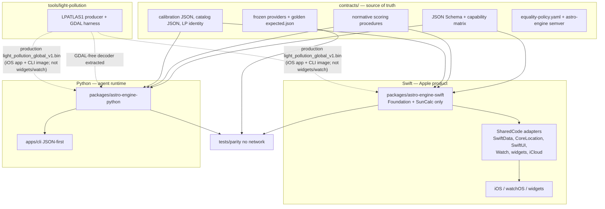
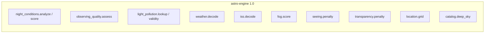
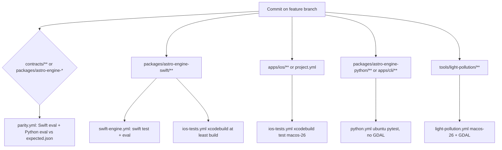

# Dual-Implementation Astro Engine: Contract-First iOS + Headless Python CLI

| Field | Value |
|---|---|
| **Document** | Dual-implementation Astro Engine architecture |
| **Author** | Design owner |
| **Date** | 2026-08-30 |
| **Status** | Living implementation roadmap |
| **Branch strategy** | One dedicated feature branch; many reviewable commits; **one eventual PR into `main`**. Do not land dual-engine work on `main` before the [feasibility gate](#feasibility-gate-grok-bot-vm). The branch may be abandoned wholesale. |
| **Resolved open questions** | 2026-08-30 — CLI is a local AGPL tool (no network wrap); production CLI **bundles** `light_pollution_global_v1.bin`; English copy out of parity; longer forecast horizon is CLI-only / out of contract |
| **Product** | Astro Viewing Conditions (iOS 18 / watchOS 11, Swift 6, AGPL-3.0) |
| **Current app version** | MARKETING_VERSION `2.3.1` (root `project.yml` today; `apps/ios/project.yml` after the relocation phase) |
| **Scope** | Architecture and implementation roadmap. This file **is** the roadmap: update it when implementation disproves an assumption or changes an architectural decision. Do not let the branch and this document diverge. |

---

## Overview

Astro Viewing Conditions is today a root-centric XcodeGen iOS/watch/widget product. Domain logic lives in `Sources/SharedCode`, but that module is a kitchen-sink: pure scoring (`ObservingQualityCalculator.assess`, `NightQualityAnalyzer`, `DefaultTargetRecommendationScorer`) sits beside Apple adapters (`CoreLocationSuitabilityResolver`, SwiftData `@Model SavedLocation` / `EquipmentItem`, SwiftUI presentation on `ViewingConditions` / `LocationScore`, WatchConnectivity, WidgetKit). CI already exists (`.github/workflows/ios-tests.yml` on `macos-26`). The only Python in the repo is `Tools/LightPollution/` (`light-pollution-harness`), an atlas **preprocessing** pipeline that already contains a GDAL-free LPATLAS1 decoder (`light_pollution/binary_format.py`), not a runtime observing engine.

This document proposes a **contract-first dual-engine** architecture:

1. A language-neutral **Astro Engine contract** is the source of truth. It is **not** a third runtime. It contains: capability matrix, engine semver, calibration/catalog **data**, golden fixtures, a field-level equality policy, input/output schemas for capabilities the CLI actually speaks, and **normative procedures only for product scoring algorithms** where prose is what stops Swift from becoming the oracle.
2. An idiomatic **Swift engine** (Foundation + SunCalc only) powers the existing iOS/watch/widget app.
3. An idiomatic **Python engine + headless JSON CLI** runs on a Linux VM (Grok Bot) as a deterministic capability API for an AI astronomer assistant.

The two implementations must reach **semantic parity** on in-contract capabilities given the same normalized inputs, including frozen provider envelopes (Open-Meteo, N2YO, LPATLAS1). Exact equality is required for integer scores, rankings, enums, and decoded provider DTOs (UUIDs, emoji, and English copy stripped). Astronomy-library floats live in a later capability slice, use explicit per-field tolerances, and must not feed live into integer product-score fixtures. **Swift must not silently become the source of truth**; fixtures and procedures are authored from the product rules, not dumped from whichever implementation is written first.

This is **not** “feature parity of the whole app,” not a second UI, not a 1:1 class mirror of `SharedCode`, and not a custom backend that the iOS app would call. iOS remains a no-backend, public-API + local-calculation product. The CLI is a local tool on the bot VM.

**Feasibility before breadth.** The main uncertainty is not whether Python can reproduce `ObservingQualityCalculator.assess`. It is whether a local CLI on the actual Grok Bot VM is installed, invoked unattended by a skill/routine, and consumed as JSON. A [vertical proof](#feasibility-gate-grok-bot-vm) of one real capability happens **before** SharedCode extraction and the rest of the 1.0 port. If that gate fails, abandon the feature branch.

**1.0 freeze (after the gate):** pure scoring + provider decode. Live astronomy, target-window computation, location.compare, and composed CLI hosts ship as `since: 1.1` once their hedges are gone.

---

## Background & Motivation

### Current state (verified)

| Area | Reality |
|---|---|
| Product | Open-source AGPL-3.0 SwiftUI app, iOS 18 + watchOS 11, Swift 6, XcodeGen via root `project.yml` (`xcodeVersion: "26.5"`), checked-in `AstroViewingConditions.xcodeproj`. |
| Data | Open-Meteo weather + geocoding; SunCalc SPM (`nikolajjensen/SunCalc`); optional N2YO ISS; curated local catalog (**29** deep-sky objects in `CuratedDeepSkyCatalogProvider` plus Moon and four planets); offline LPATLAS1 binary ~10 MiB bundled only in the iOS app (`Sources/AstroViewingConditions/Resources/LightPollution/light_pollution_global_v1.bin`). |
| Backend | None. Documented product principle in `PROJECT_DOCUMENTATION.md` and `FEATURES/FEATURE_ROADMAP.md`. |
| Air quality | **Not present.** Out of 1.0. Schema placeholder only if needed later. |
| CI | **Incumbent:** `.github/workflows/ios-tests.yml` runs on push/PR to `main`, `macos-26`, timezone `America/Los_Angeles`, `xcodegen generate` from repo root, then `xcodebuild test` on a dynamically selected iOS simulator. `build.sh` is a local `xcodebuild` wrapper and is **not** the CI definition. |
| Tests | `Tests/AstroViewingConditionsTests/` is one XCTest bundle mixing domain, widget presentation, and watch tests. The test target depends only on `AstroViewingConditions` (`project.yml`), so several “pure” calculator tests `@testable import AstroViewingConditions` (`FogCalculatorTests`, `GeographicGridGeneratorTests`, `WeatherServiceTests`, `ISSServiceTests`, `NightQualityAnalyzerTests`). |
| Python | `Tools/LightPollution/` is a Python 3.11+ atlas harness (`pyproject.toml` name `light-pollution-harness`). Tiny fixtures exist at `Tools/LightPollution/fixtures/` and are consumed by `BinaryLightPollutionProviderTests`. Runtime lookup already exists as GDAL-free `LightPollutionArtifact.lookup` in `light_pollution/binary_format.py`. Full harness (GeoTIFF / `osgeo`) is Mac-only Homebrew GDAL. |

### Pain points that make a naive dual implementation fail

1. **`SharedCode` is not a domain engine.** Phase 2 split Foundation DTOs **in place** (still under `Sources/SharedCode`; see [File-split map](#file-split-map-prerequisite-of-the-swift-package)), but the module still mixes engine types with Apple adapters:
   - `HourlyForecast`, `FogScore`, `SunEvents`, `MoonInfo`, `NightQualityAssessment`, `ISSPass`, `Coordinate`, and `CachedLocation` now live in dedicated Foundation files. SwiftUI `Color` helpers moved to `NightQualityColor.swift` / `LocationScore+Color.swift`. `NightQualityPresentation` stays Foundation-only (copy/tone), not a Color adapter.
   - `@Model SavedLocation` remains SwiftData; `SelectedLocation` stays with it. `CachedLocation.init(from: SavedLocation)` is an iOS host adapter on `SavedLocation.swift`, **not** on the extractable `CachedLocation.swift`. `@Model EquipmentItem` is now `EquipmentItem.swift` (`#if os(iOS)`); `Equipment.swift` is Foundation-only.
   - `NightQualityAssessment.calculatedScore` is a convenience that calls `NightConditionsScoring.publicScore` (same formula as the former `BestSpotSearcher.calculateScore` body). It does **not** call `BestSpotSearcher`. The property was kept because Watch/widget/iOS call sites are extensive; deleting it would be API churn with no extraction benefit.
   - `CuratedDeepSkyCatalogProvider` no longer calls `TargetImageManifest` at type-init. `DefaultTargetCatalogProvider` attaches credits when building `ObservableTarget` (`entry.image` wins, else the host manifest). iOS still loads pixels via `TargetImageRepository` by target id.
   - `EquipmentMatchingService` is in `Sources/SharedCode/Core/Models/EquipmentMatching.swift` (there is **no** `EquipmentMatchingService.swift`).
   - `LocationTimeZoneResolver` and `CoreLocationSuitabilityResolver` still depend on `CLGeocoder`.
   - `LocationManager` is CoreLocation + SwiftUI; `WidgetReloadService` imports WidgetKit.
   - `ISSService` `import CoreLocation` is **unused** (no `CLLocation`). That unused import is hygiene, not architectural coupling. The real Apple coupling in ISS is `URLSession` / actor hosting, not geocoding. Phase 2 did not clean it (not an engine-DTO file).
   - Remaining `import SunCalc` after Phase 2: `AstronomyService`, `MoonRecommendationService`, `NightQualityAnalyzer`. `BestSpotSearcher` had an unused `import SunCalc` (no `MoonPosition`/`SunTimes` call sites) and Phase 2 removed it. `BestSpotSearcher` still uses CoreLocation for `CLGeocoder`.
   Mirroring `SharedCode` class-for-class in Python would copy this contamination.

2. **Integer product scores currently depend on live astronomy-library floats and Calendar.** `NightQualityAnalyzer.analyzeNight` calls SunCalc `MoonPosition` / `MoonIllumination` per nighttime hour **and** consumes `sunEventsToday` / `sunEventsTomorrow` via `NightForecastFilter.calculateNightRange`, which copies twilight hour/minute into a location-zone `Calendar`. A 60 s twilight disagreement can drop or add an hourly forecast and change the public integer. `ConditionsProvider.fetchConditions` uses `Date()` for `startOfDay` and `fetchedAt`. Injecting only moon samples is not enough.

3. **Best Nearby land/water is not portable.** `CoreLocationSuitabilityResolver` reverse-geocodes with `CLGeocoder`, treats `placemark.ocean` / `inlandWater` as unsuitable, and caps checks at 40 (`BestSpotSearcher.maxSuitabilityCandidateChecks`). Ranking (`isHigherRanked`) also tie-breaks on `suitability.verificationRank`. That cannot be an implicit CLI invariant.

4. **Timezone identity is derived, not input.** `LocationTimeZoneResolver.resolve` uses `CLGeocoder` (4 s timeout) and falls back to `approximate(longitude:)` (15°/hour GMT offset). Open-Meteo is requested with `timezone=auto`. IANA timezone must be an explicit input on the contract side.

5. **Fixtures are trapped in Swift tests.** `WeatherServiceTests` and `ISSServiceTests` embed JSON strings (happy path, missing fields, negatives, offset-only timezone, short optional arrays, empty/nil ISS passes). OQ calibration anchors `(17.5, 8.0) … (21.75, 0.0)` are duplicated in `ObservingQualityCalculator` and `ObservingQualityCalculatorTests`. The catalog is a Swift array. Only LPATLAS1 already has a language-neutral fixture. Several Night Quality tests use `Calendar.current` (`NightQualityAnalyzerTests`, `BestSpotSearcherTests`, `AstronomyServiceTests`) and cannot be transcribed into timezone-fixed goldens without rewriting those tests.

6. **The existing Python tree is the wrong home for a CLI.** Putting an observing engine under `Tools/LightPollution/` or `Sources/` would confuse atlas preprocessing with runtime semantics and would pollute Xcode. `open_in_xcode.sh` currently runs `open -a Xcode .` (opens the **directory**), which is how Python files get dragged into the pbxproj. Changing it to open the `.xcodeproj` fixes that footgun.

7. **There is no behavioral contract.** Swift is the accidental oracle. Generating Python goldens from current Swift output would freeze Swift bugs and UI-adjacent copy as “the spec.” Schemas-without-procedures would leave `expected.json` as the real spec.

---

## Goals & Non-Goals

### Goals

- One GitHub monorepo containing the Apple product, a headless Python CLI + library, a language-neutral Astro Engine contract (including **normative scoring procedures**), cross-language parity tests, and the existing LP atlas preprocessing tool.
- Semantic parity for **in-contract capabilities** given identical normalized inputs and frozen provider payloads. No network in parity tests.
- Capability-catalog so iOS-only UI and agent-only tooling are not forced onto the other platform.
- Idiomatic Swift and idiomatic Python. Shared truth is semantics and procedures, not class names.
- Xcode remains clean: Python, venv, pytest, contracts, and tools never appear as Xcode groups. `open_in_xcode.sh` opens the `.xcodeproj`, not the directory.
- Independent `astro-engine` semantic version, reported by both products.
- Incremental, reviewable **commits on one feature branch** that satisfy the [iOS migration invariant](#ios-migration-invariant). Enable CI on that branch (today the workflow runs only on `main`).
- An explicit Grok Bot feasibility gate before extracting SharedCode or porting the rest of Astro.

### Non-goals

- A Python GUI, TUI, or SwiftUI rewrite.
- Making the iOS app a client of a remote Python service.
- Requiring Swift on the Grok Bot Linux VM (bot language is Python).
- 1:1 type/class mirroring of `SharedCode` in Python.
- Porting Field Mode, widgets, WatchConnectivity, MapKit, SwiftData, iCloud, or CLGeocoder land/water to the CLI.
- Wrapping the CLI as an HTTP/network service (it is a **local process** on the Grok Bot VM; AGPL §13 does not trigger).
- Treating `Tools/LightPollution` as the observing engine (the GDAL-free **decoder** may be extracted; the harness stays a tool).
- Optical FOV, mounts, cameras, or a full Messier/NGC dump.
- Implementing air quality; out of 1.0.
- Shipping live-astronomy or location.compare parity in 1.0.
- Putting English summary strings or a longer-than-3-day forecast horizon into 1.0 parity.

---

## Alternatives Considered

### A. Contract-first dual engine in one monorepo (recommended)

Two idiomatic implementations behind one language-neutral contract, plus a capability matrix.

| | |
|---|---|
| **Pros** | Matches the two real runtimes (Apple app, Linux bot VM). One branch/PR can change fixtures + Swift + Python together. No custom iOS backend. Each language stays idiomatic. Xcode can be isolated. Abandonable as a unit. |
| **Cons** | Dual maintenance. Drift risk. Golden files can become a shadow spec if generated from one implementation. |

Mitigations: capability matrix with a small 1.0 freeze, frozen inputs (moon **and** sun/night window **and** clock), normative procedures in `contracts/`, independent `expected.json` with `origin` tags, field-level equality, CI gates, engine-semver.

### B. Extract a Swift-only engine and run it on Linux

`SharedCode` cannot run on Linux as it exists (SwiftUI, SwiftData, CoreLocation, WidgetKit). A Foundation-only Swift package might compile on Linux Swift.org images; that has **not** been evaluated empirically in this repo (neither has macOS `swift test` of a package that does not yet exist).

| | |
|---|---|
| **Pros** | Single scoring implementation. No Python port of OQ/night formulas. |
| **Cons** | **The bot host language is Python** (product constraint). A Python wrapper around a Swift binary is still two artifacts, with a harder Linux deploy (runtime / static linking on an unmanaged VM). Widgets/watch cannot call that binary. Apple Foundation `Calendar` / `TimeZone` / `DateFormatter` vs Linux Foundation is the same class of gap the dual-engine equality policy already has to police — Linux Swift would not remove it. |

**Decision:** extract a pure Swift package for iOS cleanliness and **macOS** `swift test` CI. Do **not** reject Linux Swift because “SunCalc-on-Linux is unverified”; that is equally true of the new macOS package until it exists. Reject Swift-on-Linux **as the Grok Bot runtime** because the agent host is Python. Linux Swift remains an optional experiment *after* macOS `swift test` is green.

### C. Single Python engine; iOS as a remote client

Rejected for the iOS product (no custom backend, widgets/watch offline, AGPL network clause). The CLI may run on the bot VM without the iOS app calling it.

### D. Separate repositories (iOS vs CLI)

Rejected. Contract/fixture/semver coordination becomes cross-repo; semantic drift is the default. Xcode cleanliness is a layout problem, not a Git-boundary problem.

### E. Mirror Swift types 1:1 in Python

Rejected. Python is a library of functions/modules grouped by capability, not `class NightQualityAnalyzer`.

### F. Generate both implementations from a DSL

Rejected as premature.

---

## Recommended Target Architecture

**Capability-catalog / contract-first dual engine in a restructured monorepo**, with a **small 1.0 freeze**.



### Architectural rules

1. **The contract is the oracle**, not whichever implementation is written first. New **scoring** semantics: procedure + data + fixture + equality policy, then both implementations. At least one OQ fixture (and later one night-conditions fixture) must be arithmetic from the procedure with **no implementation in the loop**. Decode/catalog/grid do **not** get a parallel prose restatement of the code; fixtures + equality are enough.
2. **Capabilities, not apps.** A capability is a named, versioned function with JSON in/out.
3. **Prove the Grok Bot path first.** One real capability on the actual VM + skill, then extract SharedCode. See [feasibility gate](#feasibility-gate-grok-bot-vm).
4. **Inject provider I/O, clocks, moon samples, and night-window bounds** once night-conditions is in-contract. Production hosts fetch HTTP and call AstroEngine SunCalc samplers; scoring fixtures never call astronomy libraries. **SharedCode never `import SunCalc` after the package-extract phase.**
5. **Do not JSON-ify UI.** Field Mode, Dynamic Type, widget layout, WatchConnectivity, MapKit stay iOS-only.
6. **Split Foundation types out of SwiftUI/SwiftData files before creating the Swift package.** Isolation rules on `project.yml` paths are necessary but not sufficient.
7. **`contracts/data` is the only source-controlled copy of product numbers.** Do not commit generated copies into engine packages. Do not symlink. Tests and eval read `contracts/` via `CONTRACTS_ROOT`. Production bundles are **build artifacts** (see [Runtime data loading](#runtime-data-loading-no-committed-copies)).
8. **Extract the Swift package in the current root layout before moving `apps/ios/`**, and only **after** the feasibility gate. Prove `swift test` + XcodeGen local-package linking before path churn. Retarget the incumbent `ios-tests.yml`; do not invent a greenfield iOS workflow.
9. **This document is the roadmap.** When a phase disproves an assumption, edit this file in the same commit series. Do not accumulate silent drift between code and design.
10. **[iOS migration invariant](#ios-migration-invariant)** — no intentional iOS/watch/widget behavior change; existing tests are not weakened to land a refactor.

#### iOS migration invariant

Dual-engine work must introduce **no intentional user-visible or semantic behavior changes** to the existing iOS/watch/widget product.

- Existing tests are a regression safety net. They may be **mechanically adapted** when the architecture requires it (imports change from the app target to `AstroEngine`; test files move with the Apple product; embedded provider JSON moves into shared contract fixtures; helpers change because module/resource boundaries change).
- Those adaptations **preserve original behavioral assertions and expected values** unless there is an independently justified product-semantic change documented in this file.
- Do **not** delete, loosen, skip, or rewrite an existing assertion merely because the refactored code initially fails it.
- New engine/package/parity tests are **additive**; they do not replace existing iOS regression coverage.
- Every structural/extraction phase must leave the existing iOS product tests green and the actual iOS/watch targets compiling.
- Phase 13 (`apps/ios` tree relocation) remains **strictly behavior-free**.
- Before the eventual merge to `main`, run the **full existing iOS test suite** plus a **manual app smoke test**, in addition to engine/parity CI.

---

## Proposed Design

### 1. Monorepo vs separate repos

**Keep one monorepo.** The value of this work is coordinated semantic change. Separate repos optimize language purity and regress the requirement (one PR, one contract, two implementations).

### 2. Current layout cannot support this cleanly — but the move is not the first work

The current tree is an Apple app with a tools folder and a working iOS CI job. Problems: kitchen-sink `SharedCode`; tests import the app target; fixtures live in XCTest strings; `open -a Xcode .` directory open; Python only under `Tools/LightPollution`.

**Do not move to `apps/ios/` first. Do not extract SharedCode first.** Sequence:

1. **Feasibility vertical slice** (OQ contract + Python + minimal CLI + existing Swift XCTest + Grok Bot VM/skill). Gate.
2. Split Foundation types **in place** (still `Sources/SharedCode`).
3. Extract `packages/astro-engine-swift` **including** `NightQualityAnalyzer`, `NightForecastFilter` (helper), `calculateScore`, injected night window + 1:1 moon_series, **and** SunCalc-backed `MoonSampling`/`SunEventsSampling` so SharedCode can drop `import SunCalc`. XcodeGen gains a local package path while sources are still at repo root.
4. Only then relocate Apple sources to `apps/ios/` and retarget `.github/workflows/ios-tests.yml`.

### 3. Target repository tree

```
.
├── README.md
├── LICENSE
├── Makefile                         # `make parity`; optional `make bundle-engine-data` for local Swift prod builds
├── scripts/
│   ├── bundle-engine-data           # build-time copy contracts/data → untracked package/app resource dirs
│   └── parity                       # local macOS Swift eval + Python eval
├── open_in_xcode.sh                 # opens the .xcodeproj (not the directory)
├── build.sh
├── CODEOWNERS                       # contracts/ required reviewers
├── .github/workflows/
│   ├── ios-tests.yml                # INCUMBENT; retarget after the move; macos-26
│   ├── swift-engine.yml             # macOS-26, swift test + astro-engine-eval
│   ├── python.yml                   # ubuntu, engine + CLI pytest (no GDAL)
│   ├── parity.yml                   # contracts/** OR either engine package
│   ├── light-pollution.yml          # macos-26 + Homebrew GDAL; harness only
│   └── ios-nightly.yml              # unfiltered xcodebuild test
│
├── contracts/
│   ├── ENGINE_VERSION
│   ├── CHANGELOG.md
│   ├── capabilities.yaml
│   ├── equality-policy.yaml
│   ├── json-profile.md              # dates, finite numbers, null-vs-omitted, debug pretty-print
│   ├── procedures/                  # scoring algorithms ONLY; not decode/grid/catalog
│   │   ├── observing-quality.md     # required before feasibility gate
│   │   ├── night-conditions.md      # after gate
│   │   ├── calculate-score.md
│   │   ├── fog-seeing-transparency.md
│   │   └── target-scoring.md        # 1.1
│   ├── schemas/
│   ├── data/
│   │   ├── calibration/
│   │   ├── catalog/deep-sky.json
│   │   ├── orbital/schlyter-planets.json   # 1.1
│   │   └── identity/light-pollution-dataset.json
│   └── fixtures/
│       ├── providers/
│       └── capabilities/
│
├── packages/
│   ├── astro-engine-swift/
│   │   ├── Package.swift            # SunCalc resolved HERE only
│   │   ├── Sources/AstroEngine/
│   │   ├── Sources/AstroEngineEval/ # astro-engine-eval
│   │   └── Tests/AstroEngineTests/
│   └── astro-engine-python/
│       ├── pyproject.toml
│       ├── src/astro_engine/
│       └── tests/
│
├── apps/
│   ├── ios/                         # after the relocation phase
│   │   ├── project.yml              # no SunCalc URL; depends on AstroEngine package
│   │   ├── AstroViewingConditions.xcodeproj/
│   │   ├── Sources/…
│   │   └── Tests/AstroViewingConditionsTests/   # UI, watch, widgets, adapters only
│   └── cli/
│
├── tests/parity/
│   ├── parity_runner.py
│   └── compare.py                   # field-level compare using equality-policy.yaml
│
└── tools/light-pollution/           # moved Tools/LightPollution in the relocation phase
```

**Gitignore:** SwiftPM’s vendor directory is `/Packages/`. On case-insensitive volumes that also matches `packages/`, so `.gitignore` must re-include `!/packages/` or the engine trees are invisible to git.

**Xcode isolation rules:**

- After the move, `apps/ios/project.yml` may only list paths under `apps/ios/Sources`, `apps/ios/Tests`, and the local package `../../packages/astro-engine-swift`.
- No glob of repo-root `Sources/`.
- Python, `contracts/`, `tools/`, `.venv`, `__pycache__` never appear as Xcode groups.
- `open_in_xcode.sh` runs `xcodegen` if needed and `open <path-to>/AstroViewingConditions.xcodeproj`.
- Keep XcodeGen as the Apple project generator.
- **Only one SunCalc resolution:** `packages/astro-engine-swift/Package.swift`. SharedCode / the app link AstroEngine; they do **not** redeclare the SunCalc URL and **must not** `import SunCalc` (SPM does not re-export it). 1.0 AstroEngine owns `MoonSampling` + `SunEventsSampling` with SunCalc-backed implementations. Host `AstronomyService` only **wires** those samplers and keeps Foundation-only `approximateSunEvents`. Unused SunCalc in 1.0 (samplers not on the parity allow-list) is acceptable: 1.1 live astronomy lives in the same package.

watchOS continues to link AstroEngine for scoring only and **must not** embed the 10 MiB atlas (unchanged from `CROSS_SURFACE_ARCHITECTURE.md`).

---

### File-split map (prerequisite of the Swift package)

Do this **in place** before `Package.swift` exists. Engine XCTest must `import AstroEngine` only. Ban `@testable import AstroViewingConditions` for moved types.

| Current file | Extract to AstroEngine (Foundation) | Stay in SharedCode / iOS adapters |
|---|---|---|
| `Models/ViewingConditions.swift` | Already split in place: `HourlyForecast.swift`, `SunEvents.swift`, `MoonInfo.swift`, `FogScore.swift`, `ISSPass.swift`, `NightQualityAssessment.swift`. Equality DTO still **omits** `HourlyForecast.id`, `MoonInfo.phaseName`/`emoji`, FogFactor English, `Trend.icon`/`label`. `calculatedScore` stays as a convenience wrapping `NightConditionsScoring.publicScore` | `ViewingConditions` host aggregate remains a Codable snapshot (`import Foundation` only). SwiftUI `Color` / `scoreColor` / `scoreLabel` → `NightQualityColor.swift` (Watch/widgets need SharedCode). Do **not** put Color on `NightQualityPresentation` (that file is Foundation copy/tone). `analyzeConditions(_ ViewingConditions)` wrapper |
| `Models/SavedLocation.swift` | `Coordinate.swift` and `CachedLocation.swift` are Foundation-only / engine-extractable (optional `id` omitted from equality DTO). `CachedLocation.swift` must **not** reference `SavedLocation` | `@Model SavedLocation`, `SelectedLocation`, SwiftData ordering, and the iOS host adapter `CachedLocation.init(from: SavedLocation)` on `SavedLocation.swift`. `ViewingConditions`'s `SavedLocation` convenience init stays host-side with the aggregate |
| `Models/LocationScore.swift` | File is Foundation-only after Phase 2 (`LocationSuitabilityStatus`, `BestSpotScoringMode`, `LocationScore`, `BestSpotResult` stay together). Equality DTO still **omits** `id` / `summary` / Color | SwiftUI `LocationScore.color` → `LocationScore+Color.swift`. String `scoreColor` and English `label` / `lightPollutionUnavailableMessage` stay on the Foundation types (not SwiftUI) |
| `Models/Equipment.swift` | File is Foundation-only after Phase 2: `EquipmentType`, `EquipmentApertureUnit`, `EquipmentDraft`, `EquipmentValidation`. `EquipmentCapability` already had its own file | `@Model EquipmentItem` + persisted snapshot/validation → `EquipmentItem.swift` (`#if os(iOS)` stays) |
| `Models/EquipmentMatching.swift` | Entire `EquipmentMatchingService.match` structured result (`level`, `reason`, `mode`, apertures). **Equality omits `explanation`** | Host formats `explanation` strings |
| `Models/TargetEquipmentRequirements.swift` | Entire file | — |
| `Models/ObservableTarget.swift` | Domain fields; image credit **id** only. Do not move `TargetImageCredit` presentation metadata into the engine DTO | iOS image loading; host may attach `TargetImageCredit` when building recommendations |
| `Models/ObservingQualityAssessment.swift` | Entire file | — |
| `Models/LightPollutionDatasetIdentity.swift` | Entire file | — |
| `Services/ObservingQualityCalculator.swift` path: `Utilities/ObservingQualityCalculator.swift` | Entire file | — |
| `Utilities/NightQualityAnalyzer.swift` | `analyzeNight` taking already-windowed or inject-clipped forecasts + **required 1:1 `moon_series`** + injected `night_window` + tz. **No** `import SunCalc` in this type. | Host wrapper `analyzeConditions(_ ViewingConditions)` that supplies window + samples |
| `Utilities/NightQualityAnalysisRules.swift` | Entire file (enums; `summaryText` is presentation, omitted from equality) | — |
| `Utilities/NightForecastFilter.swift` | Entire file as a **separately tested helper** (sun events + local start-of-day → filter window). 1.0 `night_conditions.analyze` does **not** call it live | — |
| `Utilities/SeeingCalculator.swift`, `TransparencyCalculator.swift`, `FogCalculator.swift` | Entire files | — |
| `Utilities/GeographicGridGenerator.swift` | Entire file. Phase 2 already deleted the unused `import CoreLocation`. `GridPoint` stays here | — |
| `Services/WeatherService.swift` | `OpenMeteoResponse`, `HourlyData`, `parseHourlyForecasts` (pure decode + time parser). Protocol `WeatherForecastProviding` | Actor + `dataLoader` + HTTP + timeouts |
| `Services/ISSService.swift` | `N2YOResponse` decode → `[ISSPass]` | Actor + `dataLoader` + URL builder + API key encoding |
| `Services/BinaryLightPollutionProvider.swift`, `LightPollutionProviding.swift`, `ModeledZenithBrightnessValidity.swift` | Entire files | `BundledLightPollutionResource` (CryptoKit SHA-256, app bundle) |
| `Services/ObservingQualityService.swift` | Pure assess-after-lookup | Bootstrap / session wiring |
| `Services/DeepSkyCatalogService.swift` | Curated catalog **data** (`DeepSkyCatalogEntry` identity/fields, `CuratedDeepSkyCatalogProvider`). Engine catalog does **not** depend on `TargetImageManifest` and must **not** own `TargetImageCredit` presentation metadata. SharedCode may keep optional `DeepSkyCatalogEntry.image` temporarily so injected providers can supply a credit; Phase 3 must not copy that compatibility field into AstroEngine merely because it exists today. Split this file on extract: curated data moves; host mapping stays | `DefaultTargetCatalogProvider` host mapping (`entry.image ?? TargetImageManifest.image(for: id)`), `TargetImageManifest`, iOS images (`TargetImageRepository` loads pixels by target id) |
| `Services/TargetRecommendationService.swift` | `DefaultTargetRecommendationScorer` (1.1 fixtures) | Service orchestration, debug logger |
| `Services/BestSpotSearcher.swift` | `NightConditionsScoring.publicScore` (already the formula owner; `BestSpotSearcher.calculateScore` is a one-line wrapper); `isHigherRanked` total order (1.1); coherent mode selection | `CoreLocationSuitabilityResolver`, search actor, progress, 40-check cap, English `generateSummary`. Phase 2 already deleted unused `import SunCalc`. Remaining Apple coupling is real `CLGeocoder` / `CLLocation`, not SunCalc |
| `Utilities/LocationTimeZoneResolver.swift` | `calendar(for:)` Gregorian+tz; **not** `resolve` / `approximate` | `CLGeocoder` resolve + longitude fallback (iOS host) |
| `Utilities/AdaptiveFont.swift`, `BestSpotSettings.swift` | Geometry defaults (radius/spacing numbers) may live in calibration JSON | SwiftUI / AppGroup persistence |
| `Services/AstronomyService.swift` | **1.0:** `MoonSampling` + `SunEventsSampling` protocols and `SunCalcMoonSampler` / `SunCalcSunEventsSampler` (the only `import SunCalc` in the iOS tree). Polar missing-times stay out of the sampler. | Host actor: injects samplers, maps missing SunCalc times through Foundation-only `approximateSunEvents` (`hosts: [ios]`). **Never `import SunCalc`.** |
| `Services/PlanetRecommendationService.swift` | `PlanetOrbitalElements` algorithm + coefficients (1.1) | Recommendation copy |
| `Services/MoonRecommendationService.swift` | SunCalc-backed `MoonAstronomyProviding` implementation **moves into AstroEngine in the package-extract phase** (even though live moon recommend is 1.1) so SharedCode does not keep `import SunCalc` | Host orchestration / copy only |
| Watch / widget / App Group / iCloud / `LocationManager` | — | All stay |

`NightQualityAssessment.calculatedScore` no longer calls `BestSpotSearcher`. It is a convenience wrapping `NightConditionsScoring.publicScore(_ assessment)`. Callers may use either; there is one implementation. Do not delete the property in a later phase unless the Watch/widget/iOS call sites are migrated for a real API reason.

After the package-extract phase, `rg 'import SunCalc' Sources/` (Apple tree) must be empty. Remaining SharedCode importers after Phase 2: `AstronomyService`, `MoonRecommendationService`, `NightQualityAnalyzer`. `BestSpotSearcher` is **not** a SunCalc rewrite. Do not `@_exported import SunCalc` and do not leave a SharedCode adapter that calls `MoonPosition.compute()`.

---

### 4. What is Swift-only, Python-only, or in-contract

#### 1.0 in-contract (must have fixtures + both implementations + eval without the iOS app)



| Capability ID | Current Swift locus | Equality |
|---|---|---|
| `weather.decode` | `WeatherService.parseHourlyForecasts` | Exact DTO: omit `HourlyForecast.id` (`UUID()`). Times exact under the [Open-Meteo time parser](#open-meteo-time-parser). Skip malformed times. **Bot-facing 1.0 information surface:** structured hourly weather (time, cloud cover, humidity, temperature, dew point, wind speed/direction, visibility, precipitation, layered clouds, seeing/transparency inputs). Do not duplicate this inside night scoring. |
| `iss.decode` | `ISSService` decode path | Exact `ISSPass` DTO including deterministic `id`; empty array vs missing `passes` as in Swift (`[]` vs no-key → `[]` output either way after map). |
| `night_conditions.analyze` | `NightQualityAnalyzer.analyzeNight` | Exact DTO given injected `night_window` + **1:1 `moon_series`** + clock/tz. See [Night conditions procedure](#night-conditions-analyzenight). Omit `HourlyRating.id`, English `summary`, `Trend.label`/`icon`, **`best_window`**. **Bot-facing:** `hourly_ratings` is first-class objective data (time, score, cloud, fog, moon illumination/altitude, wind, optional seeing/transparency), not merely an input to the aggregate `public_score`. |
| `night_conditions.score` | `BestSpotSearcher.calculateScore` | Integer exact. |
| `observing_quality.assess` | `ObservingQualityCalculator.assess` | Integer `score` exact. Anchor penalties abs 1e-12. Interpolated penalties abs 1e-9 (matches `ObservingQualityCalculatorTests` home/stub). |
| `light_pollution.lookup` | `BinaryLightPollutionProvider.modeledZenithSkyBrightness` | Exact dequantized value for fixture coordinates (existing tiny-bin lookups). |
| `light_pollution.validity` | `ModeledZenithBrightnessValidity`, `LightPollutionDatasetIdentity` | Exact (1000 m haversine, `[13.0, 22.5]`, identity triple). |
| `fog.score` | `FogCalculator.calculate` | Integer exact; factor **enum set** exact (not English). |
| `seeing.penalty` | `SeeingCalculator.penalty` | Exact optional number (abs 1e-12; these are small discrete tables). |
| `transparency.penalty` | `TransparencyCalculator.penalty` | Same. |
| `location.grid` | `GeographicGridGenerator.generateGrid` | Equality on discrete `(northStep, eastStep)` lattice plus center/boundary bearings. Derived lat/lon abs **1e-4 deg** (~11 m), matching `GeographicGridGeneratorTests`. Not 1e-9 deg. |
| `catalog.deep_sky` | `CuratedDeepSkyCatalogProvider` | Exact JSON round-trip of the 29 entries (image **id** only). |

#### 1.1 in-contract (hedges removed first)

| Capability ID | Notes |
|---|---|
| `geocoding.decode` | Open-Meteo search JSON. Not needed to prove scoring. |
| `astronomy.sun_events` | **Required Grok Bot product capability** (1.1). Live skyfield/SunCalc; times ±60 s. Sunset, civil/nautical/astronomical twilight, astronomical night start/end, sunrise. **Polar missing-times / `approximateSunEvents`:** `hosts: [ios]`, not in Python 1.1. Live suite **must not** assert product integers. Not implemented in Phase 6. |
| `astronomy.moon_info` / `astronomy.moon_series` | **Required Grok Bot product capabilities** (1.1). Illumination, altitude, useful phase identity, waxing/waning if the engine already models it, hourly altitude/illumination through the observing period; moonrise/moonset only if the astronomy capability formally supports those events. Altitude ±0.5°; illumination integer ±1. Phase name/emoji omitted. Not fed live into integer fixtures. Not implemented in Phase 6. |
| `astronomy.planet_positions` | Exact **after** Schlyter procedure is written in `contracts/procedures/` and coefficients are JSON. Until then, `equality: n/a`. |
| `targets.windows` | Prefer frozen alt/az samples; live windows are 1.1 astronomy. |
| `targets.recommend` | Integer scores + sort order exact given **precomputed windows**. |
| `equipment.match` | `level` / `reason` / `mode` exact. `explanation` **never** in equality (host copy). |
| `location.compare` | Full [total order](#locationcompare-total-order-11). Suitability is an **injected overlay** (default all `unchecked`). Omit `id` and `summary`. |

#### Grok Bot information surface (objective engine facts, not one mega-capability)

The Bot must answer astronomy-planning questions from objective Astro Engine data, not merely return aggregate scores. Astro Engine owns deterministic facts and calculations. Grok owns subjective interpretation and conversational reasoning across those facts. Do **not** collapse weather, darkness timing, Moon context, and scored hours into one “conditions” capability.

Intended composition:

```text
weather.decode
+ astronomy.sun_events
+ astronomy.moon_info / astronomy.moon_series
+ night_conditions.analyze
→ Grok reasoning/planning
```

Grok should not reimplement astronomical-night calculations, Moon astronomy, weather normalization, or scoring logic.

| Surface | Capability | Version | Phase 6 |
|---|---|---|---|
| Normalized hourly weather | `weather.decode` | 1.0 | Not implemented (Phase 8). Documented as Bot-facing now. |
| Scored hourly observing conditions | `night_conditions.analyze` `hourly_ratings` | 1.0 | Implemented in the Python library (CLI allow-list still F2-only). |
| Astronomical darkness timing | `astronomy.sun_events` | 1.1 | Required Bot product capability. Not implemented. |
| Moon context | `astronomy.moon_info`, `astronomy.moon_series` | 1.1 | Required Bot product capabilities. Not implemented. |

Do not add English summaries to parity. Do not invent phase emoji or presentation copy.

#### Swift / iOS only (out of contract)

Field Mode, Dynamic Type, SwiftData, GPS, MapKit, `CoreLocationSuitabilityResolver` and the 40-check cap, `LocationTimeZoneResolver.resolve` via `CLGeocoder`, WatchConnectivity, widgets, App Group, iCloud, bundled images, `approximateSunEvents`, English summaries, SwiftUI colors. `ISSService` unused `import CoreLocation` is not an in-contract concern.

#### Python / CLI only (out of contract)

Argparse/typer, env, `--atlas-path` (defaults to the bundled production LPATLAS1 on the bot VM), stdin/stdout framing, `--pretty`, logging, HTTP client, composed `agent.conditions` / `agent.batch_compare` (1.1), `agent.forecast_horizon` (CLI-only longer Open-Meteo fetch; out of contract), `--suitability-json` overlay file.

---

### JSON profile (parity is parsed, not byte-for-byte)

On-disk fixtures are pretty-printed (2-space indent, trailing newline) for review. Eval stdout is compact unless `--pretty`. **Comparison never string-compares whole documents**; it parses JSON and applies `equality-policy.yaml`. Numeric fields compare as numbers (`72` and `72.0` are equal). Extra keys fail.

Keep these rules — they affect correctness or debuggability:

| Rule | Why |
|---|---|
| UTF-8, no BOM | Interop |
| Finite numbers only; reject `NaN` / `±Inf` at encode | Invalid / non-portable JSON |
| Dates as ISO-8601 UTC `YYYY-MM-DDTHH:MM:SSZ` (integer seconds, always `Z`) | Swift `JSONEncoder` default is **not** ISO-8601 (reference-date seconds). That would silently break interoperability. Custom `dateEncodingStrategy` is required. |
| `null` vs omitted is distinct | Meaningful for OQ fallback (`light_pollution: null`), empty-night half-scores, and `weather.decode` `timezone` (`string \| null`, always present) vs per-hour optionals (omit when nil) |
| Extra keys fail | Drift detection |
| `--pretty` uses 2-space indent + sorted keys | Human diffs of CLI stdout; **not** an equality requirement |

Do **not** treat RFC 8785 / UTF-16 key order / shortest-round-trip float serialization / “integers must encode without `.0`” as correctness requirements. Those belong only as optional debug encoder settings. `equality-policy.yaml` is the spec for pass/fail.

Swift eval encoder (debug/pretty only needs sorted keys):

```swift
let encoder = JSONEncoder()
encoder.outputFormatting = pretty ? [.prettyPrinted, .sortedKeys] : [.sortedKeys]
encoder.dateEncodingStrategy = .iso8601UTCZ // yyyy-MM-dd'T'HH:mm:ss'Z', POSIX, GMT
encoder.nonConformingFloatEncodingStrategy = .throw
```

Python:

```python
json.dumps(obj, allow_nan=False, sort_keys=pretty, indent=2 if pretty else None)
```

---

### Equality policy

`contracts/equality-policy.yaml` is the comparator table. Fixtures set `equality: <policy-id>` (not a slogan). Unknown fields fail closed.

```yaml
# contracts/equality-policy.yaml
version: 1
default:
  extra_keys: fail
  missing_keys: fail
  arrays: ordered
  null_vs_omitted: distinct

policies:
  exact_dto:
    description: Canonical DTO, no floats with tolerance
    fields:
      "**": exact

  observing_quality:
    fields:
      score: exact
      night_conditions_score: exact
      light_pollution: null_or_object
      light_pollution.modeled_zenith_sky_brightness: abs_1e9
      light_pollution.base_penalty: abs_1e9   # interpolated; anchors also satisfy 1e-12
      light_pollution.applied_penalty: abs_1e9
      # omitted: any presentation

  observing_quality_anchor:
    fields:
      light_pollution.base_penalty: abs_1e12
      light_pollution.applied_penalty: abs_1e12
      score: exact
      night_conditions_score: exact

  night_conditions:
    fields:
      rating: exact
      night_start: exact          # ISO-8601 Z; first included hour (or injected window if empty)
      night_end: exact            # last included hour (or injected window if empty)
      trend: exact                # improving|stable|degrading
      first_half_score: null_or_abs_1e9   # 0 for <4 hours; null only for empty night
      second_half_score: null_or_abs_1e9
      # never emit: best_window, id, summary, icon, label
      details.cloud_cover_score: abs_1e9
      details.fog_score_avg: abs_1e9
      details.moon_illumination_avg: exact    # integer
      details.wind_speed_avg: abs_1e9
      details.seeing_score_avg: optional_abs_1e9   # omit when no defined seeing hours
      details.transparency_score_avg: optional_abs_1e9
      hourly_ratings[].time: exact
      hourly_ratings[].score: abs_1e9
      hourly_ratings[].cloud_cover: exact
      hourly_ratings[].fog_score: exact
      hourly_ratings[].moon_illumination: exact
      hourly_ratings[].moon_altitude: abs_1e9   # injected, not live lib
      hourly_ratings[].wind_speed: abs_1e9
      hourly_ratings[].seeing_score: optional_abs_1e9   # omit when SeeingCalculator returned nil
      hourly_ratings[].transparency_score: optional_abs_1e9
      public_score: exact
      # omitted: id, summary, icon, label, Color, best_window

  weather_decode:
    fields:
      timezone: exact            # always present; JSON null if Open-Meteo omitted IANA
      utc_offset_seconds: exact  # always present
      hourly[].time: exact
      hourly[].cloud_cover: exact
      hourly[].humidity: exact
      hourly[].wind_speed: abs_1e12
      hourly[].wind_direction: exact
      hourly[].temperature: abs_1e12
      hourly[].dew_point: abs_1e12
      hourly[].visibility: abs_1e12
      hourly[].low_cloud_cover: exact
      hourly[].mid_cloud_cover: exact
      hourly[].high_cloud_cover: exact
      hourly[].wind_speed_200hpa: abs_1e12
      # omitted: id

  light_pollution_lookup:
    fields:
      modeled_zenith_sky_brightness: abs_1e9   # dequantized; tiny-bin JSON uses ~1e-9 already

  grid:
    fields:
      points[].north_step: exact
      points[].east_step: exact
      points[].is_center: exact
      points[].bearing_deg: abs_1e9
      points[].distance_miles: abs_1e9
      points[].latitude: abs_1e4
      points[].longitude: abs_1e4

  location_compare:   # 1.1
    fields:
      scoring_mode: exact
      ranking: ordered_ids        # candidate keys, not UUID
      locations[].public_score: exact
      locations[].night_conditions_score: exact
      locations[].avg_cloud_cover: abs_1e9
      locations[].fog_score: exact
      locations[].avg_wind_speed: abs_1e9
      locations[].suitability: exact
      locations[].north_step: exact
      locations[].east_step: exact
      # omitted: id, summary
```

Comparators: `exact` (JSON equal; numbers compared numerically so `72` equals `72.0`), `abs_1e12` / `abs_1e9` / `abs_1e4` (absolute), `null_or_object`, `null_or_abs_1e9` (`null` matches `null`; number uses abs 1e-9), `optional_abs_1e9` (both omit → pass; both numbers → abs 1e-9; omit vs number → fail; do not encode JSON `null` for these), `ordered_ids`. No relative/ULP in 1.0 unless a fixture overrides in `meta.yaml`.

**Canonical DTO rule:** eval output never includes `id` UUIDs, emoji, `phaseName`, English `summary`/`explanation`/`label`/`icon`, or SwiftUI-only fields. `ISSPass.id` is a deterministic string and **is** included.

---

### Fixture loader and `CONTRACTS_ROOT`

All four consumers (SPM tests, leftover iOS adapter tests, Python, eval CLIs) use the same root discovery:

1. If `CONTRACTS_ROOT` is set, it must be a directory containing `ENGINE_VERSION`. Else fail.
2. Else walk ancestors of `#filePath` / `__file__` until `contracts/ENGINE_VERSION` is found (repo-root independent of how many levels deep the test file lives — **do not** hardcode “up three levels”).
3. Provider `$ref` is **not** JSON Schema `$ref`. It is a POSIX-relative path under `contracts/fixtures/` only. Resolution: `normpath(contracts/fixtures + ref)`; if the result is not still under `contracts/fixtures/`, fail with `error.code = ref_escape`. No URLs, no `..` escape, no symlinks followed out of that tree (`lstat` + reject symlink if target escapes).
4. Missing file → fail (`error.code = fixture_missing`).
5. Fixtures are **never** copied into package resources. Calibration **data** is also not a source-controlled copy inside packages; see [Runtime data loading](#runtime-data-loading-no-committed-copies).
6. CI exports `CONTRACTS_ROOT=${GITHUB_WORKSPACE}/contracts`.

Swift helper (`AstroEngine/FixtureRoot.swift`, usable from tests and eval):

```swift
public enum FixtureRoot {
    public static func contractsDirectory() throws -> URL {
        if let env = ProcessInfo.processInfo.environment["CONTRACTS_ROOT"], !env.isEmpty {
            let url = URL(fileURLWithPath: env, isDirectory: true)
            try requireEngineVersion(at: url)
            return url
        }
        var dir = URL(fileURLWithPath: #filePath)
        for _ in 0..<16 {
            dir.deleteLastPathComponent()
            let candidate = dir.appendingPathComponent("contracts", isDirectory: true)
            if FileManager.default.isReadableFile(atPath: candidate.appendingPathComponent("ENGINE_VERSION").path) {
                return candidate
            }
        }
        throw EngineError.contractsRootNotFound
    }
}
```

Python mirrors this in `astro_engine.fixtures.contracts_root()`.

---

### Contract surface (what is justified)

`contracts/` must prevent silent Swift/Python divergence **without** becoming a third implementation of the engine.

| Artifact | Keep? | Role |
|---|---|---|
| `capabilities.yaml` + `ENGINE_VERSION` | Yes | Cheap. Defines what parity even means. |
| `contracts/data/**` (anchors, catalog, LP identity) | Yes | Single source of product numbers. |
| Fixtures + `expected.json` + `equality-policy.yaml` | Yes | **This** is the anti-oracle mechanism. Both engines are scored against the fixture, not against each other and not against Swift dumps. |
| Input/output JSON Schema for CLI-spoken capabilities | Yes, incrementally | Validate CLI envelopes. Write schemas when the capability is implemented, not a complete universe on day one. |
| Normative **procedures** | **Only for product scoring algorithms** | OQ, night-conditions, `calculateScore`, fog/seeing/transparency, later target scoring. Required so `expected.json` can be hand-authored from the formula. |
| Procedures for `weather.decode`, `iss.decode`, `location.grid`, `catalog.deep_sky`, LP lookup | **No** | Fixtures + equality (and existing `BINARY_FORMAT.md`) are the spec. Prose would duplicate code. |
| Full RFC-style JSON canonicalization | **No** | See JSON profile. |

New scoring semantics still follow: procedure + data + fixture, **then** both implementations. Decode semantics: frozen payload + expected DTO + equality policy.

---

### 5. Shared conformance fixtures

Each fixture is a directory:

```
contracts/fixtures/capabilities/observing-quality/home-backyard-v1/
  input.json
  expected.json
  meta.yaml
```

**`$ref` loader:** `"$ref": "providers/open-meteo/forecast/beaverton-2026-02-19.json"` resolves under `contracts/fixtures/` as specified above.

#### Worked fixture: observing quality (hand arithmetic, `origin: manual`)

`meta.yaml`:

```yaml
capability: observing_quality.assess
engine_semver: ">=0.1.0 <2.0.0"
equality: observing_quality
hosts: [swift, python]
origin: manual
procedure: contracts/procedures/observing-quality.md#home-backyard-manual-arithmetic
notes: "Home sample from ObservingQualityCalculatorTests; expected computed from piecewise-linear formula, not from Swift dump"
```

`input.json`:

```json
{
  "capability": "observing_quality.assess",
  "injected": {
    "modeled_zenith_sky_brightness": 18.5896816253662,
    "night_conditions_score": 72
  }
}
```

`expected.json` is the domain result. Runtime envelopes still report `engine_semver`; that value is checked against `meta.yaml`'s range, not against this golden:

```json
{
  "capability": "observing_quality.assess",
  "ok": true,
  "result": {
    "light_pollution": {
      "applied_penalty": 5.911218516031919,
      "base_penalty": 6.820636749267599,
      "modeled_zenith_sky_brightness": 18.5896816253662
    },
    "night_conditions_score": 72,
    "score": 66
  }
}
```

Worked arithmetic (normative; no implementation in the loop):

- Brightness 18.5896816253662 sits between anchors `(18.5, 7.0)` and `(19.5, 5.0)`.
- `t = (18.5896816253662 − 18.5) / (19.5 − 18.5) = 0.0896816253662`
- `base_penalty = 7.0 + t × (5.0 − 7.0) = 6.8206367492676` (abs 1e-9 vs `ObservingQualityCalculatorTests` `6.820636749267599`)
- Night score 72 sits between usability anchors `(65, 0.75)` and `(80, 1.00)`.
- `t_w = (72 − 65) / (80 − 65) = 7/15`
- `weight = 0.75 + (7/15) × 0.25 = 0.8666…` — **not** the 65-anchor weight 0.75
- `applied = 6.820636749267599 × 13/15 = 5.911218516031919`
- `score = Int((72 − applied).rounded()) = Int(66.088….rounded()) = 66` (`rounded()` then `Int`, as in `ObservingQualityCalculator.assess`)

Exact-anchor fixtures `anchor-*-v1` use night-conditions score `80` (usability weight 1) and `equality: observing_quality_anchor`. Additional F1 boundary goldens: usability weight 0 at night 35 (LP present, applied 0); inclusive brightness `13.0` / `22.5`; `12.999` out of range; night-score clamp at 150 and −5. `unavailable-brightness-v1` covers JSON-null brightness.

#### Worked fixture: weather.decode (`origin: manual`, transcribed from existing tests)

`contracts/fixtures/providers/open-meteo/forecast/missing-fields.json` + capability wrapper `weather-decode/missing-fields/`:

Existing XCTest cases **must** become named fixtures in the decode phase (see [Implementation Plan](#implementation-plan)). `HourlyForecast.id` is not in `expected.json`.

Example `expected.json` for the happy-path two-hour payload (`utc_offset_seconds: -28800`, no `timezone` key — offset-only):

```json
{
  "capability": "weather.decode",
  "ok": true,
  "result": {
    "hourly": [
      {
        "cloud_cover": 50,
        "dew_point": 8.5,
        "humidity": 80,
        "temperature": 12.5,
        "time": "2026-02-19T08:00:00Z",
        "visibility": 10000.0,
        "wind_direction": 180,
        "wind_speed": 5.5
      },
      {
        "cloud_cover": 75,
        "dew_point": 8.3,
        "humidity": 85,
        "temperature": 12.3,
        "time": "2026-02-19T09:00:00Z",
        "visibility": 9500.0,
        "wind_direction": 190,
        "wind_speed": 6.2
      }
    ],
    "timezone": null,
    "utc_offset_seconds": -28800
  }
}
```

Times are stored as UTC instants after applying `utc_offset_seconds` (−28800 ⇒ `2026-02-19T00:00` local = `2026-02-19T08:00:00Z`). **`timezone` is always present** (`null` here: offset-only payload). Per-hour nil optionals (`dew_point`, layers, …) are omitted.

#### Night-conditions 1.0 fixtures (injected window + 1:1 moon)

1.0 `night_conditions.analyze` **does not** call `NightForecastFilter` or SunCalc. Input **must** include:

| Field | Rule |
|---|---|
| `clock` | Instant. Local observing date is `startOfDay(clock)` in `time_zone` (Gregorian). Needed so hosts stay deterministic; clipping uses `night_window`, not raw `clock`. |
| `time_zone` | IANA. Required. |
| `injected.night_window.start` / `.end` | Filter half-open `[start, end)` used to clip `forecasts`. **Not** copied into the output `night_start`/`night_end` unless the night is empty. |
| `injected.forecasts` | Hourly rows (may extend outside the window; engine clips). |
| `injected.moon_series` | **One object per included forecast hour**, keyed by exact `time` ISO-8601 `Z` equal to `forecast.time`. Missing timestamp → envelope `ok: false`, `error.code: validation` (not altitude 0, not interpolate). Extra moon samples ignored. |

`NightForecastFilter` is a **separately tested helper** (unit tests in AstroEngine, not a 1.0 capability): inputs = `sun_events_today` / `tomorrow` + `date` = local start-of-day + calendar. It copies twilight **hour/minute** onto that start-of-day / next day (`NightForecastFilter.swift`). Live `astronomy.sun_events` fixtures are 1.1 and **must not** set `public_score`.

Worked `origin: manual` fixture `night-conditions/four-clear-hours-v1` (not the empty-`forecasts` sketch; that path is `public_score` **20**):

`meta.yaml`:

```yaml
capability: night_conditions.analyze
engine_semver: ">=1.0.0 <2.0.0"
equality: night_conditions
hosts: [swift, python]
origin: manual
procedure: contracts/procedures/night-conditions.md#four-clear-hours
```

`input.json`:

```json
{
  "capability": "night_conditions.analyze",
  "clock": "2026-03-01T12:00:00Z",
  "time_zone": "UTC",
  "location": { "lat": 45.0, "lon": -122.0 },
  "injected": {
    "night_window": {
      "start": "2026-03-01T20:00:00Z",
      "end": "2026-03-02T05:00:00Z"
    },
    "forecasts": [
      {
        "time": "2026-03-01T21:00:00Z",
        "cloud_cover": 0,
        "humidity": 0,
        "wind_speed": 3.0,
        "wind_direction": 0,
        "temperature": 15.0
      },
      {
        "time": "2026-03-01T22:00:00Z",
        "cloud_cover": 0,
        "humidity": 0,
        "wind_speed": 3.0,
        "wind_direction": 0,
        "temperature": 15.0
      },
      {
        "time": "2026-03-01T23:00:00Z",
        "cloud_cover": 0,
        "humidity": 0,
        "wind_speed": 3.0,
        "wind_direction": 0,
        "temperature": 15.0
      },
      {
        "time": "2026-03-02T00:00:00Z",
        "cloud_cover": 0,
        "humidity": 0,
        "wind_speed": 3.0,
        "wind_direction": 0,
        "temperature": 15.0
      }
    ],
    "moon_series": [
      { "time": "2026-03-01T21:00:00Z", "altitude_deg": -10.0, "illumination_pct": 0 },
      { "time": "2026-03-01T22:00:00Z", "altitude_deg": -10.0, "illumination_pct": 0 },
      { "time": "2026-03-01T23:00:00Z", "altitude_deg": -10.0, "illumination_pct": 0 },
      { "time": "2026-03-02T00:00:00Z", "altitude_deg": -10.0, "illumination_pct": 0 }
    ]
  }
}
```

Wind is **3.0** so `FogCalculator` does not add the `windSpeed < 3` term; night wind penalty is still 0 (`…3 → 0`). No dew/visibility/layers/200 hPa keys (omitted).

`expected.json`:

```json
{
  "capability": "night_conditions.analyze",
  "ok": true,
  "result": {
    "details": {
      "cloud_cover_score": 0,
      "fog_score_avg": 0,
      "moon_illumination_avg": 0,
      "seeing_score_avg": 0,
      "wind_speed_avg": 3
    },
    "first_half_score": 0,
    "hourly_ratings": [
      {
        "cloud_cover": 0,
        "fog_score": 0,
        "moon_altitude": -10.0,
        "moon_illumination": 0,
        "score": 0,
        "time": "2026-03-01T21:00:00Z",
        "wind_speed": 3
      },
      {
        "cloud_cover": 0,
        "fog_score": 0,
        "moon_altitude": -10.0,
        "moon_illumination": 0,
        "score": 0,
        "seeing_score": 0,
        "time": "2026-03-01T22:00:00Z",
        "wind_speed": 3
      },
      {
        "cloud_cover": 0,
        "fog_score": 0,
        "moon_altitude": -10.0,
        "moon_illumination": 0,
        "score": 0,
        "seeing_score": 0,
        "time": "2026-03-01T23:00:00Z",
        "wind_speed": 3
      },
      {
        "cloud_cover": 0,
        "fog_score": 0,
        "moon_altitude": -10.0,
        "moon_illumination": 0,
        "score": 0,
        "seeing_score": 0,
        "time": "2026-03-02T00:00:00Z",
        "wind_speed": 3
      }
    ],
    "night_end": "2026-03-02T00:00:00Z",
    "night_start": "2026-03-01T21:00:00Z",
    "public_score": 100,
    "rating": "excellent",
    "second_half_score": 0,
    "trend": "stable"
  }
}
```

No `best_window`. First hour omits `seeing_score` (no previous temperature, no 200 hPa → `SeeingCalculator.penalty` nil, “neither” regime). Hours 2–4 include `seeing_score: 0.0` (ΔT = 0). `transparency_score` omitted (no layered clouds). `details.seeing_score_avg` is the mean of the three defined seeing values (= 0). `moon_illumination_avg` is Swift **integer** division of integer illuminations.

A second required fixture `night-conditions/empty-night-v1` uses the same window and `forecasts: []` (moon_series may be empty). Outcome: `rating: poor`, `hourly_ratings: []`, `trend: stable`, `first_half_score: null`, `second_half_score: null`, `public_score: 20`, `night_start`/`night_end` **equal the injected window** (no hours to take first/last from). That is `createNoNighttimeDataAssessment` adapted to injected bounds — do **not** claim `public_score` 100 for empty forecasts.

`origin` in `meta.yaml`:

| origin | Allowed | CI |
|---|---|---|
| `manual` | Hand arithmetic from `contracts/procedures/` | Required for ≥1 OQ and ≥1 night-conditions fixture |
| `generated` | Integration | Requires `generator`, `reviewed-by`, and `dual_run: {swift: <sha>, python: <sha>}` once both evals exist. Fail if `origin: generated` lacks `dual_run` after Python scoring exists. Fail if generated in the same commit as a scoring-code change without a procedure changelog |
| `transcribed` | Existing XCTest JSON moved as-is | Decode fixtures |

`--update --from manual` exists on `scripts/parity` and **refuses to run when `CI=true`**.

---

### Open-Meteo time parser

Byte-for-byte with `DateFormatter.openMeteoLocalDateFormatter`:

| Property | Value |
|---|---|
| Calendar | Gregorian |
| Locale | `en_US_POSIX` |
| Format | `yyyy-MM-dd'T'HH:mm` (no seconds) |
| Time zone | If `response.timezone` is a non-empty IANA identifier that `TimeZone(identifier:)` / `zoneinfo` accepts, use it. Else `TimeZone(secondsFromGMT: utc_offset_seconds)` (Swift `TimeZone(secondsFromGMT:)`). Do **not** use `TimeZone.current` |
| Malformed `time[i]` | Skip that hour (log + `continue`); do not fail the decode |
| Missing required arrays (`time`, `cloudcover`, humidity, wind, temperature) | Fail decode |
| Short optional arrays | Index missing → **omit** that per-hour optional (`testParseHourlyForecastsHandlesShortOptionalArrays`) |
| Negative values | Pass through (`testParseHourlyForecastsNegativeValues`) |

Python must use `zoneinfo.ZoneInfo` for IANA and `datetime` with a fixed offset for the GMT fallback, then emit UTC `Z`. DST: POSIX formatter + IANA tz uses the tz database for that local civil time; fixtures that include a `timezone` key must pick dates where this is unambiguous or use offset-only.

---

### Normative scoring procedures (contracts are the spec)

`expected.json` is **not** the spec for scoring algorithms. Procedures live in `contracts/procedures/` for **product scoring only** (OQ, night conditions, `calculateScore`, fog/seeing/transparency, later targets). Decode, grid, catalog, and LP lookup do **not** get a parallel prose implementation; fixtures + equality (and `BINARY_FORMAT.md`) are the spec.

#### Observing quality (`ObservingQualityCalculator.assess`)

```
clampedNight = clamp(nightConditionsScore, 0, 100)
if brightness is null or not finite or not in [13.0, 22.5]:
    return {score: clampedNight, night_conditions_score: clampedNight, light_pollution: null}
base = piecewise_linear(brightness, basePenaltyAnchors)   # x-sorted; endpoint clamp
weight = piecewise_linear(clampedNight, usabilityWeightAnchors)
applied = base * weight
score = clamp(round(clampedNight - applied), 0, 100)      # round half away from 0 / .rounded()
```

Anchors (also JSON):

- base penalty mag/arcsec² → points: `(17.5, 8.0), (18.5, 7.0), (19.5, 5.0), (20.5, 3.0), (21.3, 1.0), (21.75, 0.0)`
- usability night score → weight: `(35, 0.00), (45, 0.25), (65, 0.75), (80, 1.00)`

No second Moon term. Invalid brightness is **not** pristine.

#### Night conditions (`analyzeNight`)

Anchor: `NightQualityAnalyzer.analyzeNight`, `NightForecastFilter.calculateNightRange`, `createNoNighttimeDataAssessment`, `calculateTrend`. 1.0 capability **clips with an injected window** and does not invoke the filter or SunCalc.

**Moon join (1.0, mandatory):** after clipping to `[night_window.start, night_window.end)`, build a map `moon_series[time]`. For **every** remaining `forecast.time` there must be an entry with identical ISO-8601 `Z` timestamp. Missing → **validation error** (do not use today’s SunCalc `catch` → 0, do not interpolate). Join is exact-key, not nearest-hour.

**Clock / date:** `date` in production `analyzeNight(for:)` is the observing site’s **local start-of-day**, i.e. `calendar.startOfDay(for: clock)` with Gregorian calendar in `time_zone`. 1.0 analyze uses this only if a host calls `NightForecastFilter`; the capability itself clips with `night_window`.

**Filter helper (not 1.0 capability):** `NightForecastFilter.calculateNightRange` copies `hour`/`minute` of `sunEventsToday.astronomicalTwilightEnd` onto `startOfDay(date)`, and tomorrow’s `astronomicalTwilightBegin` onto the next local day. Unit-test this helper separately with frozen `SunEvents`. Do not feed live sun into integer fixtures.

**Clip then score:**

```
included = sort(forecasts where night_window.start ≤ time < night_window.end)
if included is empty:
    return empty-night assessment
for each hour in included:
    moon = moon_series[hour.time]   # required
    ... hourly weighted score ...
```

**Empty night** (matches `createNoNighttimeDataAssessment` except bounds come from the injected window, not `sunEvents.astronomicalNightStart/End` aliases):

| Field | Value |
|---|---|
| `rating` | `poor` |
| `hourly_ratings` | `[]` |
| `trend` | `stable` |
| `first_half_score` / `second_half_score` | JSON `null` (**not** `0`; distinct from the `< 4` hour path) |
| `public_score` | `20` (poor base, no hourly adjustment because ratings empty) |
| `night_start` / `night_end` | injected `night_window.start` / `.end` |
| `details` | zeros; `moon_illumination_avg` 0 (no hours; do not require a dummy `MoonInfo`) |
| `best_window` | omitted |

**Stored bounds when non-empty** (production stores `hourlyRatings.first.time` / `.last.time`, **not** the filter-window instants):

- `night_start` = first included hourly rating `time`
- `night_end` = last included hourly rating `time`

**Trend** (`calculateTrend`; **higher hourly score is worse**):

```
if hourlyRatings.count < 4:
    return (stable, first_half=0, second_half=0)   # zeros, not null
mid = count / 2   # integer division
first = mean(scores[0 ..< mid])
second = mean(scores[mid ..< count])
diff = second - first
if diff > 0.3:  degrading
else if diff < -0.3: improving
else: stable
```

**Hourly weighted sum** — cloud-cover component when layered transparency is unavailable: thresholds `(5, 0.0), (20, 0.5), (40, 1.0), (60, 1.5), (100, 2.0)` — first `cloudCover ≤ max`.

Moon penalty (`NightQualityAnalysisRules.moonPenalty`): `altitude ≤ 0` → 0; else illumination buckets `…10 → 0`, `…25 → 0.5`, `…50 → 1`, else `2`; times `(0.5 + 0.5 * clamp(altitude/90, 0, 1))`.

Wind penalty: `…3 → 0`, `…6 → 0.5`, `…10 → 1`, else `2`.

Fog penalty: `FogCalculator.score / 50.0`.

**Four weight regimes** (all in `contracts/data/calibration/night-quality.json`):

| Regime | Weights |
|---|---|
| transparency **and** seeing present | `transparency 0.40 + seeing 0.20 + fog 0.15 + moon 0.15 + wind 0.10` |
| transparency only | `transparency 0.50 + fog 0.20 + moon 0.20 + wind 0.10` |
| seeing only | `cloud 0.40 + seeing 0.20 + fog 0.15 + moon 0.15 + wind 0.10` |
| neither (Constants) | `cloud 0.55 + fog 0.20 + moon 0.15 + wind 0.10` |

Seeing is nil when both previous temperature and 200 hPa wind are missing (`SeeingCalculator.penalty`). Transparency is treated as absent unless **all three** of low/mid/high cloud are present (then the calculator value is used).

**Cloud floor:** if `forecast.cloudCover ≥ 80`, hourly `score = max(weighted, fairMax)` where `fairMax = 1.0`. After averaging, if mean cloud ≥ 80, `avgScore = max(rawAverage, 1.0)`.

Rating: `score < 0.3` excellent; `< 0.7` good; `< 1.0` fair; else poor.

**Averages:** `details.fog_score_avg` is `Double` of **integer** mean of integer fog scores (Swift `Int` division then widen). `details.moon_illumination_avg` is integer division of integer illuminations. `details.seeing_score_avg` / `transparency_score_avg` omitted when the compact-map is empty.

**`best_window`:** computed in Swift (`calculateBestWindow`) but **omitted from the 1.0 DTO**. With `extra_keys: fail`, neither eval may emit it.

Four-clear-hours arithmetic (the `expected.json` above): each hour weighted 0, no cloud floor, `avgScore` 0 → excellent; 4 hours → trend means 0/0, `|diff| < 0.3` → stable; `public_score` = `90 + Int((1.0-0)*10)` = 100. Output `night_start`/`night_end` are 21:00Z / 00:00Z, **not** the 20:00Z–05:00Z filter window.

#### Public night integer (`BestSpotSearcher.calculateScore`)

```
base = {excellent: 90, good: 70, fair: 45, poor: 20}[rating]
adjustment = 0
if hourlyRatings nonempty:
    adjustment = int(trunc toward 0 of (1.0 - mean(hourly.score)) * 10)   # Swift Int(Double)
public = clamp(base + adjustment, 0, 100)
```

Document Swift `Int(Double)` truncation toward zero, not banker's rounding.

#### Fog / seeing / transparency

Export the exact switch tables already in Swift (`FogCalculator`, `SeeingCalculator`, `TransparencyCalculator` including 0.50/0.30/0.20 layer weights and 0.75/0.25 combine). These stay data, not “close enough” prose.

#### Target scoring (1.1 procedure; numbers in JSON now so they are not reverse-engineered later)

```
altitudeComponent = clamp(maxAltitude/80, 0, 1) * 30
darknessComponent =
  deepSky|meteorShower: overlap * 35
  satellite: 12 + overlap * 8
  moon|planet: 18 + overlap * 10
weatherComponent = weatherQuality * 35
moonPenalty = 0 if moon.altitude ≤ 0 else illumination01 * (0.5 + 0.5*alt01) * ceiling
  ceilings: galaxy|diffuseNebula 55; globular|open cluster 28; doubleStar 5;
            planetaryNebula 22; meteorShower 28; planet 6; satellite 4; moon 0
difficultyPenalty = difficulty * 8
score = round(clamp(sum − moon − difficulty, 0, 100))
```

Until 1.1 fixtures exist, these numbers still belong in `contracts/data/calibration/target-scoring.json` so Python authors do not scrape Swift.

---

### 6. CI and semantic-drift detection

Treat `.github/workflows/ios-tests.yml` as the incumbent. Do **not** claim CI is greenfield. Prefer `macos-26` (and the workflow’s `xcode-select` / Xcode 26.5 world) over `macos-latest` until proven.



| Workflow | Runner | Paths | What |
|---|---|---|---|
| `ios-tests.yml` (incumbent, keep name) | `macos-26` | `apps/ios/**` (after move), **`packages/astro-engine-swift/**`**, `project.yml`, `contracts/data/**` | Existing steps (timezone LA, XcodeGen, dynamic simulator, `xcodebuild test`). After the move: `working-directory: apps/ios` (or `-project apps/ios/…`). On **package-only** changes: required `xcodebuild build` (compile iOS+watchOS SharedCode link) even if full XCTest is skipped to save minutes — **compile must not be skipped**. |
| `swift-engine.yml` | `macos-26` | `packages/astro-engine-swift/**`, `contracts/**` | `swift test` + `astro-engine-eval`. No simulator. |
| `python.yml` | `ubuntu-latest` | Python packages, CLI, contracts | pytest; `NO_NETWORK=1`; no GDAL. |
| `parity.yml` | matrix ubuntu + macos-26 | **`contracts/**` OR `packages/astro-engine-swift/**` OR `packages/astro-engine-python/**`** | Each eval vs `expected.json`. Drift gates below. |
| `light-pollution.yml` | `macos-26` | `tools/light-pollution/**` | Harness pytest with Homebrew GDAL. **Not** an engine gate. **Not** `ubuntu-latest`. |
| `ios-nightly.yml` | `macos-26` | unfiltered / cron | Full `xcodebuild test` until the split is proven; then keep nightly. |

**Feature-branch CI:** today’s `ios-tests.yml` runs only on `main`. The dual-engine branch **must** enable workflows on itself from the first feasibility commits (branch filter or `push` without a `main`-only restriction while the branch lives). Otherwise there is no CI until the eventual PR.

**Do not** run full simulator XCTest on Python-only commits (today’s unfiltered job over-tests). **Do** compile the iOS app when the Swift package changes (filtering everything to `apps/ios` would under-test).

Drift gates:

1. Fixture `hosts` missing a passing implementation.
2. Capability in `capabilities.yaml` with a host and zero fixtures (for 1.0 rows).
3. `expected.json` change without `ENGINE_VERSION` bump.
4. Calibration/catalog change without fixture touch + engine-semver bump.
5. Network in parity jobs.
6. `origin: generated` without `dual_run` after both engines exist.
7. `CI=true` + `--update`.

Add `CODEOWNERS` for `contracts/`.

Local: `make parity` → `scripts/parity` runs Swift eval + Python eval with `CONTRACTS_ROOT`.

---

### 7. Constants and calibration boundary

**Move to `contracts/data/`** (complete relative to the real formula):

| Data | Notes |
|---|---|
| OQ anchors | base + usability |
| Night rating thresholds | 0.3 / 0.7 / 1.0 |
| **Four** night-weight vectors | not just 0.55/0.20/0.15/0.10 and 0.40/0.20/0.15/0.15/0.10 |
| Cloud ≥ 80 floor | `fairMax` |
| Cloud-cover score table, moon buckets, wind buckets | |
| Seeing / transparency / fog tables | including layer 0.50/0.30/0.20 and fog integer formula |
| `calculateScore` bases 90/70/45/20 and ±10 map | |
| Target darkness **per type** and moon **ceilings including planet 6 / meteor 28 / satellite 4 / moon 0** | even though capability is 1.1 |
| Equipment numeric thresholds | catalog JSON |
| 29 deep-sky entries | |
| Schlyter coefficients | 1.1 |
| LP identity + `[13.0, 22.5]` + 1000 m | |
| Grid defaults 30/5 mi, Earth radius 6_371_000, 1609.344 m/mi | |

**Keep in code:** SunCalc/skyfield internals; Apple UI; CLI argparse; Watch payloads; English summaries; Kepler *control flow* once the procedure is written (coefficients are data). Polar `approximateSunEvents` offsets stay iOS host code.

If a branch stays in code, it is **not** claimed as “single source of product numbers.” After the calibration-loading phase, the four night-weight vectors must not remain as inline literals in Swift.

---

### 8. Versioning

Three independent versions: iOS `MARKETING_VERSION` (2.3.1), CLI PEP 621, `contracts/ENGINE_VERSION`.

Both hosts report `engine_semver` in the **runtime** JSON envelope. That field is identity, not a domain golden.

- `ENGINE_VERSION` / `capabilities.yaml` `engine_semver` = current contract release.
- Capability `since` = introduction version; the capability remains valid in later compatible releases.
- Fixture `meta.yaml` `engine_semver` = **applicability range**. OQ F1 goldens use `>=0.1.0 <2.0.0`. Phase 12's 1.0.0 declaration does **not** rewrite goldens unless OQ semantics actually change (that would be a major bump).
- `expected.json` contains `ok` + `result` (and `capability` as a mix-up guard). It does **not** embed `engine_semver`.
- The parity runner checks `runtime.engine_semver` satisfies `meta.engine_semver`, then compares `result` using `equality-policy.yaml`.

F1 ships current release `0.1.0` for the OQ-only slice. 1.0.0 is declared when the 1.0 capability rows are green on both evals — **before** live astronomy / location.compare.

---

### 9. Feature parity without forcing UI or agent features

Parity is `contracts/capabilities.yaml`. Example:

```yaml
capabilities:
  - id: observing_quality.assess
    hosts: [ios, cli]
    equality: observing_quality
    since: "1.0.0"
  - id: night_conditions.analyze
    hosts: [ios, cli]
    equality: night_conditions
    since: "1.0.0"
    requires_injected: [night_window, moon_series, clock, time_zone]
  - id: location.grid
    hosts: [ios, cli]
    equality: grid
    since: "1.0.0"
  - id: location.compare
    hosts: [ios, cli]
    equality: location_compare
    since: "1.1.0"
  - id: astronomy.sun_events
    hosts: [ios, cli]
    equality: astronomy_times
    since: "1.1.0"
  - id: astronomy.sun_events.polar_fallback
    hosts: [ios]
    equality: n/a
    since: "1.0.0"
  - id: location.suitability.clgeocoder
    hosts: [ios]
    equality: n/a
  - id: ui.field_mode
    hosts: [ios]
    equality: n/a
  - id: agent.conditions
    hosts: [cli]
    equality: n/a
    since: "1.1.0"
    composed_of: [weather.decode, night_conditions.analyze, observing_quality.assess]
  - id: agent.batch_compare
    hosts: [cli]
    equality: n/a
    since: "1.1.0"
    composed_of: [location.compare]
  - id: agent.forecast_horizon
    hosts: [cli]
    equality: n/a
    since: "1.1.0"
    notes: >
      Agent-only Open-Meteo fetch longer than the iOS 3-day product.
      Not a parity target. 1.0 fixtures remain 3-day. iOS is not required to match.
```

---

### 10. Is there a better architecture?

Contract-first dual-engine remains the right product architecture for two runtimes. The better *engineering* cut vs “add Python next to Sources/” is this document: procedures + DTO equality + type split **before** package extract **before** tree move; 1.0 freeze; GDAL-free decoder extract; incumbent CI retargeted.

Residual weaknesses:

| Weakness | Severity | Mitigation |
|---|---|---|
| Dual maintenance | High | Small scoring cores; shared data+procedures |
| Golden-from-Swift | High | Manual arithmetic fixtures; `origin` + `dual_run`; procedures in contracts |
| SharedCode mixing | High | File-split map phase first (after the feasibility gate) |
| CLGeocoder | High if in 1.0 | `location.compare` is 1.1 with injected suitability |
| Timezone | High if ignored | IANA tz + clock inputs |
| Astronomy integers | High if ignored | Inject moon **and** sun/window |
| Path-filter skip of iOS compile | High | Package changes trigger `xcodebuild build` |
| Atlas redistribution residual | Medium legal | Production CLI **does** ship `light_pollution_global_v1.bin` (user decision: existing in-app permission covers the CLI image). Widgets/watch still must not embed it. Fail-closed lookup + tiny-fixture tests unchanged. Residual atlas-license risk remains; do not relitigate. |
| AGPL §13 | Low given deployment | CLI is a **local tool** on the VM, never a network service. Do not wrap it as HTTP. |
| Grok Bot invocation | **Highest product risk** | Vertical proof of one capability on the real VM **before** SharedCode extraction. See [feasibility gate](#feasibility-gate-grok-bot-vm). |

---

## Feasibility gate (Grok Bot VM)

The expensive work in this document (Foundation type split, AstroEngine package, Night Conditions injection, decode ports, `apps/ios` move) is **not** the main uncertainty. Python can reproduce a piecewise-linear formula. The uncertainty is operational:

1. Can a local Python CLI be installed and run on the actual Grok Bot Linux VM?
2. Can a private astronomer skill/routine invoke it **without** the user typing the command?
3. Does Grok consume the JSON envelope unattended, including in routines?

If the answer is no, porting the rest of Astro is wasted work. The feature branch exists so the whole initiative can be deleted.

### Minimum slice that makes the proof meaningful

Not `echo`. Not a mocked “tool called” log. One **real product capability** already isolated in Swift:

`ObservingQualityCalculator.assess(nightConditionsScore:modeledZenithSkyBrightness:)` — no SunCalc, no Calendar, no HTTP, no SharedCode split.

**In-contract for the gate:**

- `contracts/procedures/observing-quality.md`
- `contracts/data/calibration/observing-quality.json` (anchors only)
- `equality-policy.yaml` with the `observing_quality` policy
- One `origin: manual` arithmetic fixture (home-backyard) plus the exact-anchor cases
- `capabilities.yaml` with `observing_quality.assess` only (plus optional `light_pollution.lookup` if the CLI composes them)

**Implementations:**

- **Python:** OQ function + thin CLI `astro-engine observing_quality.assess --input -`
- **Swift:** **no package extract.** Add an XCTest in the existing `AstroViewingConditionsTests` bundle that loads the same fixture and calls `ObservingQualityCalculator.assess`. iOS production still uses hardcoded anchors until a later phase.
- **Optional but recommended for a natural skill:** `light_pollution.lookup` by **importing** `Tools/LightPollution/light_pollution/binary_format.py` (no extract, no GDAL). CLI host `site_quality` (CLI-only, not a 1.0 parity ID) takes `{latitude, longitude, night_conditions_score}`, looks up brightness, then assesses OQ. That is a question Grok can choose to answer (“how good is this site given tonight’s night score?”).

**Do not require for the gate:** SharedCode file split, Swift package, NightQualityAnalyzer, weather decode parity, catalog, grid, `apps/ios` move, live Open-Meteo in the **parity** suite.

**Stretch (same gate window, not a kill criterion):** a Python-only live `agent.conditions` that fetches Open-Meteo and uses a **temporary non-parity** night estimate so Grok can answer “how is tonight?” If that stretch is needed to get unattended invocation, document it in this file as a spike, not as engine 1.0.

### Success / fail

| Pass | Fail (abandon or rethink the branch) |
|---|---|
| CLI installed on the VM; `--engine-version` and OQ JSON work | Cannot install or run Python CLI on the VM |
| Skill/routine invokes the CLI **without** the user naming the binary | Grok never calls it unless spoon-fed the command |
| Grok consumes `ok` / `result` JSON and answers the user from it | JSON is ignored, mangled, or unusable in unattended runs |
| Frozen OQ fixtures pass on Swift XCTest and Python | Python cannot match the arithmetic fixture (then the dual-engine idea is also in trouble, but that is the cheap failure) |

On **fail**: stop. Do not extract SharedCode. Delete or freeze the branch. `main` is unchanged except possibly leftover CI branch filters, which should be reverted.

On **pass**: continue the implementation phases below on the **same** branch. Update this document if the skill shape differs from `site_quality` / raw `observing_quality.assess`.

---

## API / Interface Changes

### 1.0 CLI invocation (normative)

One pattern:

```text
astro-engine --engine-version
astro-engine <capability-id> --input -
astro-engine <capability-id> --input <file.json>
astro-engine <capability-id> --pretty --input -
```

- `<capability-id>` is an allow-list from `capabilities.yaml` with `since <=` implemented engine version and `hosts` containing `cli`. Unknown id → exit 3, stderr usage, no stdout JSON.
- `--input -` reads stdin. `--input` and flags for lat/lon are **mutually exclusive** in 1.0 (no flag form). Composed flag-style commands are 1.1 CLI-only (`agent.conditions`).
- **Stdout:** JSON for capability invocations and `--engine-version`. Compact; `--pretty` adds 2-space indent + sorted keys.
- **Stderr:** diagnostics only. Never mix traces into stdout.
- **Exit codes / envelopes:**
  - successful **capability** invocation → `ok: true` capability envelope (`capability`, `engine_semver`, `ok`, `result`), exit 0
  - successful **`--engine-version`** → JSON **identity object** `{"engine_semver":"<version>"}` (no `ok` field), exit 0
  - validation/input failure → `ok: false` envelope (`error.code` = `validation` / `payload_too_large` / …), exit 2
  - engine/runtime failure, including `--engine-version` bootstrap failure → `ok: false` envelope (`error.code` = `engine_failure`), exit 1; stderr may repeat the message. Omit `engine_semver` if it cannot truthfully be resolved (do not fabricate a version)
  - usage / unknown capability → **no** stdout JSON, exit 3
- Production CLI image **includes** the same `light_pollution_global_v1.bin` the iOS app already bundles (~10 MiB). Default lookup path is that bundled file. `--atlas-path` overrides it (tests, tiny fixture, hostile-file checks).
- Atlas **file missing or unreadable** is **not** an error for `observing_quality.assess`: `ok: true`, `light_pollution: null`, score = night score. Distinct from `decode_failure` and from `atlas_invalid` (corrupt file that failed header/DFS validation).
- Hostile `--atlas-path` files must fail closed (same header/DFS validation as Swift `BinaryLightPollutionProvider.init`).
- **1.1 CLI-only:** `agent.forecast_horizon` may request more Open-Meteo days than iOS (3-day). Out of contract; 1.0 fixtures stay 3-day.

**1.0 allow-list:** `observing_quality.assess`, `night_conditions.analyze`, `night_conditions.score`, `fog.score`, `seeing.penalty`, `transparency.penalty`, `weather.decode`, `iss.decode`, `light_pollution.lookup`, `light_pollution.validity`, `location.grid`, `catalog.deep_sky`.

**1.1 CLI-only composed** (not capability eval targets): `agent.conditions`, `agent.batch_compare`, `agent.forecast_horizon`. They loop 1.0/1.1 capabilities or fetch extra forecast days and are out of `parity.yml` except as optional golden envelopes tagged `hosts: [python]`.

Capability envelope (success):

```json
{
  "capability": "observing_quality.assess",
  "engine_semver": "1.0.0",
  "ok": true,
  "result": {}
}
```

`--engine-version` success identity object (not a capability envelope; no `ok`):

```json
{"engine_semver":"0.1.0"}
```

`error.code` values: `validation`, `decode_failure`, `engine_failure`, `capability_unknown`, `payload_too_large`, `ref_escape`, `grid_cap`, `fixture_missing`, `atlas_invalid`. **No** `missing_atlas` error for OQ fallback.

`astro-engine-eval` (Swift) and `python -m astro_engine.parity_eval` accept a fixture directory, write the same envelope, and are what `scripts/parity` runs. They are not the user-facing CLI.

---

### location.compare total order (1.1)

Publish `BestSpotSearcher.isHigherRanked` as the in-contract order. Candidate A ranks higher than B if the first differing key wins:

1. `public_score` descending  
2. `avg_cloud_cover` ascending  
3. `fog_score` (integer) ascending  
4. `avg_wind_speed` ascending  
5. `suitability.verification_rank` ascending (`suitable=0`, `unknown=1`, `unchecked=2`, `unsuitable=3`)  
6. `distance_miles` ascending  
7. `latitude` ascending  
8. `longitude` ascending  

Suitability is an **optional injected overlay** in the fixture (`injected.suitability[{north_step,east_step}]`). If omitted, every candidate is `unchecked` (rank 2), so it does not change relative order. iOS production still uses CLGeocoder **outside** this capability. CLI `--suitability-json` is the same overlay. Equality omits `LocationScore.id` (`UUID()`) and English `summary`.

Coherent mode unchanged: OQ for all iff every scorable candidate has valid brightness; else all Night Conditions.

---

### Swift package

`Package.swift` platforms iOS 18 / watchOS 11 / macOS 15. Product `AstroEngine` + executable `astro-engine-eval`. **SunCalc dependency only here** (`MoonSampling` / `SunEventsSampling` implementations). SharedCode must not `@_exported import` it and must not declare it in XcodeGen. Tests and eval load `contracts/` via `CONTRACTS_ROOT` / ancestor walk. Production iOS/watch load calibration through a gitignored resource bundle populated by `scripts/bundle-engine-data` (see [Runtime data loading](#runtime-data-loading-no-committed-copies)). Local Xcode test schemes set `CONTRACTS_ROOT` to the repo `contracts/` path (gitignore `.xcconfig`, or ancestor walk from `#filePath`).

XcodeGen (after extract, still at repo root initially):

```yaml
packages:
  AstroEngine:
    path: packages/astro-engine-swift
# no SunCalc URL here
targets:
  SharedCode:
    dependencies:
      - package: AstroEngine
```

---

## Data Model Changes

No SwiftData schema change. New language-neutral documents as in the tree. `HourlyForecast.id` / `HourlyRating.id` / `LocationScore.id` stay in Swift models for `Identifiable` but **leave the engine DTO**.

### Runtime data loading (no committed copies)

**Canonical files live only in `contracts/data/`.** Do not check in copies under `packages/`. Do not symlink (Xcode 12+ historically failed to process symlinked SPM resources; Git-on-Windows is a second failure mode).

SwiftPM resources must live **inside the target directory** (Apple: scoped like sources). A `Package.swift` path of `../../contracts/data` is not a reliable, supported layout. SPM build-tool plugins are sandboxed and cannot be assumed to read repo-root `contracts/` from `packages/astro-engine-swift`. Therefore production bundling is a **build artifact**, not a second source tree.

| Consumer | How it loads `contracts/data` |
|---|---|
| Parity, `astro-engine-eval`, XCTest, pytest | `CONTRACTS_ROOT` / ancestor walk. **No copy.** |
| Python editable / repo-checkout on the bot VM | Walk to repo `contracts/data`, or `ASTRO_ENGINE_DATA_ROOT`. **No copy.** |
| Python wheel (if we ever `pip install` a built dist) | Hatch `force-include` of `../../contracts/data` → `astro_engine/data` **at wheel build time**. Loader: `importlib.resources` then env then repo walk. |
| iOS / watch production | Xcode **Run Script** build phase (XcodeGen) runs `scripts/bundle-engine-data` into the AstroEngine resource bundle or app/watch resource dir **under `BUILT_PRODUCTS_DIR` / a gitignored `Resources/data`**. `Bundle.module` / host bundle reads that. Watch still must **not** embed the 10 MiB atlas; calibration JSON is tiny. |
| CLI image on the Grok Bot VM | Ship the repo (or a checkout) so the CLI finds `contracts/data` next to the engine; production also bundles `light_pollution_global_v1.bin` as a **data file**, not via this JSON copy path. |

`scripts/bundle-engine-data` is invoked by the Xcode script phase (and later Makefile / CI) to populate generated calibration JSON. Generated `calibration/` directories are gitignored. There is no `--check` of committed copies because copies are not source.

If a developer runs `swift test` inside `packages/astro-engine-swift` without the script, tests must still pass: they use `CONTRACTS_ROOT` / ancestor walk, **not** `Bundle.module`, for calibration and fixtures. `Bundle.module` is production-only. The tracked empty `Resources/data` directory exists only so SwiftPM can evaluate the resource rule.

`.gitignore` (generated JSON only; the parent directory is tracked):

```
packages/astro-engine-swift/Sources/AstroEngine/Resources/data/calibration/
packages/astro-engine-python/src/astro_engine/data/
```

SwiftPM `.copy("Resources/data")` fails `swift build` / `swift test` if that directory is absent. A committed `.gitkeep` keeps the directory in the source tree without committing calibration copies. Package tests still read canonical files via `CONTRACTS_ROOT` / ancestor walk and do **not** require the generated `calibration/` JSON.

### LPATLAS1

- Producer: `tools/light-pollution` (after move).
- Runtime lookup **tests** use the **tiny fixture** only (in-contract, no GDAL).
- Python runtime: **extract** the GDAL-free decoder (`ArtifactHeader`, `lookup`, fail-closed init/DFS) from `light_pollution/binary_format.py` into `packages/astro-engine-python` (import via a slim extra **or** vendor a copy kept in sync by a test that both trees parse the tiny bin identically). Do **not** reimplement DFS from scratch. Do **not** import `osgeo`.
- Production **iOS app** still bundles `light_pollution_global_v1.bin` in the **app target only** (not SharedCode, widgets, or watch — unchanged from `CROSS_SURFACE_ARCHITECTURE.md`).
- Production **CLI image on the Grok Bot VM also includes** that same `light_pollution_global_v1.bin` (~10 MiB). The existing in-app atlas permission is treated as covering this CLI image. Default lookup path is the bundled file; `--atlas-path` overrides. Fail closed on truncated/bad magic like Swift.

### Load / latency / storage

CLI: tens of calls/session. Pure scoring < 1 ms. LP lookup < 1 ms. Night analysis < 20 ms excluding astronomy. Catalog = 29 deep-sky + Moon + Venus/Mars/Jupiter/Saturn = **34** named targets (not “~35”). Tiny LP fixture 16_438 bytes. Global atlas ~10 MiB on the iOS app **and** the production CLI image.

---

## Security & Privacy Considerations

- No secrets in fixtures; strip N2YO keys from URLs.
- CLI is a **local process** on the Grok Bot VM. It **must not** be wrapped as an HTTP or other network service. Under that deployment AGPL §13 (network source-offer) does not trigger. The iOS app remains no-custom-backend.
- Do not log lat/lon at info. JSON envelope may echo lat/lon **only** if the request included them (do not geolocate or add).
- Numeric caps: **1 MiB** stdin; **200** hourly forecast rows on **1.0 contract / stdin fixtures** (3-day product); `$ref` confined to `contracts/fixtures/`; grid capped at `GeographicGridGenerator.estimatedPointCount` for max iOS geometry (50 mi radius / 3 mi spacing) else `error.code = grid_cap`; capability name allow-list. `agent.forecast_horizon` may use a higher **host** hour cap (e.g. 16 days) without changing 1.0 fixtures.
- `--atlas-path` may point at arbitrary files: mmap/read must use the same fail-closed header/root-index/DFS validation as `BinaryLightPollutionProvider` (`badMagic`, `truncated`, `invalidNode` → `atlas_invalid`, not a crash and not pristine brightness). The production CLI still ships the global binary; this cap is for overrides and tests.
- Pin Python lockfile; parity CI no network egress except package install.

---

## Observability

| Signal | Behavior |
|---|---|
| Parity fail | CI annotation: fixture id, JSON pointer, expected vs actual, policy id |
| Local | `make parity` |
| Golden update | `scripts/parity --update --from manual` **disabled in CI** |
| ENGINE_VERSION rollback | Revert the **contracts** commit(s) (small). Do not revert the later `apps/ios` move to undo a bad calibration. Hosts pin `engine_semver_range`; CLI refuses to run capabilities it does not implement |
| Atlas missing | `ok: true`, `light_pollution: null` — must not look like `decode_failure` |
| Stack traces | stderr only; stdout remains one JSON object |
| Engine version | `--engine-version` and every envelope |

---

## Rollout Plan

Work happens on **one feature branch**. Nothing dual-engine lands on `main` before the feasibility gate. After the gate, continue on the same branch; merge as **one eventual PR** once 1.0 is actually usable (or abandon the branch). Merge requires the [iOS migration invariant](#ios-migration-invariant): full existing iOS tests green, iOS/watch targets compiling, and a manual app smoke test — not only engine/parity CI.

1. **Feasibility:** OQ contract slice + Python CLI + existing Swift fixture test + VM install + skill. Gate.
2. Expand contract data/procedures for remaining scoring algorithms. iOS still uses Swift literals until the loaders exist.
3. Split Foundation types in place. App still green on incumbent `ios-tests.yml`.
4. Extract AstroEngine **including Night Conditions** + SunCalc samplers (SharedCode never imports SunCalc). `swift test` without simulator. XcodeGen local package at **repo root**.
5. Production Swift/watch load calibration JSON via build-time bundle script; kill duplicate literals. Tests keep using `CONTRACTS_ROOT`.
6. Provider fixtures transcribed from XCTest.
7. Python scoring remainder + extracted LP decoder + decode ports.
8. Path-filtered engine CI on the feature branch; retarget `ios-tests.yml` paths only when they change; package changes compile iOS.
9. Expand CLI 1.0 allow-list.
10. `astro-engine` 1.0.0.
11. Relocate `apps/ios/` + `tools/light-pollution` + retarget `ios-tests.yml`. Fix `open_in_xcode.sh` to open the xcodeproj (do this earlier if cheap — it is an existing footgun).
12. 1.1: compare, targets, live astronomy.

Rollback: abandon the branch, or revert individual phase-commits. A bad engine-semver bump reverts `contracts/` only, not the tree move.

No UI feature flag. CLI `--engine-semver-min` optional.

---

## Astronomy library policy

Do not require Python to use SunCalc. 1.0 scoring fixtures inject `night_window` + 1:1 `moon_series`; live libs are 1.1. Swift SunCalc lives **only** in AstroEngine samplers after the package-extract phase.

| Quantity | 1.x | Swift | Python | Parity |
|---|---|---|---|---|
| Night integers | 1.0 | Injected samples | Injected samples | Exact |
| Sun twilight live | 1.1 | `SunCalcSunEventsSampler` in AstroEngine | skyfield | ±60 s; **no** integer assertions |
| Polar missing times | iOS host | Foundation `approximateSunEvents` (no SunCalc) | not implemented | `hosts: [ios]` |
| Moon live | 1.1 | `SunCalcMoonSampler` in AstroEngine | skyfield | ±0.5° / illumination ±1; omit emoji/name |
| Planets | 1.1 | Schlyter in-repo | Same JSON + procedure | Exact once procedure is written |
| ISS | 1.0 | Decode | Decode | Exact DTO |

---

## Major migration steps

See [Implementation Plan](#implementation-plan). Summary:

1. Feasibility gate (OQ + minimal CLI + real VM/skill). **Stop if it fails.**
2. Expand contract (remaining scoring procedures + data).
3. File-split Foundation types in `Sources/SharedCode` (no package yet).
4. Create `packages/astro-engine-swift` moving the split types **plus** `NightQualityAnalyzer`, `NightForecastFilter`, `NightConditionsScoring.publicScore`, injected night_window + 1:1 moon_series, and **SunCalc-backed `MoonSampling`/`SunEventsSampling`**. Add `astro-engine-eval`. Point root `project.yml` at the package; drop the XcodeGen SunCalc URL.
5. Build-time data bundle for production Swift; tests stay on `CONTRACTS_ROOT`.
6. Transcribe provider fixtures.
7. Python remainder: scoring, GDAL-free LP extract, decode, grid, catalog.
8. Expand CLI allow-list; declare engine 1.0.0.
9. Relocate `apps/ios` + tools; retarget `ios-tests.yml`.
10. 1.1 capabilities.

Do **not** enable `parity.yml` for `night_conditions.*` until `astro-engine-eval` (not the iOS app) can run those fixtures.

---

## Risks / Tradeoffs

Same table as §10 plus: the tree-move **phase** is large (atlas binary, Tools) — keep it **behavior-free** and **after** the package is green so a contracts rollback is not that move. Long-lived branch: rebase/merge `main` regularly; enable CI on the branch (today workflows are `main`-only). Production CLI atlas bundling is a **packaging** concern for the bot image (same `light_pollution_global_v1.bin` bytes as the iOS app resource); it is not gated on a further permission ticket.

---

## Open Questions

All four product questions are **Resolved** (2026-08-30). Do not re-open them in implementation phases.

1. **AGPL-3.0 and the Grok Bot VM — Resolved: local tool only.** The CLI is a local process on the bot VM and is never wrapped as a network service. AGPL §13 network source-offer does not trigger. Matches the no-custom-backend iOS product.
2. **LPATLAS1 global binary on the VM — Resolved: bundle it.** The production CLI image includes `light_pollution_global_v1.bin`, the same production artifact the iOS app already bundles. Existing in-app permission is treated as covering the CLI image. Widgets/watch still do not embed the atlas. Fail-closed lookup and tiny-fixture tests stay. Residual license risk is recorded under Risks, not as an open question.
3. **English summary strings — Resolved: no.** Parity is integers, enums, rankings, and decoded DTOs. English copy stays host-specific.
4. **Forecast horizon — Resolved: CLI may request a longer horizon as an agent-only feature.** Out of contract (`agent.forecast_horizon`, `hosts: [cli]`, `equality: n/a`). 1.0 fixtures stay 3-day (iOS Open-Meteo product). iOS is not required to match.

Python live astronomy library remains skyfield for 1.1 sun/moon and Schlyter JSON for planets (not an open question).

---

## Key Decisions

1. **Monorepo, not separate repos.** One feature branch / one eventual PR updates contract + Swift + Python + parity together. The branch is abandonable as a unit.

2. **Feasibility gate first, then restructure.** Grok Bot vertical slice (OQ + minimal CLI + real VM/skill) **before** SharedCode extraction. After the gate: split types in place → extract AstroEngine (including Night Conditions) at repo root → then move `apps/ios/` and retarget incumbent `.github/workflows/ios-tests.yml` (`macos-26`, XcodeGen). Keep XcodeGen; isolate Apple sources. `open_in_xcode.sh` must open the `.xcodeproj`, fixing the current `open -a Xcode .` footgun.

3. **Target layout** is `apps/{ios,cli}`, `packages/astro-engine-{swift,python}`, `contracts/`, `tools/light-pollution`, `tests/parity`, `.github/workflows`. Path isolation plus the file-split map.

4. **1.0 parity is pure scoring + decode**, not ~20 hedged capabilities. Gate: OQ only. After gate 1.0: night analyze/score with injected **night_window + 1:1 moon_series** + clock/tz, fog/seeing/transparency, catalog, weather/ISS decode, LP lookup+validity on tiny fixture, grid. 1.1: live astronomy, target windows/recommend, equipment structured match, location.compare, geocoding, composed CLI. Polar sun fallback is `hosts: [ios]`. Equipment explanations and English summaries are never equality fields. **SharedCode never `import SunCalc` after package extract:** AstroEngine owns SunCalc-backed `MoonSampling`/`SunEventsSampling`. **Grok Bot product surface:** `weather.decode` hourly weather and `night_conditions.analyze.hourly_ratings` are 1.0 objective facts; `astronomy.sun_events`, `astronomy.moon_info`, and `astronomy.moon_series` are required 1.1 Bot capabilities, not optional parity experiments. Grok reasons over those facts; it does not reimplement them.

5. **Fixtures** are `input.json` + `expected.json` + `meta.yaml` with field-level `equality-policy.yaml`. Parity compares **parsed JSON**, not canonical bytes. `expected.json` is the domain result (`ok`/`result`); runtime `engine_semver` is checked against `meta.yaml`'s range, not pinned in the golden. Required encode rules: ISO-8601 `Z` dates, finite numbers, null-vs-omitted where meaningful. Night analyze: missing moon timestamp is validation; stored `night_start`/`night_end` are first/last included hours; `best_window` omitted. `weather.decode` always emits `timezone` (`string|null`) and `utc_offset_seconds`. Loader: `CONTRACTS_ROOT` + ancestor walk; `$ref` confined to `contracts/fixtures/`. DTO omits UUID `id`, emoji, English copy.

6. **CI compares each engine to `expected.json`.** Enable workflows on the feature branch (today they are `main`-only). Incumbent `ios-tests.yml` is retargeted, not replaced by `macos-latest`. Package changes **must** `xcodebuild build`. Parity runs on `contracts/**` **and** both engine packages. Harness GDAL stays macOS. `CODEOWNERS` on `contracts/`. `make parity` locally. `--update` forbidden in CI.

7. **Product numbers live in `contracts/data` (one source-controlled copy).** Procedures exist **only** for scoring algorithms that would otherwise make Swift the oracle. Decode/grid/catalog/LP lookup use fixtures + equality (and existing `BINARY_FORMAT.md`). Tests load `contracts/` directly. Production iOS/watch bundles data at **build time** (gitignored); no committed package copies; no symlinks.

8. **Independent `astro-engine` semver.** 1.0.0 when the freeze set is green. iOS `2.3.1` can remain while implementing 1.0.0. Fixture applicability is a **range** in `meta.yaml`; goldens do not churn solely because the current engine version was promoted.

9. **Parity = matrix, not screenshots.** Best Nearby land/water stays iOS-only. `location.compare` (1.1) uses the full `isHigherRanked` order with suitability injected or default `unchecked`. Grid tolerance 1e-4 deg + step lattice, not 1e-9 deg. English summaries stay host-specific. Longer-than-3-day forecast fetch is `agent.forecast_horizon` (`hosts: [cli]`, equality n/a).

10. **One long-lived branch, many commits, one eventual PR to `main`.** No technical need for a stack of GitHub PRs into `main`. Mitigate merge/CI risk by running CI on the branch and rebasing `main` regularly.

11. **iOS migration invariant.** No intentional iOS/watch/widget behavior change during extraction. Existing tests may be mechanically adapted; assertions and expected values are not weakened to make a refactor pass. New engine tests are additive. Structural phases keep iOS tests green and iOS/watch compiling. Phase 13 is behavior-free. Merge to `main` requires the full existing iOS suite plus a manual app smoke test. See [Architectural rule 10](#ios-migration-invariant).

12. **Rejected product alternatives stand:** bot language is Python; Linux Swift is an optional post-macOS-`swift test` experiment. Also rejected: iOS-as-client of Python, separate repos, 1:1 mirrors, Python under `Tools/` or `Sources/`, treating the LP **harness** as the CLI (the GDAL-free **decoder** is extracted after the gate). Type extraction remains independently valuable **after** feasibility.

13. **CLI deployment (resolved):** local AGPL tool on the Grok Bot VM, not a network service. Production CLI **ships** `light_pollution_global_v1.bin` (same binary as the iOS app). Residual atlas-license risk is accepted and listed under Risks.

---

## References

- `/Users/gaston/repo/AstroViewingConditions/.github/workflows/ios-tests.yml`
- `/Users/gaston/repo/AstroViewingConditions/project.yml` (`xcodeVersion: "26.5"`)
- `/Users/gaston/repo/AstroViewingConditions/open_in_xcode.sh`
- `/Users/gaston/repo/AstroViewingConditions/Sources/SharedCode/Core/Utilities/ObservingQualityCalculator.swift`
- `/Users/gaston/repo/AstroViewingConditions/Sources/SharedCode/Core/Utilities/NightQualityAnalyzer.swift`
- `/Users/gaston/repo/AstroViewingConditions/Sources/SharedCode/Core/Services/WeatherService.swift` (`openMeteoLocalDateFormatter`, `dataLoader`)
- `/Users/gaston/repo/AstroViewingConditions/Sources/SharedCode/Core/Services/BestSpotSearcher.swift` (`isHigherRanked`, `calculateScore`, `maxSuitabilityCandidateChecks = 40`)
- `/Users/gaston/repo/AstroViewingConditions/Sources/SharedCode/Core/Models/ViewingConditions.swift`, `LocationScore.swift`, `SavedLocation.swift`, `EquipmentMatching.swift`
- `/Users/gaston/repo/AstroViewingConditions/Tools/LightPollution/light_pollution/binary_format.py`
- `/Users/gaston/repo/AstroViewingConditions/Tests/AstroViewingConditionsTests/{WeatherServiceTests,ISSServiceTests,ObservingQualityCalculatorTests,GeographicGridGeneratorTests,BinaryLightPollutionProviderTests}.swift`
- `Tools/LightPollution/CROSS_SURFACE_ARCHITECTURE.md`, `BINARY_FORMAT.md`
- SunCalc: https://github.com/nikolajjensen/SunCalc
- Open-Meteo: https://open-meteo.com/

---

## Implementation Plan

This is the implementation roadmap. Phases are **reviewable commit boundaries** on one feature branch, not separate GitHub PRs into `main`. Preserve dependency order. Do not mix the tree move with scoring extracts. Do not turn on night-conditions parity until `astro-engine-eval` can run those fixtures.

**iOS migration invariant (enforced every structural phase):** see [Architectural rule 10](#ios-migration-invariant). Existing iOS product tests stay green; iOS/watch targets compile. Mechanical test adaptations (imports, paths, fixture location, helpers) are allowed; loosening or rewriting assertions to match a refactor is not. Engine/parity tests are additive. Phase 13 is strictly behavior-free. The eventual merge to `main` additionally requires the **full existing iOS test suite** and a **manual app smoke test**.

**Branch:** one dedicated feature branch. **Merge:** one eventual PR into `main` after the feasibility gate has passed and 1.0 is actually usable — or abandon the branch. Enable CI on the branch from Phase F0 (today `.github/workflows/ios-tests.yml` is `main`-only).

When a phase disproves an assumption, update **this document in the same commit series**.

### Phase F0 — Branch CI + Xcode footgun

- **Commit intent:** `Enable iOS CI on the dual-engine feature branch and open the Xcode project`
- **Files:** `.github/workflows/ios-tests.yml` (`on.push.branches` includes `feature/astro-engine-cli` **and** `main`; pull_request remains `main` only); `open_in_xcode.sh` opens the `.xcodeproj`.
- **Depends on:** none
- **Notes:** Without this, the long-lived branch has no CI until the eventual PR. The optional stub `python.yml` is deferred to F2 (minimum F0 change). `main` CI behavior is unchanged.

### Phase F1 — OQ contract slice

- **Commit intent:** `Add observing_quality.assess contract: procedure, anchors, arithmetic fixtures`
- **Files:** `contracts/ENGINE_VERSION=0.1.0`; `capabilities.yaml` with `observing_quality.assess` only (`since: "0.1.0"`); `equality-policy.yaml` (`observing_quality` / `observing_quality_anchor` only); `procedures/observing-quality.md`; `data/calibration/observing-quality.json`; fixtures `home-backyard-v1`, `anchor-*-v1`, boundary cases (usability 0, brightness range, night-score clamp), `unavailable-brightness-v1`; `CODEOWNERS` for `contracts/`.
- **Depends on:** none (can land with F0)
- **Notes:** Do **not** write night-conditions / catalog / full 1.0 schema universe yet. iOS still uses Swift literals. `expected.json` does not pin `engine_semver`; `meta.yaml` range is `>=0.1.0 <2.0.0`.

### Phase F2 — Python OQ + minimal CLI

- **Commit intent:** `Add Python observing_quality.assess and JSON CLI`
- **Files:** `packages/astro-engine-python/` (OQ only); `apps/cli/` (`astro-engine observing_quality.assess --input -`; exit codes 0/1/2/3; 1 MiB stdin cap). Optional: import harness `binary_format.py` (no extract) + CLI-only `site_quality` composing lookup + OQ. Bundle path for production atlas on the VM image.
- **Depends on:** F1
- **Notes:** No SharedCode surgery. Parity: Python vs `expected.json`.

### Phase F3 — Swift fixture test in the existing XCTest bundle

- **Commit intent:** `Load OQ contract fixtures from existing ObservingQualityCalculator tests`
- **Files:** `Tests/AstroViewingConditionsTests/` helper to walk to `contracts/`; assertions against `ObservingQualityCalculator.assess`. No package extract. No Swift literals removed yet (test that JSON anchors match the literals).
- **Depends on:** F1
- **Notes:** This is the Swift side of the gate. Cheap, revertible. Additive fixture loading; do not weaken existing `ObservingQualityCalculatorTests` assertions.

### Phase F4 — Grok Bot VM + private astronomer skill

- **Commit intent:** deploy/docs only as needed (`Install astro-engine CLI on Grok Bot VM and add astronomer skill`)
- **Files:** skill/routine definition (private); VM install notes; not an iOS change.
- **Depends on:** F2
- **Notes:** Verify: install works; Grok invokes the CLI **without** being told the binary name; JSON is consumed unattended / in a routine.

### Gate F — Go / no-go

Pass criteria: [feasibility gate](#feasibility-gate-grok-bot-vm).

- **Fail:** stop. Do not extract SharedCode. Abandon or freeze the branch. `main` stays the iOS app.
- **Pass:** continue Phase 1+ on the **same** branch. Record skill shape in this document if it differed.

**Result (2026-08-31): PASS.** Operational notes: `docs/design/f4-grok-bot-feasibility.md`. Skill shape is raw `observing_quality.assess` via local CLI `/workspace/bin/astro-engine`; `site_quality` was not required. Grok Bot skills are an account-wide library, not per-Bot private. Phase 1 was not started in the F4 experiment.

### Phase 1 — Expand contract for remaining 1.0 scoring

- **Commit intent:** `Add night-conditions, fog/seeing/transparency procedures and calibration data`
- **Files:** remaining `contracts/procedures/*` (scoring only); four night-weight vectors, cloud floor, `calculateScore` map; catalog JSON; LP identity; `json-profile.md` (slim rules); **numeric** `contracts/data/calibration/target-scoring.json` only (no 1.1 procedure, capability, or fixtures). Night-conditions goldens in the procedure. Still no decode-procedure restatement.
- **Depends on:** Gate F pass
- **Notes:** iOS still uses Swift literals. Contract expansion stays `ENGINE_VERSION` `0.1.0`; fixture ranges remain `>=0.1.0 <2.0.0`. `1.0.0` is still Phase 12. Comprehensive Swift-vs-canonical-calibration binding is Phase 4, when production Swift starts loading `contracts/data`.


### Phase 2 — Split Foundation types in place

- **Commit intent:** `Split engine DTOs out of SwiftUI/SwiftData SharedCode files`
- **Files:** new files under `Sources/SharedCode` (`HourlyForecast.swift`, `Coordinate.swift`, `NightQualityAssessment.swift`, `NightConditionsScoring.swift`, `NightQualityColor.swift`, `EquipmentItem.swift`, …); strip `import SwiftUI` from domain files; `NightConditionsScoring`; drop unused `import CoreLocation` from `GeographicGridGenerator.swift`; catalog entries stop calling `TargetImageManifest` at type-init.
- **Depends on:** none after Gate F (parallel with Phase 1)
- **Notes:** Behavior-neutral. Must satisfy the [iOS migration invariant](#ios-migration-invariant): existing product tests green, iOS/watch compiling. This is the first expensive iOS change; it happens **after** the bot path is proven.
- **Phase 2 findings (do not treat the original sketch as current code):**
  - Kept `NightQualityAssessment.calculatedScore` as a convenience over `NightConditionsScoring.publicScore` instead of deleting the property.
  - Put SwiftUI `Color` on `NightQualityColor.swift`, not `NightQualityPresentation`.
  - Did not further split `LocationSuitabilityStatus` / `LocationScore` into extra files once `LocationScore.swift` was Foundation-only.
  - Catalog image boundary is host mapping in `DefaultTargetCatalogProvider`, not lazy stored credits on curated entries. Mapping is `entry.image ?? TargetImageManifest.image(for: id)` so an injected provider credit is preserved. UI pixels were already loaded by target id.
  - `CachedLocation.swift` is Foundation-only. `CachedLocation.init(from: SavedLocation)` lives on `SavedLocation.swift` as an iOS host adapter, not on the extractable DTO.
  - Removed unused `import SunCalc` from `BestSpotSearcher` (stale). Phase 3 SunCalc extraction is the remaining three importers, plus injecting samplers into `NightQualityAnalyzer`.
  - Left `ISSService` unused `import CoreLocation` alone (hygiene; not a DTO-split file).

### Phase 3 — Extract AstroEngine including Night Conditions

- **Commit intent:** `Extract AstroEngine Swift package with NightQualityAnalyzer and publicScore`
- **Files:** `packages/astro-engine-swift/` (`Package.swift` **owns SunCalc**); move split types + calculators + decode + **SunCalc samplers**; `astro-engine-eval`; root `project.yml` local package, **remove** `packages.SunCalc` URL; engine tests `import AstroEngine` only.
- **Depends on:** Phase 2
- **Notes:** Still repo-root Xcode layout. After this, `rg 'import SunCalc' Sources/` is empty. Night-conditions eval uses injected window + 1:1 moon_series. Tests that move into `AstroEngine` keep their original assertions; iOS app/watch still compile and their remaining tests stay green. Do **not** move `CachedLocation.init(from: SavedLocation)` or `TargetImageCredit` / `TargetImageManifest` into the package. Curated catalog data can move; host mapping (`DefaultTargetCatalogProvider`) stays in SharedCode. Optional SharedCode `DeepSkyCatalogEntry.image` is a compatibility surface, not an engine DTO field.
- **Phase 3 findings (do not treat the original sketch as current code):**
  - SharedCode uses `@_exported import AstroEngine` (not SunCalc) so existing `import SharedCode` clients keep seeing engine types. Per-file `import AstroEngine` is still required inside SharedCode.
  - Deterministic `NightQualityAnalyzer.analyzeNight(forecasts:nightWindow:moonSeries:)` does not call SunCalc or `NightForecastFilter`. Production `analyzeNight(forecasts:sunEvents…:)` remains, using an injected `MoonSampling` (`SunCalcMoonSampler` by default). `analyzeConditions(_ ViewingConditions…)` stays a SharedCode host wrapper.
  - `SunCalcMoonAstronomyProvider` could not move as-is: `MoonAstronomyProviding` takes host `TargetRecommendationContext`. Engine owns `SunCalcMoonObservationSampler` (lat/lon/night window/`MoonInfo` fallback). Host provider is a thin adapter.
  - `ObservableTarget` stays host-side because it owns `TargetImageCredit`. Engine catalog `DeepSkyCatalogEntry` has no image field. Host `DeepSkyCatalogProvider.imageCredit(for:)` preserves injected-provider credits; mapping remains `imageCredit ?? TargetImageManifest.image(for:)`.
  - `EquipmentMatching` / `TargetEquipmentRequirements` stay in SharedCode: they take `ObservableTarget`. `EquipmentItem.matchingCapability` stays host-side. `Equipment` / `EquipmentCapability` DTOs moved.
  - `WeatherForecastProviding` stays host (HTTP fetch). Engine owns `OpenMeteoResponse` / `OpenMeteoForecastDecoder.parseHourlyForecasts` and `N2YOPassDecoder`. `ISSService` still has unused `import CoreLocation`.
  - `LocationTimeZoneResolver.approximate` / `resolve` stay host (`CLGeocoder`). Engine owns `ObservingCalendar.gregorian(for:)`; host `calendar(for:)` forwards.
  - Binary LP lookup moved (`BinaryLightPollutionProvider` takes `Data`). Atlas bootstrap (`BundledLightPollutionResource`) stays host. Watch links AstroEngine for scoring and does not embed `light_pollution_global_v1.bin`.
  - Empty-night `night_start`/`night_end`: production path still uses `SunEvents` astronomical night; contract path uses the injected window.
  - `astro-engine-eval` Phase 3 allow-list: `observing_quality.assess`, `night_conditions.analyze`, `night_conditions.score`, `fog.score`, `seeing.penalty`, `transparency.penalty`. Fog contract IDs are mapped from English `FogFactor.rawValue`; Swift display strings are unchanged.
  - XcodeGen local package `path: packages/astro-engine-swift` with `product: AstroEngine` works; SharedCode_iOS and SharedCode_watchOS both link that product. The app does not redeclare SunCalc.

### Phase 4 — Production Swift loads calibration JSON (build artifact)

- **Commit intent:** `Load engine calibration from contracts/data at runtime and in production bundles`
- **Files:** `scripts/bundle-engine-data`; gitignore generated resource dirs; Swift readers; tests that JSON equals former literals via `CONTRACTS_ROOT`; XcodeGen Run Script phase.
- **Depends on:** Phase 1, Phase 3
- **Notes:** **No committed copies, no symlinks.** Tests never need the copy.
- **Implementation notes (2026-09-04):**
  - Production Swift binds `fog.json`, `night-quality.json`, `observing-quality.json`, `seeing.json`, and `transparency.json`. `target-scoring.json` stays unbound (parked 1.1 numbers; procedure/fixtures/ports are Phase 15). Catalog JSON, equipment limits, and LP identity remain Swift literals until their later phases.
  - `scripts/bundle-engine-data` copies **only** those five files. It does not copy `target-scoring.json`, so unfinished 1.1 data cannot become a silent production runtime contract.
  - SwiftPM cannot copy a missing `Resources/data` directory (`swift test` fails). The directory is tracked via `.gitkeep`; generated `Resources/data/calibration/*.json` is gitignored. Empty `data/` is enough for package evaluation; tests use `CONTRACTS_ROOT`.
  - Scheme pre-actions run `scripts/bundle-engine-data` (package `Resources/data` copy) before SPM compiles AstroEngine. Per-target Xcode Run Scripts use `--host-only` so they copy only into `${TARGET_BUILD_DIR}/${UNLOCALIZED_RESOURCES_FOLDER_PATH}/data`. Declaring the package source files as outputs of every target made Xcode fail with "Multiple commands produce".
  - Runtime lookup: iOS/watchOS use `Bundle.module` then host/framework bundles only, and fail fast if the copy is missing (no repo walk; a simulator checkout would hide a packaging hole). macOS tests and `astro-engine-eval` load canonical `contracts/data` via `CONTRACTS_ROOT` / ancestor walk only; they do not probe `Bundle.module`. `EngineCalibration.current` is one immutable snapshot; scoring APIs do not reopen JSON per call.
  - Watch may embed the tiny calibration JSON. Watch still must not embed `light_pollution_global_v1.bin`.

### Phase 5 — Provider fixtures from existing XCTest inventory

- **Commit intent:** `Move Open-Meteo and N2YO payloads into named contract fixtures`
- **Files:** `contracts/fixtures/providers/open-meteo/forecast/{happy-path,missing-fields,negative-values,tz-from-offset-only,layered-seeing-transparency,short-optional-arrays,malformed-time-skipped}.json`; `providers/n2yo/visualpasses/{two-passes,empty-passes-array,nil-passes}.json`; LP tiny-bin copies; `WeatherServiceTests` / `ISSServiceTests` / `BinaryLightPollutionProviderTests` via `FixtureRoot`.
- **Depends on:** Phase 1, Phase 3
- **Notes:** Preserve decoder edge cases including skip-on-malformed-time.
- **Implementation notes (2026-09-05):**
  - `FixtureRoot` lives in AstroEngine next to `ContractsRoot`. It only discovers `contracts/fixtures` (env `CONTRACTS_ROOT` or ancestor walk). Production iOS/watch never call it and do not bundle these files.
  - Host Weather/ISS decode tests stay in the iOS XCTest target and now load named provider envelopes through `FixtureRoot`. Timeout, error-copy, URL, and presentation tests were not migrated.
  - `tz-from-offset-only` had no dedicated XCTest. The existing happy-path payload already omitted `timezone` and used `utc_offset_seconds: -28800`. Production `OpenMeteoForecastDecoder` maps that to UTC instants via `TimeZone(secondsFromGMT:)` (`2026-02-19T00:00` local → `2026-02-19T08:00:00Z`). The named fixture freezes that existing boundary; the decoder was not changed.
  - `malformed-time-skipped` also had no XCTest. Production decode already `continue`s when `DateFormatter.openMeteoLocalDateFormatter` returns nil and indexes remaining arrays by the original row, so a skipped timestamp does not shift later values. The named fixture freezes that skip-with-alignment behavior. `"not-a-timestamp"` is a string the current POSIX formatter actually rejects.
  - LPATLAS1 tiny-bin copies live at `contracts/fixtures/providers/lpatlas1/lpatlas1_tiny_constant.bin` plus the adjacent `.lookups.json` manifest. `Tools/LightPollution/fixtures/` copies remain because the Python preprocessing harness still loads them.
  - `testHourlyDataCodableKeys` (`cloudcover_low`) is Codable-key coverage, not a named provider-decode fixture, and keeps its inline JSON.

### Phase 6 — Python scoring remainder

- **Commit intent:** `Port fog, seeing, transparency, and night conditions to Python`
- **Files:** `packages/astro-engine-python/`; hand-authored night-conditions fixtures; `tests/parity`.
- **Depends on:** Phase 4, Phase 3, F2
- **Notes:** Injected `night_window` + 1:1 `moon_series` + clock/tz. Missing moon timestamp is validation. Public Python CLI allow-list remains `observing_quality.assess` (Phase 11 expands it).
- **Implementation notes (2026-09-05):**
  - Python library modules `fog.py`, `seeing.py`, `transparency.py`, `night_conditions.py` load canonical `contracts/data/calibration/*.json` through the F2 `contracts_root` / `data_root` path. No copied numbers.
  - `tests/parity` is a Phase 6 scoring layer only: Python library (private `_capability` adapter, not the user CLI) and Swift `astro-engine-eval` are each compared to hand-authored `expected.json` via `equality-policy.yaml`. Not Phase 10 CI/`scripts/parity`/`Makefile`. Git currently records the files as `Tests/parity` because that collides with iOS `Tests/` on case-insensitive volumes. Executable imports (package `conftest.py`) resolve that Git path, not lowercase `tests/parity`. XcodeGen still lists only `Tests/AstroViewingConditionsTests`, so the Python files are not part of the iOS test target. Phase 13 relocates Apple tests to `apps/ios/Tests/`, after which lowercase `tests/parity` is unambiguous. Until then invoke pytest as `Tests/parity`.
  - New night-condition fixtures cover fog-heavy, wind penalty, transparency-only, improving trend, extra moon ignored, and half-open window clipping. Public-score truncation stays on `night-conditions-score/truncation-8-5-v1`.
  - Bot-facing product intent for hourly weather / scored hours / sun events / moon context is documented above. Live 1.1 astronomy was not pulled into this phase.

### Phase 7 — Extract GDAL-free LP lookup into the Python engine

- **Commit intent:** `Extract LPATLAS1 runtime lookup from the harness into astro-engine-python`
- **Files:** decoder from `Tools/LightPollution/light_pollution/binary_format.py`; tiny-bin fixtures; harness keeps GDAL.
- **Depends on:** Phase 5, Phase 6 (feasibility may already import the harness in-place)
- **Notes:** Fail-closed like Swift. Tests do not import `osgeo`. Replaces the F2 import path.

### Phase 8 — Python weather/ISS decode

- **Commit intent:** `Port Open-Meteo and N2YO decode to Python against named fixtures`
- **Depends on:** Phase 5, Phase 6

### Phase 9 — Grid + catalog JSON both engines

- **Commit intent:** `Port location.grid and deep-sky catalog round-trip`
- **Depends on:** Phase 4, Phase 6

### Phase 10 — Path-filtered engine CI

- **Commit intent:** `Add path-filtered engine CI and keep macos-26 ios-tests.yml`
- **Files:** expand `ios-tests.yml` paths for the package; `swift-engine.yml`, `python.yml`, `parity.yml`, `light-pollution.yml` (macos-26 + GDAL), `ios-nightly.yml`; `scripts/parity`; `Makefile`.
- **Depends on:** Phase 5–9
- **Notes:** No committed-copy `--check`. Package changes compile iOS.

### Phase 11 — Expand CLI 1.0 allow-list

- **Commit intent:** `Allow-list remaining 1.0 capability IDs on the JSON CLI`
- **Depends on:** Phase 6, 7, 8, **9** (do not advertise `location.grid` / `catalog.deep_sky` before those ports)
- **Notes:** The CLI binary already exists from F2. This phase only expands it.

### Phase 12 — Declare astro-engine 1.0.0

- **Commit intent:** `Declare astro-engine 1.0.0 for scoring and decode capabilities`
- **Depends on:** Phase 10, Phase 11

### Phase 13 — Relocate Apple product and atlas tool

- **Commit intent:** `Move Apple product to apps/ios and retarget ios-tests.yml`
- **Files:** `Sources/`, `Tests/`, `project.yml`, xcodeproj → `apps/ios/`; `Tools/LightPollution` → `tools/light-pollution`; `ios-tests.yml` working-directory; AstroEngine path `../../packages/astro-engine-swift`.
- **Depends on:** Phase 3, Phase 10
- **Notes:** Strictly behavior-free ([iOS migration invariant](#ios-migration-invariant)). Do not mix Python scoring into this move. Existing tests may only change paths/imports as required by the tree move.

### Phase 14 — location.compare 1.1 (injected suitability)

- **Depends on:** Phase 12, Phase 9

### Phase 15 — targets.recommend + equipment.match 1.1

- **Depends on:** Phase 12
- **Notes:** Equality omits `explanation`. No live alt/az. Numeric calibration is already parked in `contracts/data/calibration/target-scoring.json` from Phase 1; this phase owns the procedure, fixtures, and ports.

### Phase 16 — Live astronomy 1.1 with tolerances

- **Depends on:** Phase 3, Phase 12
- **Notes:** Polar fallback remains `hosts: [ios]`. Optional composed `agent.conditions` after this phase.

---

## Final Architecture Review

Independent evaluation of five concerns raised before check-in. Accepted changes are already reflected above.

### 1. Contract complexity / triple maintenance — accepted in part

The original `contracts/` surface was large enough to become a third implementation if every capability had a prose restatement of the code.

**Keep (this is how Swift is not the oracle):**

- calibration/catalog **data**
- fixtures + `expected.json` + field-level `equality-policy.yaml`
- capability matrix + engine semver
- CLI input/output schemas, written when the capability is implemented
- normative **procedures for product scoring algorithms** (OQ, night conditions, `calculateScore`, fog/seeing/transparency, later targets) so goldens can be hand-authored from the formula

**Drop as day-one artifacts:**

- procedures for decode, grid, catalog round-trip, LP lookup (`BINARY_FORMAT.md` already exists)
- a complete JSON Schema universe before any CLI exists
- RFC-style byte-canonical JSON as a correctness requirement

Procedures are not a third runtime. They are the authoring spec for `expected.json`. Both engines are scored against that fixture. Generating goldens from Swift remains forbidden without `origin: generated` + `dual_run`.

### 2. Copied contract resources — accepted; design changed

Committed copies of `contracts/data` inside both packages plus a drift `--check` is a third tree of the same numbers, and it is not required by SwiftPM.

Facts:

- SwiftPM resources must live **inside the target directory**. `../../contracts/data` in `Package.swift` is not a supported layout.
- Xcode has historically failed to process **symlinked** SPM resources. Symlinks stay forbidden.
- SPM plugin sandboxes cannot be assumed to read repo-root `contracts/` from `packages/astro-engine-swift`.
- Tests and eval do **not** need a bundle; they can walk to `contracts/` (`CONTRACTS_ROOT`).

**Decision:** one source-controlled copy (`contracts/data`). Tests/eval/editable Python: no copy. Production iOS/watch: Xcode Run Script copies into a **gitignored** resource bundle / `BUILT_PRODUCTS_DIR`. Python wheels may `force-include` at build time. No `scripts/sync-engine-resources --check` of committed clones.

### 3. Canonical JSON complexity — accepted; design changed

Parity already compares parsed JSON field-by-field. UTF-16 key order, shortest-round-trip floats, and “encode `72` never `72.0`” are not correctness requirements. Numeric compare treats `72` and `72.0` as equal.

**Keep:** ISO-8601 UTC `Z` dates (Swift’s default encoder is not ISO-8601), reject NaN/Inf, null-vs-omitted where it is meaningful, extra-keys-fail, pretty/sorted output as a **debug** flag.

### 4. Earlier Grok Bot feasibility gate — accepted; this is the most important change

The original plan extracted SharedCode and ported most of 1.0 before a production CLI existed. That optimizes for scoring-formula risk, which is the cheap risk.

The expensive risk is: install on the real VM, skill/routine invocation without naming the binary, JSON consumption.

**Minimum meaningful proof:** `observing_quality.assess` (already a pure function) + Python CLI + Swift XCTest against the same fixture (**no** package extract) + VM install + skill. Optional `site_quality` composition via in-place harness lookup so the skill has a site-shaped tool.

**Gate placement:** Phases F0–F4, **before** Phase 2 (type split). Fail ⇒ abandon the branch. Pass ⇒ continue.

A live “how is tonight?” host may be a Python-only spike in the same window; it is **not** a reason to port `NightQualityAnalyzer` before the gate, and it is not a kill criterion if OQ+skill already invoke unattended.

### 5. One branch / one eventual PR — accepted

There is no technical requirement for a stack of GitHub PRs into `main`. The values (abandonability, no half-landed dual engine on `main`, reviewable history) are better served by many clean commits on one branch.

Risks of a long-lived branch, with mitigations:

- **No CI:** today’s workflows run only on `main` → Phase F0 enables the feature branch.
- **Merge conflicts with ongoing iOS work:** rebase/merge `main` regularly, especially around SharedCode.
- **Huge final PR:** review by phase-commit; the implementation plan is the review map. Still one merge to `main`.
- **Broken `main` iOS if merged early:** do not merge before Gate F; prefer not merging until 1.0 CLI is actually usable.

---

*This file is the living implementation roadmap. Update it when implementation disproves an assumption or changes an architectural decision.*
